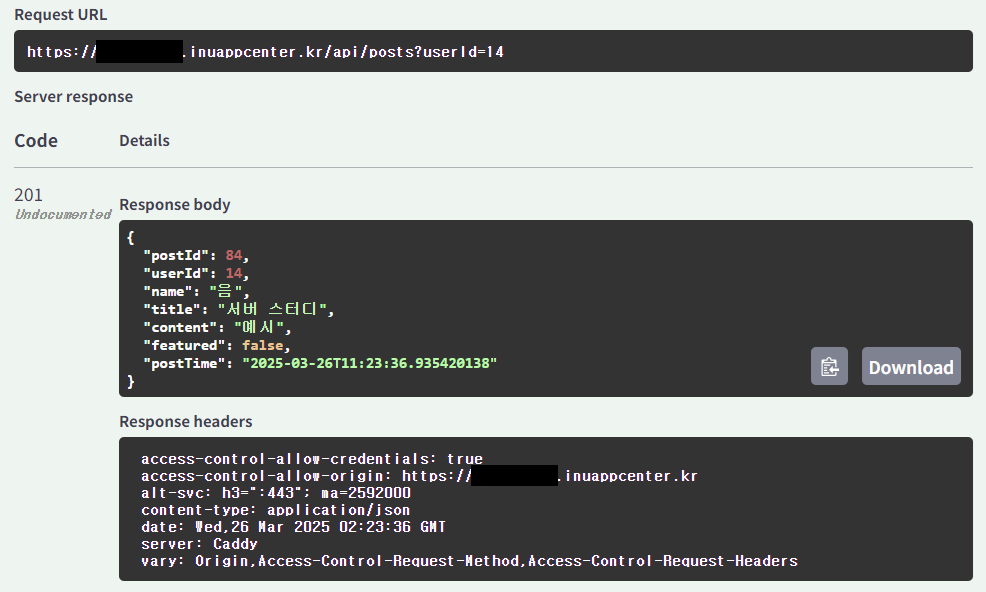

# week1

---

# 🌱Server, Spring

# 공통 주제

## 🍀 웹/앱 서비스에서 클라이언트와 서버는 어떻게 데이터를 주고 받을까요?

REST API, GraphQL, gRPC … 

### 역할

클라이언트: 사용자가 직접 사용하는 화면(웹/앱)
서버: 데이터 처리 및 저장, 비즈니스 로직 수행

### 통신 흐름

1. 클라이언트, 사용자의 입력을 통해 HTTP 요청을 보낸다.
2. 서버, 요청을 처리하고 데이터베이스 등과 연동한다.
3. 서버, 결과를 HTTP 응답으로 클라이언트에 전달한다.
4. 클라이언트, 데이터를 받아 UI에 반영한다.

### HTTP (HyperText Transfer Protocol)

웹상에서 클라이언트와 서버가 데이터를 주고받을 수 있게 해주는 통신 규약(프로토콜)

- 요청(Request)와 응답(Response)으로 구성된다.
- 주로 텍스트 기반이다.
- JSON과 같은 형식으로 데이터를 교환한다.
- REST API, GraphQL, gRPC 등도 HTTP를 기반으로 동작한다.

### REST API

**REST(Representational State Transfer)**
자원(Resource)을 URI로 표현하고, HTTP 메서드(GET, POST, PUT, DELETE 등)를 활용하여 그 자원을 다룬다.

**API**

소프트웨어 애플리케이션이 서로 통신하여 데이터, 특징 및 기능을 교환할 수 있도록 하는 일련의 규칙

**⇒ REST API란?**

REST 원칙을 따르는 웹 기반 API

- HTTP를 통해 요청하고 JSON 형식으로 응답한다.
- 사용하기 쉽고 직관적
- 다양한 플랫폼과 연동 가능
    - REST API는 플랫폼 독립적 → HTTP만 사용할 수 있다면 어디서든 쉽게 연동 가능
- Swagger 등으로 자동 문서화 용이



### WebSocket

HTTP 연결을 업그레이드하여 양방향(Full-Duplex) 통신을 가능하게 하는 기술.

- 한 번 연결되면 클라이언트와 서버가 서로 자유롭게 메시지를 주고받을 수 있다.
- 별도의 요청 없이도 서버가 클라이언트에 실시간 푸시 가능
- 실시간성이 중요한 서비스에 사용된다.
    - 채팅 앱, 실시간 게임, 주식 실시간 시세 전송 등

### GraphQL

Facebook이 개발한 API 쿼리 언어(Query Language)

- 클라이언트가 필요한 데이터만 골라서 요청할 수 있다.
- 한 번의 요청으로 여러 API의 정보를 가져올 수 있다.
- 복잡한 쿼리 구조

### 적합한 용도

단순하고 범용적인 서비스 → REST API
실시간 응답이 필요한 서비스 → WebSocket
클라이언트에 맞춤형 데이터 제공 → GraphQL

---

## 🍀 Spring은 무엇이고 어떻게 구성되어 있을까요?

개발의 편의성을 높이는 Java 기반의 오픈소스 프레임워크.

- 객체를 효과적으로 관리하고, 웹 애플리케이션 개발을 위한 다양한 기능들을 제공한다.
    - *어떻게? →* 객체의 생성, 소멸, 의존성 주입, 생명주기 관리까지 모두 자동으로 관리한다.
- 객체 관리, 웹 애플리케이션 개발, 데이터베이스 처리, 보안, 트랜잭션 등 다양한 기능 제공

### Spring은 어떤 구성 요소를 포함하고 있나요?


**DispatcherServlet**

- 모든 요청의 진입점 역할을 한다.
- 클라이언트의 요청을 받아 적절한 컨트롤러로 전달한다.
- 최종적으로 응답을 View로 반환한다.

**HandlerMapping**

- 요청 URL에 매핑된 핸들러(Controller)를 찾아주는 역할을 한다.
    - 핸들러는 스프링에서 HTTP 요청을 처리하는 모든 구성 요소를 의미한다.
- 어노테이션 기반(@RequestMapping) 또는 XML 기반으로 매핑 정보를 관리한다.

**Controller**

- 실제 요청을 처리하는 로직을 담은 클래스이다.
    - 서비스 계층을 호출해 비즈니스 로직을 처리한다.
- 요청 파라미터를 받고, 필요한 처리를 한 후, 결과(Model)와 View 이름을 반환한다.
- 개발자가 직접 구현하는 부분이다.

**Service** 

- 컨트롤러로부터 전달받은 요청을 처리하고, 필요한 데이터를 가공한다.
    - ⇒ 핵심 비즈니스 로직을 담당하는 계층이다.
- 개발자가 직접 구현하는 부분이다.

**Model**

- 컨트롤러에서 처리한 결과 데이터를 담는 객체이다.
    - View로 전달될 데이터를 담고 있다.

**Repository** 

- DB 접근을 담당하는 DAO 역할의 클래스이다.
    - DAO란? ‘DB에 접근해서 데이터를 조회하거나 저장하는 역할을 하는 객체’
        - → 데이터베이스와 직접 대화하는 계층, DB 관련 로직만 모아둔 클래스
        - DB 처리 코드를 Controller나 Service에 직접 쓰면 코드가 지저분하고 관리에 어려움이 있다.
        - DB 관련 로직은 DAO에 모아두는 게 책임 분리(SRP 원칙)에 부합한다.
        - 유지보수와 테스트에 용이하다.
            - DAO만 따로 테스트할 수 있다.
            - DB 구조가 바뀌어도 DAO만 수정하면 된다.

**View**

- 사용자에게 보여지는 최종 결과 화면이다.
- Model 데이터를 받아 사용자 화면으로 렌더링한다.

**ViewResolver**

- 반환된 뷰 이름을 기반으로 실제 View 파일 경로를 찾아주는 컴포넌트
    - ‘View 이름 반환’의 의미 → “최종적으로 어떤 화면 파일을 보여줄 것인지를 문자열로 알려준다”

```java
@Controller
public class HomeController {
	@GetMapping("/home")
	public String home(Model model) {
    model.addAttribute("msg", "Welcome!");
    return "home"; // ← 이게 바로 "View 이름"
	}
}
```

### Spring과 SpringBoot의 주요한 차이점은 무엇일까요?

**Spring**

- Java 기반의 애플리케이션 개발을 위한 프레임워크이다.
- 객체 관리(IoC), 의존성 주입(DI), 웹 MVC, 트랜잭션, 보안 등 다양한 기능을 제공한다.

**Spring Boot**

- Spring을 더 쉽게 사용하기 위한 확장 프레임워크이다.
- 복잡한 설정 없이 빠르게 애플리케이션을 실행할 수 있도록 돕는다.

### Spring Framework의 주요 특징은 무엇일까요?

**IoC (Inversion of Control)**

- 객체 생성/관리를 개발자가 아닌 컨테이너가 담당한다.
- 애플리케이션의 결합도를 낮추고, 확장성과 테스트 용이성을 높인다.

**DI (Dependency Injection)**

- 필요한 객체를 컨테이너가 자동 주입한다. (예: @Autowired, 생성자 주입)
- 코드의 결합도를 낮추고, 유지보수를 용이하게 한다

**AOP (Aspect-Oriented Programming)**

- 핵심 로직과 공통 기능(로깅, 보안, 트랜잭션)을 분리한다.(예: @Transactional)
- 코드 중복 제거 및 모듈화로 유지보수를 용이하게 한다.

## 🍀 Servlet Container와 Spring Container는 무엇인가요? 그리고 어떻게 동작하나요?

### MVC 패턴이 무엇인가요? 또 이 패턴은 어떻게 동작하나요?

Model-View-Controller의 약자로, 구성요소를 역할별로 분리해 유지보수와 확장성을 높이는 설계 패턴이다.

**Model**

- 데이터/비즈니스 로직을 담당한다.
    - 데이터 자체(사용자 정보, 게시글 등)
    - 비즈니스 로직(계산, 상태 변화 등)
    - DB와 연동(Repository를 통해)

**View**

- 사용자에게 데이터를 시각적으로 표현하는 화면
    - Model에서 받은 데이터를 화면에 표시
    - 사용자 입력(Form)도 포함 가능

**Controller**

- 사용자의 요청을 받아 Model을 통해 처리하고, 그 결과를 어떤 View에 보여줄지 결정하는 중간 관리자 역할이다.
    - HTTP 요청 수신
    - 파라미터 추출 및 검증
    - Service를 호출하여 비즈니스 로직 처리
    - 결과(Model)와 View 이름을 DispatcherServlet에 반환

### Spring MVC 패턴은 무엇인가요?


Spring에서 MVC 패턴을 구현한 구조

**흐름**

- 클라이언트 요청 → DispatcherServlet
- 요청을 처리할 Controller 탐색 및 실행
- 결과 데이터를 Model에 담고 View 이름 반환
- ViewResolver가 View 경로 결정
- View가 최종 HTML을 렌더링하여 응답

### Servlet Container는 무엇인가요?


Java 웹 애플리케이션을 실행시키기 위한 서버 환경으로 Servlet을 관리하고 요청/응답을 처리하는 역할을 한다. (Apache Tomcat, Jetty 등)

**기능**

- 클라이언트 요청 수신
- 알맞은 Servlet 호출
- 응답 결과를 클라이언트에 전송
- Servlet 생명주기 관리

### Servlet은 무엇인가요?

HTTP 요청을 처리하고 응답을 만드는 기본 단위(컴포넌트)이다.

- 클라이언트 요청 파싱
- 필요한 작업 수행 (DB 조회, 계산 등)
- 응답 생성 (HTML, JSON 등)

### Servlet Container는 사용자의 요청을 어떻게 처리하나요?

- 클라이언트가 브라우저에서 요청을 보낸다.
- Servlet Container가 요청을 수신한다.
- 요청 URL에 등록된 Servlet 클래스를 찾는다.
- 해당 Servlet의 메서드를 호출한다.
- 응답 데이터 작성한다. (HTML, JSON 등)
- 응답을 클라이언트에게 반환한다.

### Spring Container는 무엇인가요?

- Bean 객체들을 생성하고 관리하는 역할을 하는 컴포넌트이다.
    - 객체 생성부터 소멸까지 모두 관리해주는 IoC 컨테이너
        - 클래스 인스턴스(Bean) 생성
            - Spring Container가 생성하고 관리하는 객체(Object)
            - Spring이 대신 만들어서 관리해주는 자바 객체 ⇒ Bean
        - 의존성 주입(DI) 처리
        - 생명주기 관리
        - 필요 시 Bean을 찾아서 전달
    - 설정 방식: XML, Annotation, JavaConfig 등

### 프론트 컨트롤러 패턴은 무엇이고, DispatcherServlet은 뭘까요?

- 모든 요청을 하나의 진입점에서 처리하는 패턴이다.
- Spring에서는 DispatcherServlet이 프론트 컨트롤러 역할을 한다.
- 순서: 요청 → DispatcherServlet → 적절한 Controller → 응답

### Spring Container은 Bean을 어떻게 관리하나요?

- 설정 파일 또는 어노테이션(@Component, @Service 등)을 통해 Bean을 정의한다.
- 애플리케이션 시작 시 Bean을 생성하고, @Autowired 등으로 필요한 곳에 자동 주입한다.
- (기본적으로)싱글톤으로 관리한다.