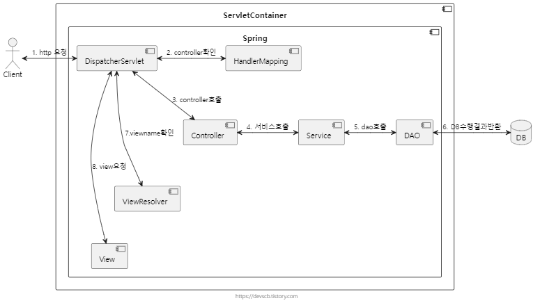

# 서버 스터디 1주차

## 웹/앱 서비스에서 클라이언트와 서버는 어떻게 데이터를 주고 받을까요?

클라이언트는 HTTP 또는 HTTPS 프로토콜을 통해 서버와 데이터를 주고받는다.

이때 주로 사용하는 API가 REST API다. 흐름은 다음과 같다.

<aside>
💡

1. 클라이언트가 서버에 HTTP Request 전송
2. 서버는 요청 내용을 처리한 후, HTTP Response를 클라이언트에 전송
3. 클라이언트는 응답을 받아 화면에 표시하거나 추가 작업을 수행
</aside>

- REST API는 GET(read), POST(create), PUT(update), DELETE(delete)등의 HTTP 메서드를 사용함.
- 데이터 포맷은 주로 json을 사용, xml을 사용하는 경우도 있음.

## Spring은 무엇이고, 어떻게 구성되어 있을까요?

spring은 자바의 객체지향을 더 잘 활용해 웹 어플리케이션을 개발하기 위해 만들어진 프레임워크다.

초기 어플리케이션 개발은 EJB로 했으나, 너무 사용하기 불편해 스프링이 등장했다.

***“the fact that Spring represented a fresh start after the “winter”” (스프링 공식문서 중)***

- spring은 어떤 구성 요소를 포함하고 있나요?

- spring과 springboot의 주요한 차이점은 무엇일까요?

<aside>
💡

EJB 시절보다 스프링이 훨씬 편리해졌다 해도, 스프링 프레임워크 자체만으로는 불편한 점이 많았다. 스프링을 개발자 친화적으로 만들어준 게 스프링부트다.

1. 스프링은 configuration 설정이 매우 길고 번거롭지만, 스프링부트는 간단하게 설정 가능하다.
2. 스프링은 라이브러리의 버전, 의존성 관리를 하나하나 해줘야 하지만 스프링부트는 스타터를 이용해 쉽게 관리할 수 있다.
3. 스프링은 내장 서버가 없지만, 스프링부트는 내장서버가 포함돼있다.
4. 스프링은 빌드, 배포가 번거롭지만 스프링부트는 jar 파일 하나로 가능하다.
</aside>

- spring framework의 주요 특징은 무엇일까요?

<aside>
💡

1. DI(dependency injection)
- DI는 객체에게 필요한 것을 외부에서 주입하는 것이다. 객체 간의 의존 관계를 통해 유연성을 확보할 수 있다.
- DI에는 필드 주입, setter 주입, 생성자 주입 등의 방법이 있지만, 생성자 주입이 가장 권장되는 방식이다.

1. IOC(Inversion of Control)
- IOC는 메소드나 객체의 호출 작업을 개발자가 결정하는 것이 아니라, 외부에서 결정하는 것을 의미한다.
- 객체의 의존성을 역전시켜 객체간의 결합도를 줄이고, 유연한 코드를 작성할 수 있게 한다.

1. AOP(Aspect Oriented Programming)
- AOP는 반복되고 공통적으로 사용되는 부분을 분리해 모듈화하는 것이다. 관점 지향 프로그래밍이라고도 한다.

1. PSA(Portable Service Abstraction)
- PSA는 환경의 변화와 관계 없이, 일관된 접근 환경을 제공하는 추상화 구조다. 확장성이 좋고 기술에 특화되어있지 않은 코드를 의미한다.
- Spring은 spring web MVC, spring transaction, spring cache 등의 다양한 PSA를 제공한다.

1. POJO(Plain Old Java Object)
- POJO는 객체지향적인 원리에 충실하면서 환경과 기술에 종속되지 않고, 필요에 따라 재활용될 수 있는 방식으로 설계된 오브젝트를 의미한다. 직역하면 자바로 생성된 순수한 객체다.
- 특정 프레임워크에 의존하지 않아 테스트 용이함, 변경에 강함, 재사용이 쉽다는 특성이 있다. 덕분에 유지보수를 쉽게 할 수 있다.
</aside>

## Servlet Container와 Spring Container는 무엇인가요? 그리고 어떻게 동작하나요?

- MVC 패턴이 무엇인가요? 이 패턴은 어떻게 동작하나요?

MVC 패턴은 model, view, controller로 역할을 분리해 구현하는 디자인 패턴이다. Spring MVC는 MVC 패턴을 스프링으로 실제로 구현한 프레임워크다.  MVC 패턴의 각 요소는 다음과 같은 역할을 한다.

model : 내부 비즈니스 로직 처리

view : model이 처리한 데이터를 사용자에게 시각적으로 제공

controller : view와 model을 연결, 흐름 제어

- Servlet Container는 무엇인가요?

<aside>
💡

Servlet Container는 클라이언트로부터 http 요청을 받아 servlet 로직을 처리할 수 있는 구성요소다. 여기서 Servlet이란 자바 기반 웹 프로그래밍에서, HTTP 요청을 처리하고 응답을 생성하는 서버 측 컴포넌트다.

servlet container가 사용자의 요청을 처리하는 방법은 다음과 같다.

1. 클라이언트의 요청
2. servlet container가 클라이언트 요청 수신
3. container가 해당 servlet 객체를 찾아서 doget(), dopost() 등 메소드 호출
4. servlet이 응답 생성
5. container가 응답 전송
</aside>

- Spring Container는 무엇인가요?

spring container는 bean을 생성하고, 의존성 주입, 그리고 생명주기까지 관리해주는 컨테이너다. @component, @autowired 등 애노테이션을 붙여서 만든 객체들을 알아서 관리해준다.

<aside>
💡

front controller 패턴이란 모든 요청을 하나의 컨트롤러에서 받고, 필요한 처리를 각각 세부 컨트롤러로 넘겨주는 구조다. DispatcherServlet이 Spring에서 front controller 역할을 수행한다. 모든 웹 요청을 DispatcherServlet이 먼저 받고, 그 다음 요청에 맞는 컨트롤러(핸들러)를 찾아 호출한다.

bean이란 spring container가 관리하는 객체를 의미한다. spring container가 bean을 관리하는 방식은 다음과 같다.

1. 컴포넌트 스캔 방식 또는 자바 코드를 통해 선언한 bean들을 스캔하고 등록한다. 
2. bean으로 등록된 클래스는 스프링이 직접 객체를 생성한다.
3. 스프링이 의존관계를 파악하고, 자동으로 주입해준다.
4. bean은 기본적으로 싱글톤으로 관리된다. 같은 클래스의 bean은 한 번 만들고 재사용한다.
5. 스프링 컨테이너가 종료될 때 bean도 같이 정리한다.

- spring container의 종류에는 beanfactory, applicationcontext가 있다. 스프링부트에서는 기본적으로 applicationcontext를 사용한다.
</aside>

---

과제 외

<aside>
💡

SOLID 원칙

- Single responsiblity principle (한 클래스는 하나의 책임만 가져야 한다.)
- Open/closed principle (확장에는 열려있으나, 변경에는 닫혀있어야 한다.) → 다형성, 역할과 구현의 분리를 통해 실현
- Liskov substitution principle (다형성에서 하위클래스는 인터페이스 규약을 다 지켜야한다.) → 예를 들어 자동차 인터페이스의 엑셀이 앞으로 가라는 기능인데, 뒤로 가게 구현하면 위반
- Interface segregation principle (인터페이스를 구체적으로 분리)
- Dependency inversion principle (구현클래스에 의존하지 말고, 인터페이스에 의존)
</aside>

하지만 다형성만으로는 OCP, DIP를 지킬 수 없음.

클라이언트 코드의 변경을 막을 수 없고, 구현체 없이 인터페이스만으로는 구현 불가능하기 때문

템플릿 엔진: html에 데이터를 넣어 동적인 웹페이지를 만들어주는 도구. thymeleaf, jsp 등

MVC ↔ api 방식: 서버가 html파일을 주는게 아니라, json, xml 등 데이터만 주는 방식