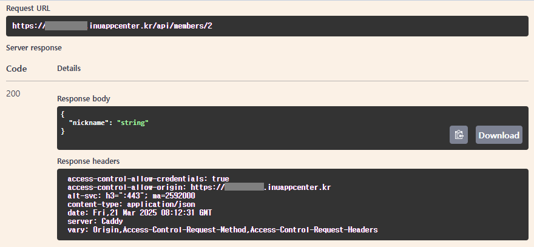

# Server & Client, Spring Framework

추가 일시: 2025년 3월 19일 오후 8:32
강의: Appcenter_Server

# 🌱 Server & Client, Spring Framework

---

## 🍀 웹/앱 서비스에서 클라이언트와 서버는 어떻게 데이터를 주고 받을까요?

---

- 웹과 앱 서비스에서 데이터를 주고받기 위해 API가 사용됩니다.

- RESTAPI는 HTTP method (GET, POST, PUT, DELETE 등)를 활용하여 데이터를 처리합니다.

- 데이터 포멧으로는 JSON과 XML을 주로 사용합니다.

<aside>
📤

**Client의 요청(Request)** 

프론트에서 특정한 작업을 위해 서버에 HTTP/HTTPS 프로토콜을 사용하여 요청합니다.

(실제 요청 예시)

```bash
curl -X 'PUT' \
  'https://example.inuappcenter.kr/api/members/2' \
  -H 'accept: */*' \
  -H 'Content-Type: application/json' \
  -d '{
  "nickname": "string",
  "address": "string",
  "birth": "2025-03-21",
  "phone": "string",
  "introduce": "string"
}'
```

</aside>

<aside>
📥

**Server의 응답(Response)**

서버는 요청을 받고, 이를 처리 후 Response값을 클라이언트에 반환합니다.

(실제 응답 예시)



</aside>

## 🍀 Spring은 무엇이고 어떻게 구성되어 있을까요?

---

### ✅ Spring은 어떤 구성 요소를 포함하고 있나요?


- ServletContainer
    - Client의 HTTP 요청을 받아 Servlet logic을 처리 할 수 있는 구성요소입니다.
    - 대표적인 예로 Tomcat이 있습니다.

- DispatcherServlet
    - Spring framework에서 front controller 역할을 합니다.
    - 요청이 오면 실제로 로직을 수행할 컴포넌트로 요청을 넘겨주고 반환받는 역할을 합니다.
    
- HandlerMapping
    - 요청을 처리할 핸들러(controller)를 결정하는 컴포넌트입니다.

- Controller
    - HTTP Request를 개발자가 처리할 수 있도록 개발하는 컴포넌트입니다.

- Service
    - 비즈니스 로직을 수행하는 컴포넌트입니다.

- DAO
    - DB에 직접적으로 접근하는 객체입니다.
    - JPA interface를 상속받는 repository가 이에 해당합니다.

- ViewResolver
    - ViewName을 기반으로 어떤 View 파일을 사용할 것인지 확인하는 컴포넌트입니다.

- View
    - 보통 UI화면을 의미합니다.

### ✅ Spring과 SpringBoot의 주요한 차이점은 무엇일까요?

<aside>
🌱

**Spring**

Spring은 JAVA 기반의 웹 어플리케이션을 만들 수 있는 프레임 워크이다.

개발자가 직접 설정 파일을 작성하고, 빈 객체를 등록하고, 객체간의 의존성을 설정해야합니다.

</aside>

<aside>
🌱

**SpringBoot**

Spring을 보다 쉽게 사용할 수 있도록 핵심 모듈을 모아서 만든 프레임워크

Spring Boot에서는 개발자가 설정 파일을 작성할 필요 없이, 프로젝트 설정과 라이브러리 의존성을 자동으로 처리해주는 기능을 제공합니다.

</aside>

### ✅ Spring Framework의 주요 특징은 무엇일까요?

**스프링의 특징**

- IoC (Inversion of Control, 제어의 역전)

객체의 생명주기 및 의존성 관리를 담당하는 IoC Container를 제공합니다.

개발자는 객체의 생성과 관계 설정을 스프링에 위임할 수 있고, 컨테이너가 객체의 생명주기를 관리하고 필요한 의존성을 주심합니다.

- DI (Dependency Injection, 의존성 주입)

스프링은 의존성 주입을 통해 객체간의 관계를 설정합니다.

- AOP (Aspect Oriented Programming, 관점 지향 프로그래밍)

스프링은 AOP를 지원하여 애플리케이션의 핵심 비즈니스 로직과 부가적인 기능(로깅, 보안, 트랜잭션 관리)을 분리하여 모듈화할 수 있습니다.

- PSA (Portable Service Abstraction, 일관된 서비스 추상화)

스프링은 데이터베이스 서비스를 추상화한 인터페이스를 제공하여 다양한 데이터베이스(MySQL, Oracle, Mongo DB 등)에 동일한 사용방법을 유지할 수 있다.

Java를 사용하여 데이터베이스에 접근하는 방법을 규정한 인터페이스를 JDBS(Java DataBase Connectivity)라고한다.

- 트랜잭션(Transaction) 관리

스프링은 추상화된 트랜잭션 관리를 지원하며 XML 설정파일 등을 이용한 선언적인 방식 및 프로그래밍을 통한 방식 모두를 지원한다.

- MVC(Model-View-Controller) 패턴

스프링은 웹 프로그램밍 개발 시 표준적인 방식인 Spring MVC 패턴을 사용한다.

## 🍀 Servlet Container와 Spring Container는 무엇인가요? 그리고 어떻게 동작하나요?

---

### ✅ MVC 패턴이 무엇인가요? 또 이 패턴은 어떻게 동작하나요?


- Model
    - 애플리케이션의 비즈니스 로직과 데이터를 담당
    - 데이터의 상태를 유지하고, 유효성 검사, 조작 등을 수행
    - 데이터베이스나 외부 서비스와의 상호작용을 처리
    - 모델은 독립적으로 작동할 수 있으며, 재사용 가능한 비즈니스 로직을 포함
    
- View
    - 사용자 인터페이스(UI)를 담당
    - 모델에서 제공하는 데이터를 표시하고, 사용자의 입력을 받을 수 있는 화면을 제공
    - HTML, XML, JSON 등의 형식으로 데이터를 표현
    - 뷰는 모델에 종속되지 않으며, 여러 개의 뷰가 동일한 모델을 사용할 수 있음
    - 사용자의 인터페이스의 외관과 레이아웃을 담당
    
- Controller
    - 클라이언트의 요청을 수신하고 처리하는 역할
    - 모델과 뷰 사이의 흐름을 조정하고, 비즈니스 로직을 수행하는 서비스와의 상호작용을 관리
    - 클라이언트의 요청을 분석하고, 해당 요청에 대한 모델 호출과 뷰 선택을 수행
    - 컨트롤러는 클라이언트와 상호작용하며, 모델과 뷰를 조정하여 애플리케이션의 동작을 제어

### ✅ Servlet Container는 무엇인가요?


- Servlet은 무엇인가요?
    - Servlet은 자바 기반의 웹 애플리케이션 기술로, 웹 요청과 응답의 흐름을 간단한 메서드 호출만으로 체계적으로 다룰 수 있도록합니다.

- Servlet Container는 사용자의 요청을 어떻게 처리하나요?
    - Client 요청
    - HTTPServletRequest, HTTPServletResponse 객체 생성
    - Web.xml이 어떤 Servlet에 대해 요청한 것인지 탐색
    - 해당 Servlet에서 sevice methon 호출
    - doGet() 또는 doPost() 호출
    - 동적 페이지 생성 후 ServletResposne 객체에 응답
    - HTTPServletRequest, HTTPServletResponse 객체 소멸

- Servlet 생명주기 메서드
    - 초기화 : init()
    - 작업수행 : doGet(), doPost()
    - 종룍 : destroy()

### ✅ Spring Container는 무엇인가요?


- Front controller 패턴은 무엇이고, DispatcherServlet은 뭘까요?
    - 공통 처리 로직을 다 몰아주고, 이후 클라이언트의 각 요청에 맞는 컨트롤러로 보내 처리하는 패턴을 front controller 패턴이라 합니다.
    - DispatcherServlet은 HTTP 프로토콜로 들어오는 모든 요청을 적합한 컨트롤러에 위임해주는 front controller입니다.
    - MVC 패턴의 핵심 역할을 합니다.


- Spring Container은 Bean을 어떻게 관리하나요?
    - Spring은 Bean을 관리하기 위해 ConcurrentHashMap을 사용하고 key에는 Bean의 이름, value에는 Bean 정보 객체를 담습니다.