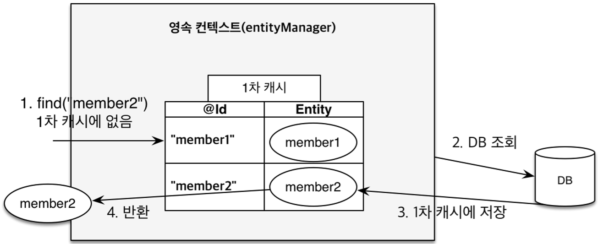

# Database&JPA

---

## 공통 주제

### 🍀 ORM은 무엇일까요? 스프링에서 ORM을 어떻게 이용할 수 있을까요?

1. ORM은 무엇이고 왜 필요할까요?
    
    ORM(Object-Relational Mapping)이란, 객체 지향 언어의 **객체(object)**와 관계형 데이터베이스의 **테이블(relational table)** 간의 **불일치를 해결하는 기술**이다. 
    
    Java, Kotlin 등의 객체 지향 언어를 사용할 때, 우리는 데이터를 **객체 단위**로 다루게 된다. 하지만 데이터베이스는 데이터를 **테이블의 형태**로 저장한다. 이게 왜 문제가 되냐하면… 객체는 속성(변수)과 행동(메서드)으로 이뤄지지만 데이터베이스의 테이블은 행과 열의 단순한 구조로 표현된다. 이러한 데이터 표현 방식의 불일치로 인해, 우리는 데이터를 저장하거나 불러올 때마다 **변환**을 해야 한다!
    
    그런데 이 변환을 사람의 손으로 일일이 처리하려면 많은 코드가 필요해진다. 당연히 실수할 확률도 높아진다. 이 문제를 해결하는 기술이 ORM이다. 
    
    ORM은 객체와 테이블 간의 데이터를 **자동으로 연결(mapping)**하여 개발 생산성과 유지보수성을 높인다. 물론, 단점도 존재한다. ORM이 생성한 쿼리가 언제나 최고의 효율을 보장하지는 않는다. 또한 데이터베이스 작업의 많은 세부 사항을 추상화(복잡한 세부 작업을 숨기고 단순화된 형태로 제공하는 것)하기에 잠재적인 문제를 인식하기 어렵고, 문제 해결이나 성능 향상을 위한 세부 튜닝에 더 많은 노력이 필요할 수 있다.
    
    위와 같은 단점을 최소화하기 위해, 우리는 SQL 쿼리의 생성 방식과 ORM 작동 원리, 성능과 복잡성 문제를 충분히 고려해야 한다.
    
2. 스프링에서 ORM을 어떻게 활용하나요?
    1. Spring Data JPA란 무엇일까요?
        
        JPA(Java Persistence API)는 자바에서의 ORM 구현을 위해 인터페이스와 기능을 제공하는 API이다. ORM이 객체와 테이블 간의 데이터를 매핑한다고 하였는데, JPA는 이 매핑과 CRUD 작업을 간편하게 만들어준다. 그런데 순수 JPA를 사용하려면 엔티티 매니저(엔티티 에 대한 DB 작업 제공)와, SQL에 가까운 JPQL 쿼리(섬세한 작성을 위해 탄생한 엔티티 객체 대상의 쿼리)를 작성해야 한다…
        
        따라서 우리는 **JPA를 더! 쉽게 사용하기 위한 스프링 모듈 ‘Spring Data JPA’를 사용한다.**
        
        Spring Data JPA는 JPA를 추상화시킨 Repository라는 인터페이스를 제공하여 매우 단순한 방식으로 데이터에 접근하게 한다.
        
        ```java
        // 순수 JPA 사용 예시 
        public Member findById(Long id) {
            return entityManager.find(Member.class, id);
        }
        
        public void save(Member member) {
            entityManager.persist(member);
        }
        ```
        
        ```java
        // Spring Data JPA 레포지토리 인터페이스만 선언
        public interface MemberRepository extends JpaRepository<Member, Long> {
            // 내부 구현 없이 선언만 하면 자동으로 생성됨
        }
        ```
        
        ① Repository 인터페이스 선언
        
        - 개발자는 데이터 접근이 필요한 엔티티에 대해 인터페이스만을 선언한다.
        - 구현 클래스는 작성하지 않는다.
        
        ② 스프링 컨테이너의 자동 감지와 프록시 생성
        
        - 스프링 컨테이너는 개발자가 작성한 Repository 인터페이스를 감지한다.
        - 해당 인터페이스에 대한 구현 클래스를 자동으로 생성한다.
        - 이 구현체(프록시)는 실제 메서드 호출 시 JPA 관련 작업을 수행하도록 구성된다.
            - 다른 객체를 대신하여 그 객체에 대한 접근을 제어하거나 기능을 확장하는 객체
        - 위 과정은 애플리케이션을 시작할 때 내부적으로 이뤄진다.
        
        ③ 자동 구현체의 생성 방식
        
        - 인터페이스의 메서드 이름을 분석하여 필요한 JPQL 쿼리 등을 자동 생성한다.
            - 메서드 이름이 findByName이라면 `select m from Member m where m.name=?` 라는 JPQL을 자동으로 생성한다.
        - 기본 CRUD 메서드(save, findById, delete 등)는 JPA의 엔티티 매니저를 직접 사용하여 제공된다.
        
        ④ 실제 메서드 호출 시 구현체의 동작
        
        - 호출된 메서드를 분석하여 미리 준비된 JPQL을 가져온다.
        - 내부적으로 JPA의 엔티티 매니저를 호출하여 DB와의 실제 작업을 수행한다.
        - 작업이 끝난 후 결과를 반환한다.
        
        과정 요약
        
        1. 인터페이스 감지
        2. JPQL 생성
        3. 엔티티 매니저로 쿼리 실행
        4. 결과를 Java 객체로 변환하여 반환
        
    2. Repository Layer란 무엇일까요?
        
        DB 접근 로직을 담당하는 계층이다. DB 접근 코드를 한 곳에 모아 유지보수를 용이하게 하고, 비즈니스 로직과 데이터 접근 로직이 명확히 분리되도록 한다.
        
        Repository Layer를 올바르게 활용하려면 **Repository에는 데이터 접근 코드만을 구현하고, 비즈니스 로직은 Service 계층에서 처리해야 한다.**
        
    3. JpaRepository 인터페이스에는 어떤 기능들이 포함되어 있나요?
        - 기본 CRUD
            - save(): 저장 또는 수정
            - findById(): Id로 조회
            - findAll(): 전체 데이터 조회
            - delete(): 삭제
        
        - 그 외 유용한 메서드
            - count(): 데이터 개수 조회
                - `long count = ticketRepository.count();`
            - existsById(): 데이터 존재 여부 확인
                - `boolean exists = personRepository.existsById(3L);`
    

### 🍀 영속성 컨택스트는 무엇일까요?



영속성 컨택스트는 서버와 DB 사이, 엔티티를 저장하는 논리적인 영역이다. 컴퓨터 분야에서 말하는 영속성은 ‘프로그램을 종료해도 데이터가 사라지지 않는 특성’을 의미한다.

구글에 영속성 컨택스트를 서치하면 위와 같은 이미지를 볼 수 있는데, ‘영속 컨택스트(entityManager)’라는 부분이 헷갈려서 개념을 다시 정리해보았다.


**Entity**

- 영속성을 가진 객체
- DB 테이블에 보관할 대상
- 즉, 영속 컨택스트에 속한 객체
- @Entity 어노테이션 이용

**엔티티 매니저**

- JPA를 사용하기 위해서는 Database 구조와 매핑된 JPA Entity 들을 먼저 생성하게 된다.
- 모든 JPA의 동작은 이 Entity들을 기준으로 돌아가게 된다.
- 이때 Entity들을 관리하는 역할을 하는 것이 바로 EntityManager
    
    ```
    1. (요청)
    2. EntityManager 만들어짐
    3. Entity들을 영속성 컨텍스트에 생성 -> Entity 영속화
    4. Entity Manager가 영속성 컨텍스트를 기반으로 요청(생성, 조회, 수정, 삭제)처리
    ```
    

**영속성 컨택스트**

- JPA에서 엔티티를 관리하기 위해서 만들어져있는 어떠한 공간
- 엔티티 매니저로 엔티티를 저장, 조회 시 엔티티 매니저는 영속성 컨택스트에 엔티티를 보관, 관리한다.
    - **영속성 컨택스트를 사용하는 이유**
        - **1차 캐시와 동일성 보장**
            - 데이터를 조회하는 기능을 처리할 때, DB에서 바로 조회하는 것이 아니라 영속성 컨텍스트에서 먼저 조회한다. (1차 캐시)
            - 이미 조회한 Entity를 다시 조회할 경우, 조회된 각각의 객체는 동일한 주소값을 갖는다.
            - 즉, 정확히 동일한 객체이다.
            - 이때 DB에 접근하지 않고 메모리에서 즉시 반환한다.
            - 동일 트랜잭션 내에서는 항상 같은 객체임을 보장한다.
        - **쓰기 지연 SQL 저장소와 변경 감지**
            - 객체 변경 시 즉시 DB에 SQL을 실행하지 않고, 트랜잭션 커밋 시점에 한꺼번에 실행한다.
            - 객체의 변경을 자동으로 감지하여 필요한 SQL만 실행함으로써 성능을 향상한다.
    - **생명 주기**
        - 트랜잭션이 시작될 때 생성되고, 트랜잭션이 끝날 때 종료된다.
        - 종료 시점에 변경사항을 DB에 반영한다.
            
            
            
            - 비영속: 영속성 컨텍스트와 무관한 일반적인 Java 객체인 상태
            - 영속: 영속성 컨텍스트에 주입 또는 관리되고 있는 경우
            - 준영속: 영속화 되었다가 분리된 경우(또는 식별자는 있지만 영속성 컨텍스트에 없는 객체)
            - 삭제: 영속성 컨텍스트에서 아예 삭제된 데이터

그래서, 맨 처음 이미지에는 왜 영속성 컨택스트와 엔티티 매니저라는 서로 다른 개념을 하나처럼 적어두었을까? 

1. 개발자는 영속성 컨택스트를 직접 사용하지 않고, 엔티티 매니저를 통해 **간접적으로만 접근**한다.
2. 엔티티 매니저가 내부적으로 **영속성 컨텍스트를 생성하고 관리**한다.
    1. 엔티티 매니저가 생성되면 그에 딸린 영속성 컨텍스트도 같이 생성된다.
    2. 둘은 일대일 관계처럼 작동한다.
    3. 위와 같은 이유로, 우리는 ‘엔티티 매니저의 내부에 영속성 컨택스트가 포함되어 있다’라고 표현하기도 한다.

**⇒ EntityManager는 개발자가 사용하는 인터페이스이고, Persistence Context는 그 내부에서 동작하는 핵심 메커니즘인 것이다!**

### 🍀 연관관계 매핑은 무엇이고 어떻게 활용할 수 있을까요?

객체 간의 참조 관계를 데이터베이스의 외래키 관계로 표현하는 기술이다.

1. 연관관계 매핑은 왜 필요할까요?
    
    객체는 **참조**로 관계를 표현하지만, DB는 **외래키**를 통해 관계를 표현하기 때문에 연관관계 매핑이 필요하다. 물론 ORM을 사용하면 이 과정도 자동으로 처리할 수 있다.
    
    연관 관계 매핑 시 우리가 고려할 3가지 요소
    
    - **방향**: 단방향, 양방향(단방향 2개)
        - DB 테이블은 외래 키 하나로 양쪽 테이블에 연결 가능하다.
        - **그러나 객체는 참조용 필드가 있는 객체만이 다른 객체를 참조할 수 있다.**
        - 두 객체 중 하나만 참조용 필드를 가진다면 → 단방향 관계
        - 두 객체 모두 참조용 필드를 가진다면 → 양방향 관계
    - **연관 관계의 주인**: 양방향일 때, 관리의 주체
        - 연관 관계의 주인은 두 객체 사이에서 조회, 저장, 수정, 삭제를 할 수 있다.
        - 주인이 아닌 객체에서 **mappedBy**를 사용해 주인을 지정해주어야 한다. (JPA에게 혼란을 주지 않기 위해)
        - **외래 키가 있는 곳을 주인으로 정하면 된다.**
    - **다중성**: 일대일, 일대다, 다대다, 다대일
        - DB를 기준으로 결정한다.
        - 일대다 ↔ 다대일과 같이 대칭성을 갖는다.

1. 연관관계 매핑에는 어떤 종류가 있을까요?
    
    
    
    - 일대일(1:1) @OneToOne
    - 일대다(1:N):  @OneToMany
    - 다대일(N:1): @ManyToOne
        - 하나의 게시판(1)에는 여러 게시글(N)을 작성할 수 있다.
        - 하나의 게시글은 하나의 게시판에만 작성할 수 있다.
    - 다대다(N:N): @ManyToMany

1. 영속성 전이는 무엇이고 어떻게 활용할 수 있을까요?
    
    영속성 전이를 사용하면 특정 엔티티를 영속 상태로 만들 때 **연관된 엔티티도 함께 영속 상태로 만들 수 있다.** 편리함을 제공하지만 무분별하게 사용했다간 데이터의 손실이 발생할 수 있으니 주의가 필요하다.
    
    | 속성 | 설명 |
    | --- | --- |
    | ALL | 모든 Cascade를 적용 |
    | PERSIST | 엔티티를 영속화할 때, 연관된 엔티티도 함께 유지 |
    | REMOVE | 엔티티를 제거할 때, 연관된 엔티티도 모두 제거 |
    | MERGE | 엔티티 상태를 병합할 때, 연관된 엔티티도 모두 병합 |
    | REFRESH | 상위 엔티티를 새로고침할 때, 연관된 엔티티도 모두 새로고침 |
    | DETACH | 부모 엔티티를 detach 하면 연관 엔티티도 detach 상태가 되어 변경사항이 반영되지 않는다. |
    
    ```java
    @OneToMany(mappedBy="member", cascade=CascadeType.ALL)
    private List<Post> posts;
    ```
    

### 🍀 Entity는 무엇이고 생명주기는 어떻게 되나요? 생성자 패턴이 무엇일까요?

1. Entity는 무엇인가요?
    
    JPA에서 Entity는 데이터베이스 테이블과 1:1로 매핑되는 클래스를 의미한다.
    
    1. Entity의 생명주기는 어떻게 되나요?
        - **비영속(Transient)**: 객체 생성 직후 DB와 무관한 상태
        - **영속(Persistent)**: 영속성 컨택스트에 등록된 상태
        - **준영속(Detached)**: 영속성 컨텍스트에서 분리된 상태
        - **삭제(Removed)**: DB에서 삭제가 예약된 상태
        
        ```java
       public class MemberExample {
        public static void main(String[] args){
            // 객체를 생성한 상태 (비영속)
            Member member = new Member();
            member.setId("member1");
            member.setUsername("회원1");
            
            // 객체를 저장한 상태 (영속)
            entityManager.persist(member);
            
            // 회원 엔티티를 영속성 컨텍스트에서 분리, 준영속 상태
            entityManager.detach(member);
            
            // 객체를 삭제한 상태
            entityManager.remove(member);
        }
       } 

        ```
        
    2. Entity에 관련된 어노테이션은 무엇이 있나요?
        - `@Entity`: JPA가 해당 클래스를 관리하도록 선언한다.
            - 기본 생성자가 반드시 필요하다.
            - final, enum, interface, innter class에서는 사용이 불가하다.
            - 필드(변수)를 final로 선언할 수 없다.
        - `@Table`: 엔티티와 매핑할 테이블을 지정한다.
        - `@Id`: 특정 속성을 기본키로 설정한다.
            - `@GeneratedValue`: 기본값을 DB에서 자동으로 생성한다.
        - `@Column`: 객체 필드를 테이블 컬럼과 매핑한다.
        - `@Enumerated`: enum 타입 필드를 엔티티에 사용할 때 DB 저장 방식을 알려준다.
            - `@Enumerated(EnumType.STRING)`
                - enum 이름 자체를 문자열로 저장한다.
                - enum 순서 변경 및 추가 시에도 데이터가 안전하다.
                - 코드와 DB 간의 명시적 매핑이 이뤄진다.
            - `@Enumerated(EnumType.ORDINAL)`
                - enum의 순서를 int로 저장한다.
                - **enum 정의 순서에 의존하기 때문에 순서가 바뀌면 데이터가 망가진다.**
        
2. Entity 객체 생성 방법으로 무엇이 있을까요?
    1. **생성자(Constructor)**
        - 구조가 단순하고 직관적이다.
        - 파라미터가 많아질수록 가독성이 떨어진다.
        - 선택적 필드 처리에 어려움이 있다.
        
        ```java
        public class User {
            private String name;
            private String email;
        
            public User(String name, String email) {
                this.name = name;
                this.email = email;
            }
        }
        ```
        
    2. **팩토리 메서드(Factory Method)**
        - 생성자를 직접 호출하지 않고 static 메서드를 통해 객체를 생성한다.
        - 의미 있는 이름을 부여하여 기능을 명확히 전달할 수 있다.
            - ex. createMember(), createPost()
        - 유효성 검사 등의 추가 처리가 가능하다.
        - 상속 시 오버라리딩이 불가하다(static)
        - 코드만으로는 어떤 객체를 반환하는지 알기 어려울 수 있다.
        
        ```java
        private User(String name, String email) {
                this.name = name;
                this.email = email;
            }
        
            public static User create(String name, String email) {
                // 유효성 검사
                if (name == null || name.isBlank()) {
                    throw new IllegalArgumentException("이름은 필수입니다.");
                }
            
                return new User(name, email);
            }
        ```
        
    3. **빌더 패턴(Builder Pattern)**
        - 필드와 선택적 파라미터가 많은 객체 생성을 유연하게 처리한다.
        - 파라미터의 순서가 무관하다.
        - 필수적/선택적 필드의 구분이 가능하다.
        - 코드의 가독성과 확장성이 매우 높다.
        - 아래와 같이 @Builder를 사용할 경우, 기본 생성자 없이 사용하면 JPA가 인식하지 못할 수 있다. → @NoArgsConstructor와 함께 사용(파라미터가 없는 기본 생성자 자동 생성)
        
        ```java
        @Builder
        @Entity
        public class User {
            private String name;
            private String email;
            private String phone;
            private String address;
        }
        ```
        
    
    **올바른 활용법**
    
    - 필드 수가 적고 간단하다 →  단순 생성자
    - 필드가 많고, 선택적 값이 많거나 조합이 다양하다 → 빌더 패턴