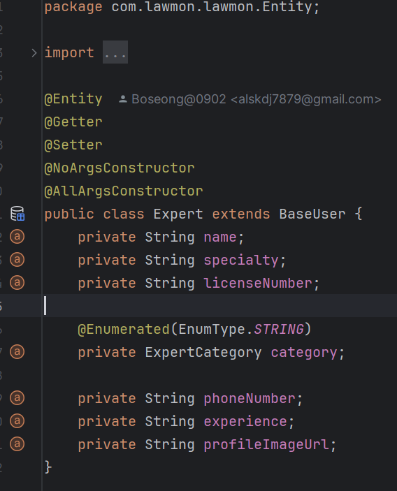
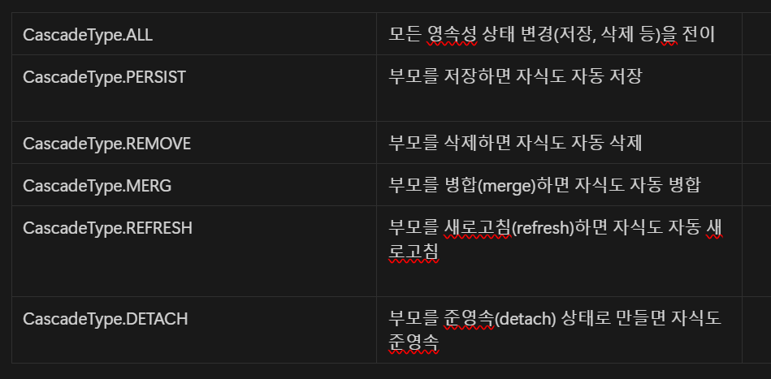

# Database & JPA

---

## 공통 주제

### 🍀 ORM은 무엇일까요? 스프링에서 ORM을 어떻게 이용할 수 있을까요?

1. ORM은 무엇이고 왜 필요할까요?
    
    ORM(Object Relational Mapping) : **자바의 객체와 관계형 DB를 맵핑**하는 것으로 DB의 특정 테이블이 자바의 객체로 맵핑되어 SQL문을 일일이 작성하지 않고 객체로 구현할 수 있도록 하는 프레임워크.
    
    객체 지향 프로그래밍은 클래스를 사용하고, 관계형 데이터베이스는 테이블을 사용.
    
    ORM을 통해 객체 간의 관계를 바탕으로 SQL을 자동으로 생성하여 모델간의 불일치를 해결.
    
    객체를 통해 간접적으로 데이터베이스 데이터를 다룸
    
    
    
    


1. 스프링에서 ORM을 어떻게 활용하나요?
    
    스프링에서는 주로 Spring JPA를 사용하여 ORM을 구현.
    
    1. Spring Data JPA란 무엇일까요?
    
    JPA란  Java Persistence API의 약자이며 **자바의 ORM을 위한 표준 기술**로 Hibernate, Spring JPA, EcliplseLink 등 과 같은 구현체가 있고 이것의 표준 인터페이스가 JPA.
    
    JPA 장점 :  SQL 위주의 Mybatis 프로젝트와 비교하여 쿼리를 하나하나 작성할 필요도 없어 **코드량이 엄청나게 줄어듬**. 또한 객체 위주로 코드가 작성되다 보니 **가독성도 좋고**, 여러 가지 요구사항으로 기능 수정이 발생해도 DB부터 **더 간편하게 수정이 가능**. 또한 Oracle, MySQL 등 DB 벤더에 따라 조금씩 다른 SQL 문법 때문에 애플리케이션이 DB에 종속될 수밖에 없었는데, JPA는 직접 쿼리를 작성하는 것이 아니라서 **DB 벤더에 독립적으로 개발이 가능**
    
    **Spring Data JPA는 JPA를 더 쉽게 사용하기 위한 Spring Data 프레임워크의 한 파트로 JPA를 이용한 구현체를 더 추상화시켜 더 쉽고 간편하게 JPA를 이용한 프로젝트를 개발할 수 있게 해 주는 Spring 모듈.**
    
    JpaRepository 를 상속하면 Spring이 자동으로 빈으로 등록하기 때문에 @Repository 는 생략해도 됨.
    
    
    
    
    
    1. Repository Layer란 무엇일까요?
        
        repository layer는 데이터베이스와 상호작용하는 계층이다.
        
        Spring 에서는 JpaRepository 또는 EntityManager를 사용하여 Repository layer를 구현 가능.
        
    
    1. JpaRepository 인터페이스에는 어떤 기능들이 포함되어 있나요?
        
        CRUD 메서드, 페이징/정렬, 배치 처리 등 다양한 기능을 제공.
        
        
        

### 🍀 영속성 컨택스트는 무엇일까요?

영속성이란?

데이터를 생성한 프로그램이 종료되어도 사라지지 않는 데이터의 특성을 말함.

영속성을 갖지 않으면 데이터는 메모리에서만 존재하게 되고 프로그램이 종료되면 해당 데이터는 모두 사라지게 됨.

그래서 우리는 데이터를 파일이나 DB에 영구 저장함으로써 데이터에 영속성을 부여함.

영속성 컨택스트란?

엔티티를 영구 저장하는 환경. 애플리케이션과 데이터베이스 사이에서 객체를 보관하는 가상의 데이터베이스 같은 역할을 함.

엔티티 매니저를 통해 엔티티를 저장하거나 조회하면 엔티티 매니저는 영속성 컨텍스트에 엔티티를 보관하고 관리함.

- EntityManagerFactory통해 요청이 올 때 마다 EntityManager 생성
- EntityManager는 내부적으로 Connection 사용하여 DB 접근


엔티티 매니저:영속성 컨텍스트 = N : 1


1. 영속성 컨택스트의 생명주기는 어떻게 되나요?
    
    영속성 컨텍스트는 **트랜잭션 단위로 관리되며, 엔티티 매니저(EntityManager)에 의해 생성 및 소멸**됩니다.
    
    1️⃣ **트랜잭션 시작** (`em.getTransaction().begin();`)
    
    2️⃣ **영속성 컨텍스트가 생성됨**
    
    3️⃣ **엔티티를 `persist()`하면 1차 캐시에 저장됨**
    
    4️⃣ **트랜잭션이 커밋(`commit()`)될 때 변경 사항이 DB에 반영됨**
    
    5️⃣ **트랜잭션 종료 시 영속성 컨텍스트가 초기화됨**
    
    📌 영속성 컨텍스트 ↔ 엔티티 생명주기 차이점
    
     **영속성 컨텍스트는 트랜잭션이 끝날 때마다 초기화되지만, 엔티티의 생명주기는 애플리케이션이 관리하는 동안 유지될 수 있음.**
    
2. 영속성 컨택스트의 특징에는 어떤게 있을까요?
    - 1차 캐시
        - 캐시는 map 형태로 key-value 저장
            - key : DB의 PK
            - value : 객체
        
        영속 상태의 엔티티를 이곳에 저장하기 때문에 만약 엔티티를 조회했을 때 1차 캐시에 엔티티가 존재한다면 DB를 찾아보지 않아도 된다. 말 그대로 캐시로써의 기능과 장점을 가지고 있다.
        
        하지만 사실 1차 캐시는 큰 도움이 되지 않는다.
        
        > 이유1. 1차 캐시가 있는 EntityManager는 트랜잭션 단위로 만들고 사라진다. 즉, 1차 캐시가 살아있는 시간은 매우 짧아 성능에 큰 효과는 없다.
        > 
        > 
        > **이유2.** 트랜잭션마다 각자 EntityManger를 사용한다. 즉, 각자 다른 영속성 컨텍스트와 1차 캐시를 가진다.
        > 
        
    - 동일성 보장
        
        ```java
        Member a = em.find(Member.class, "member1");
        Member b = em.find(Member.class, "member1");
        
        System.out.println(a==b) // true
        ```
        
        1차 캐시로 반복 가능한 읽기(Repeatable Read) 등급의 트랜잭션 격리 수준을 데이터베이스가 아닌 애플리케이션 차원에서 제공해 줄 수 있다.
        
        **JPA의 영속성 컨텍스트(1차 캐시)가 트랜잭션 내에서 같은 엔티티를 여러 번 조회해도 일관된 데이터를 유지할 수 있도록 보장한다**
        
        **데이터베이스의 트랜잭션 격리 수준을 "반복 가능한 읽기" 로 설정하지 않더라도, JPA가 애플리케이션 차원에서 동일한 효과를 제공한다는 것**
        
    - 쓰기 지연(Write-behind)
        
        ```java
        EntityManager em = emf.createEntityManager();
        EntityTransaction transaction = em.getTransaction();
        // 엔티티 매니저는 데이터 변경 시 트랜잭션을 시작해야 한다.
        transaction.begin(); // [트랜잭션] 시작
        
        em.persist(memberA);
        em.persist(memberB);
        // 여기까지 INSERT SQL을 데이터베이스에 보내지 않는다.
        
        // 커밋하는 순간 데이터베이스에 INSERT SQL을 보낸다.
        transaction.commit(); // [트랜잭션] 커밋
        ```
        
        em.persist()로 객체를 영속성 컨텍스트에 저장해도 DB에 바로 Insert 쿼리를 날리지 않는다.
        
        SQL 쿼리들을 모아놓았다가 flush 될 때(영속성 컨텍스트의 변경 내용을 DB에 반영할 때) 모아둔 쿼리를 모두 날린다.
        
    - 변경 감지(Dirty Checking)
        
        ```java
        EntityManager em = emf.createEntityManager();
        EntityTransaction transaction = em.getTransaction();
        transaction.begin(); // [트랜잭션] 시작
        
        // 영속 엔티티 조회
        Member memberA = em.find(Member.class, "memberA");
        
        // 영속 엔티티 데이터 수정
        memberA.setUsername("hi");
        memberA.setAge(10);
        
        //em.update(member) 이런 코드가 있어야 하지 않을까?
        
        transaction.commit(); // [트랜잭션] 커밋
        ```
        
        영속성 컨텍스트에서 엔티티를 조회해서 해당 엔티티를 수정한다고 하자.
        이때 조회한 엔티티를 다시 업데이트하는 코드가 있어야 할 것 같지만, 그러한 코드가 없어도 영속성 컨텍스트 내의 스냅샷과 엔티티를 비교해 변경된 엔티티가 있으면 Update 쿼리를 자동으로 생성한다.
        
        물론 이 Update 쿼리도 쓰기 지연이 될 수 있다.
        
    - 지연 로딩(Lazy Loading)
        
        지연 로딩은 연관 관계 매핑되어 있는 엔티티를 조회 시 우선 프록시 객체를 반환하고, 실제로 필요할 때 쿼리를 날려 가져오는 기능이다.
        
        즉, 필요할 때 데이터를 가져오는 기능이다.
        

### 🍀 연관관계 매핑은 무엇이고 어떻게 활용할 수 있을까요?

연관관계 매핑이란 객체의 참조와 테이블의 외래 키를 매핑하는 것을 의미.


근데 사실 객체를 직접 안받고 quizId를 받아도 됨.

객체 참조 vs 외래 키 직접 사용

- 외래 키 직접 사용
    - 장점
        - 단순한 데이터 구조로 인해 **JPA 없이도 쉽게 활용 가능**
        - 연관된 엔티티를 조회할 필요가 없는 경우 **가볍게 사용 가능**
    - 단점
        - **객체 지향적인 설계가 아님** → `quizId`만 가지고는 `Quiz` 엔티티의 정보를 가져올 수 없음
        - `Quiz` 정보를 가져오려면 **별도로 find()를 호출해야 함 → 추가 쿼리 발생**
- 객체 참조
    - 장점
        - **객체 지향적인 설계** → `quiz.getTitle()`처럼 `Quiz`의 정보를 쉽게 조회 가능
        - **지연 로딩(Lazy Loading)으로 최적화 가능**
        - **JPQL을 활용한 객체 지향 쿼리 작성 가능**
    - 단점
        - `Question` 엔티티를 조회할 때 **즉시 로딩(EAGER) 설정 시 불필요한 JOIN 발생 가능**
        - **객체 관계를 고려하여 Fetch 전략을 신중하게 설정해야 함**

1. 연관관계 매핑은 왜 필요할까요?
    
    연관관계 매핑이란? 객체의 참조와 테이블의 외래 키를 매핑하는 것을 의미.
    
    JPA에서는 연관 관계에 있는 상대 테이블의 PK를 멤버 변수로 갖지 않고, 엔티티 객체 자체를 통째로 참조.
    
    매핑하지 않는다면 객체 지향적인 개발이 어려워지고, 추가적인 쿼리 발생 등 성능 저하가 발생.
    
2. 연관관계 매핑에는 어떤 종류가 있을까요?
    - 1:1(One-To-One) 관계 → @OneToOne 사용
        
        한 객체가 다른 하나의 객체와만 매핑되는 관계
        
        ex) 사용자 - 주소
        
    - 1:N(One-To-Many) 관계 → @OneToMany 사용
        
        하나의 엔티티가 여러 개의 엔티티를 참조하는 관계
        
        ex) 팀 - 팀원, 게시글 - 댓글
        
    
    - N:1(Many-To-One) 관계 → @ManyToOne 사용
        
        여러 개의 엔티티가 하나의 엔티티를 참조하는 관계
        
        ex) 여러 명의 직원이 하나의 부서에 속함
        
    
    - N:M(Many-To-Many) 관계 → 대부분 @ManyToMany 대신 중간 엔티티를 만들어서 1:N or N:1로 풀어야함
        
        여러 개의 엔티티가 서로 다수의 엔티티와 관계를 맺음
        
        ex) 학생 - 강의
        
3. 영속성 전이는 무엇이고 어떻게 활용할 수 있을까요?
    - 영속성 전이란?
        
        영속성 전이는 **JPA에서 특정 엔티티를 영속 상태로 만들 때 연관된 엔티티도 함께 영속 상태로 만들고 싶을 때 사용**
        
        쉽게 말해서, 특정 엔티티의 상태 변화(저장, 삭제 등)가 연관된 엔티티에도 전이되는 기능 
        
        부모 엔티티를 저장하거나 삭제할 때, 자식 엔티티도 자동으로 저장되거나 삭제되는 것
        
    


```java
@Entity
public class Parent {
    @Id @GeneratedValue
    private Long id;
    
    @OneToMany(mappedBy = "parent", cascade = CascadeType.PERSIST)
    private List<Child> children = new ArrayList<>();
```

### 🍀 Entity는 무엇이고 생명주기는 어떻게 되나요? 생성자 패턴이 무엇일까요?

1. Entity는 무엇인가요?
    
    데이터 모델링에서 사용되는 객체.
    
    업무에 필요하고 유용한 정보를 저장하고 관리하기 위한 객체
    
    1. Entity의 생명주기는 어떻게 되나요?
        - 비영속(new/transient): 영속성 컨텍스트와 전혀 관계가 없는 상태
            
            ```java
            // 객체를 생성한 상태 (비영속)
            Member member = new Member();
            member.setId("member1");
            member.setUsername("회원1");
            ```
            
        - 영속(managed): 영속성 컨텍스트에 저장된 상태
            
            ```java
            // 객체를 생성한 상태(비영속)
            Member member = new Member();
            member.setId("member1");
            member.setUsername("회원1");
            EntityManager em = emf.createEntityManager();
            em.getTransaction().begin();
            //객체를 지정한 상태(영속)
            em.persist(member);
            // persist() : JPA에서 엔티티를 영속성 컨텍스트에 저장하는 메서드
            ```
            
        - 준영속(detached): 영속성 컨텍스트에 저장되었다가 분리된 상태
            
            ```java
            // 회원 엔티티를 영속성 컨텍스트에서 분리, 준영속 상태
            em.detach(member);
            ```
            
        - 삭제(removed): 삭제된 상태
            
            ```java
            // 객체를 삭제한 상태(삭제)
            em.remove(member);
            // 영속성 컨텍스트를 비워도 관리되던 엔티티는 준영속성 상태가 된다.
            em.clear();
            // 영속성 컨텍스트를 종료해도 관리되던 엔티티는 준영속 상태가 된다.
            em.close();
            ```
            
        

        
    
    1. Entity에 관련된 어노테이션은 무엇이 있나요?
    

    
2. Entity 객체 생성 방법으로 무엇이 있을까요?
    - new 연산자로 직접 생성 (비영속 상태)
        
        ```java
        Member member = new Member();
        member.setId(1L);
        member.setUsername("회원1");
        ```
        
    
    - JPA `persist()`를 이용한 생성 (영속 상태)
        
        ```java
        EntityManager em = emf.createEntityManager();
        em.getTransaction().begin();
        
        Member member = new Member();
        member.setId(1L);
        member.setUsername("회원1");
        
        em.persist(member); // 영속 상태로 변경됨
        em.getTransaction().commit();
        
        ```
        
    
    - @Builder 패턴을 활용한 생성 (Lombok 사용)
        
        ```java
        Member member = Member.builder()
            .username("회원1")
            .build();
        
        ```
        
    
    - 정적 팩토리 메서드를 이용한 생성
        
        ```java
        public static Member createMember(String username) {
                return new Member(username);
            }
            
            
         Member member = Member.createMember("회원1");
        
        ```
        
    
    - JPA 프록시를 이용한 지연 로딩 (Lazy Loading)
        
        ```java
        Member member = em.getReference(Member.class, 1L);
        ```
        
    
    - 네이티브 쿼리 또는 JDBC를 사용한 생성
        
        ```java
        Query query = em.createNativeQuery("INSERT INTO member (id, username) VALUES (?, ?)");
        query.setParameter(1, 1L);
        query.setParameter(2, "회원1");
        query.executeUpdate();
        
        ```
        

1. 각 생성 방법(생성자, 팩토리 메서드, 빌더 패턴)의 특징은 무엇인가요?
    - 생성자
        
        **특징**
        
        **객체를 생성할 때 가장 기본적인 방법**
        
        **JVM이 자동으로 기본 생성자를 제공** (다른 생성자가 없을 경우)
        
        **생성자 오버로딩 가능** (여러 개의 생성자를 만들 수 있음)
        
        **필드 값이 많아지면, 생성자 매개변수 순서를 헷갈릴 수 있음 (가독성 저하 가능)**
        
        **장점**
        
        **객체 생성이 직관적**
        
        **JVM 기본 제공 기능이라 추가 코드 필요 없음**
        
        **오버로딩을 통해 여러 방식으로 객체 초기화 가능**
        
        **단점**
        
        **필드가 많아지면 가독성이 떨어짐**
        
        **생성자 매개변수 순서 실수 가능**
        
    
    - 팩토리 메서드
        
        **특징**
        
        **객체 생성을 캡슐화하고, 원하는 방식으로 객체를 반환할 수 있음**
        
        **생성자를 private으로 감춰서 강제적으로 특정 방식으로만 객체를 생성하도록 유도 가능**
        
        **이름을 부여할 수 있어서 코드의 가독성이 향상됨**
        
        **싱글턴 패턴 등의 다양한 패턴을 적용할 수 있음**
        
        **장점**
        
        **객체 생성 방식을 유연하게 변경 가능**
        
        **이름을 부여하여 가독성이 높아짐** (`create()`, `of()`, `from()` 같은 네이밍)
        
        **불필요한 객체 생성을 막고, 재사용할 수 있음 (싱글턴 적용 가능)**
        
        **단점**
        
        **상속이 어렵다** (상속받는 클래스에서 생성자를 호출할 방법이 없음)
        
        **사용자가 `new` 키워드 대신 메서드를 사용해야 한다는 점을 알아야 함**
        
    
    - 빌더 패턴
        
        **특징**
        
        **객체의 필드가 많을 때 유용함**
        
        **각 필드를 메서드 체이닝 방식으로 설정 가능 (가독성이 좋음)**
        
        **생성자 매개변수 순서 실수를 방지할 수 있음**
        
        **장점**
        
        **필드가 많아도 가독성이 좋음**
        
        **선택적인 매개변수를 쉽게 설정할 수 있음**
        
        **단점**
        
        **코드가 상대적으로 길어짐**
        
        ```java
            @ApiResponses(value = {
                    @ApiResponse(responseCode = "200", description = "회원가입 성공"),
                    @ApiResponse(responseCode = "400", description = "잘못된 요청 데이터"),
                    @ApiResponse(responseCode = "409", description = "중복된 데이터")
            })
            @PostMapping(value = "/register", consumes = "multipart/form-data")
            public void postRegister(
              @Valid @ModelAttribute MemberRegisterDto memberRegisterDto,
              @RequestPart MultipartFile photo) {
              Member member;
              try {
                member = Member.builder()
                  .name(memberRegisterDto.getName())
                  .profileImage(s3Service.uploadImage(photo))
                  .nickname(memberRegisterDto.getNickname())
                  .instagramId(memberRegisterDto.getInstagramId())
                  .password(memberRegisterDto.getPassword())
                  .loginId(memberRegisterDto.getLoginId())
                  .sex(memberRegisterDto.getSex())
                  .age(memberRegisterDto.getAge())
                  .build();
              } catch (IOException e) {
                throw new RuntimeException(e);
              }
        
              memberService.registerMember(member);
            }
        ```
        

## 🔎 과제

<aside>
✅ **1. 현재 널리 사용되고 있는 서비스(당근마켓, 배달의 민족, 유튜브 등)의 ERD 설계해보기**
→ 전체 서비스가 아니어도 기능 중 일부 ERD도 가능!

**2. 설계된 ERD를 기반으로 Entity와 Repository Layer 구성해보기
3. Spring과 데이터베이스 연결해보기**

</aside>