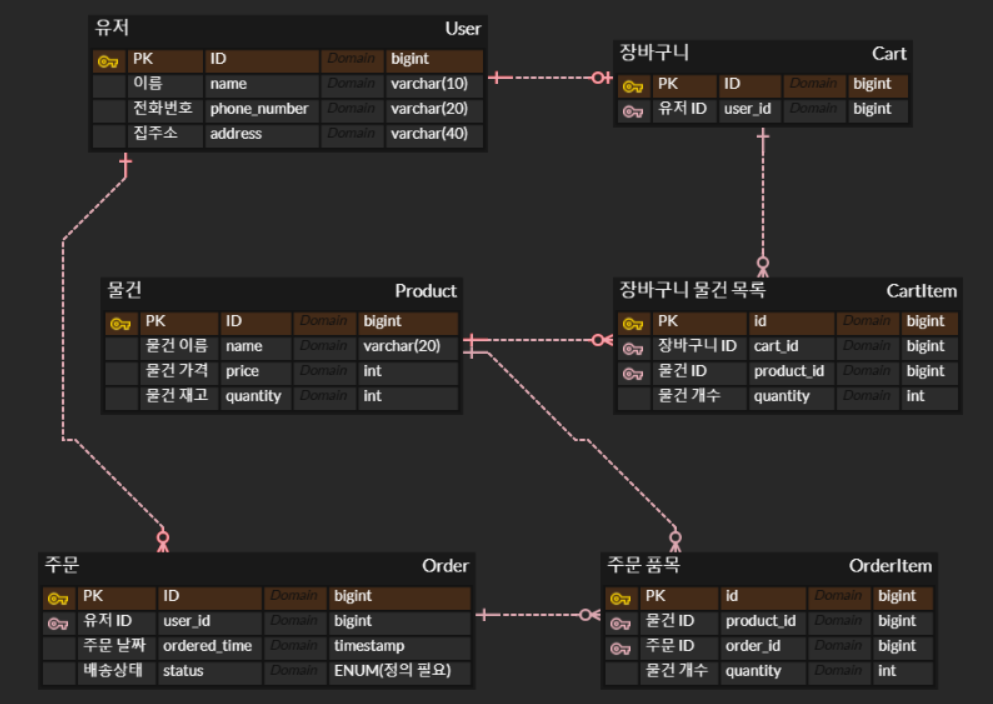

# 서버 스터디 2주차

### 🍀 ORM은 무엇일까요? 스프링에서 ORM을 어떻게 이용할 수 있을까요?

1. ORM은 무엇이고 왜 필요할까요?

<aside>
💡

- ORM(Object-Relational Mapping)은 말 그대로 객체(Object)와 관계형 데이터베이스(Relational databse)를 Mapping해주는 기술이다. 객체와 DB 테이블을 연결해 SQL 대신 객체지향 언어로 데이터베이스를 다룰 수 있게 해준다.

- ORM이 왜 필요할까?
1. 생산성 증가 (SQL 작성 감소)
2. 객체 지향적으로 코드 작성 가능
3. 유지보수 용이
4. DB에 종속적이지 않게 설계 가능 (DB 교체 유연성)

- ORM이 없던 시절엔 어떻게 했을까?

jdbc(Java DataBase Connectivity)를 이용해 자바로 SQL을 직접 다뤘다. jpa에 비해 반복되는 코드가 많고, 생산성이 떨어졌다. 점차 jdbctemplate → jpa → spring data jpa로 발전했다. 다만 jpa로 해결할 수 없는 복잡한 쿼리가 필요할 때는 sql을 직접 다루기도 한다.

- jdbc의 save 코드

```jsx
@Override
public Member save(Member member) {
    String sql = "insert into member(name) values(?)";
    Connection conn = null;
    PreparedStatement pstmt = null;
    ResultSet rs = null;

    try {
        conn = getConnection();
        pstmt = conn.prepareStatement(sql, Statement.RETURN_GENERATED_KEYS);
        pstmt.setString(1, member.getName());
        pstmt.executeUpdate();
        rs = pstmt.getGeneratedKeys();

        if (rs.next()) {
            member.setId(rs.getLong(1));
        } else {
            throw new SQLException("id 조회 실패");
        }

        return member;

    } catch (Exception e) {
        throw new IllegalStateException(e);
    } finally {
        close(conn, pstmt, rs);
    }
}

```

- jdbctemplate의 save 코드

```jsx
@Autowired
private JdbcTemplate jdbcTemplate;

@Override
public Member save(Member member) {
    SimpleJdbcInsert jdbcInsert = new SimpleJdbcInsert(jdbcTemplate)
        .withTableName("member")
        .usingGeneratedKeyColumns("id");

    Map<String, Object> params = new HashMap<>();
    params.put("name", member.getName());

    Number key = jdbcInsert.executeAndReturnKey(new MapSqlParameterSource(params));
    member.setId(key.longValue());

    return member;
}
```

- jpa의 save 코드

```jsx
@PersistenceContext
private EntityManager em;

@Override
public Member save(Member member) {
    em.persist(member); // INSERT 쿼리 자동 생성
    return member;
}
```

- spring data jpa의 save 코드

```jsx
public interface MemberRepository extends JpaRepository<Member, Long> {
}

memberRepository.save(member);
```

</aside>

1. **스프링에서 ORM을 어떻게 활용하나요?**
    1. **Spring Data JPA란 무엇일까요?**
    
           - JPA(Java Persistence API)는 자바 어플리케이션에서 관계형 데이터베이스 사용 방식을 
    
              정의한 인터페이스와 어노테이션의 표준 집합을 정의한 것이다. 우리가 사용하는
    
              em.persist같은 메소드는 JPA의 구현체인 Hibernate에서 구현한 것이다.
    
           - Spring Data JPA란 JPA를 더 쉽게 사용할 수 있도록 도와주는 기술이다. 리포지토리에 구현         
    
              클래스 없이 인터페이스만으로 개발할 수 있게 해준다. 반복적인 CRUD 기능도 제공한다.
    
           - Datasource는 DB랑 커넥션을 만들어주는 설정 객체, EntityManager는 데이터베이스와             
    
              상호작용을 담당하는 JPA의 핵심 객체이다. 트랜잭션과 영속성 컨텍스트를 관리한다.
    
     b.  **Repository Layer란 무엇일까요?**
    
           - 스프링 계층 구조는 Controller Layer(요청, 응답), Service Layer(비즈니스 로직), 
    
              Repository Layer(DB와 연결)로 나뉜다. Repository Layer는 데이터를 CRUD하는 계층이다.
    
             * DAO / Repository 차이점 → [https://www.inflearn.com/questions/111159](https://www.inflearn.com/questions/111159)
    
            
    
     c.  **JpaRepository 인터페이스에는 어떤 기능들이 포함되어 있나요?**
    
           - JpaRepository는 Spring Data JPA에서 제공하는 인터페이스로, JPA를 이용해
    
              데이터베이스를 조작하기 위한 메소드들을 제공한다.
    
           - CRUD 기능, 페이징/정렬 기능, 영속성 기능 등을 포함한다.
    
    - CRUD
    
    ```jsx
    T save(T entity);                     
    Optional<T> findById(ID id);          // 기본키로 조회
    boolean existsById(ID id);            // 존재 여부 확인
    List<T> findAll();                    // 전체 조회
    void deleteById(ID id);               // 삭제
    ```
    
    - 페이징 / 정렬
    
    ```jsx
    List<T> findAll(Sort sort);                         // 정렬 조회
    Page<T> findAll(Pageable pageable);                 // 페이징 / 정렬
    
    // 예시
    Page<Member> members = memberRepository.findAll(PageRequest.of(0, 10, Sort.by("name")));
    ```
    
    - 영속성
    
    ```jsx
    em.flush();
    ```
    

### 🍀 영속성 컨택스트는 무엇일까요?

1. **영속성 컨택스트의 생명주기는 어떻게 되나요?**

       - 영속성 컨텍스트는 애플리케이션과 데이터베이스 사이에 위치한 가상의 데이터베이스다.

          개발자가 entitymanager를 통해 엔티티를 저장하면, DB에 바로 저장되지 않고, 

          영속성 컨텍스트에 먼저 저장된 후 트랜잭션이 커밋되면 DB에 반영된다.

       - 영속성 컨텍스트는 entitymanager가 생성될 때 함께 만들어진다.

          트랜잭션 안에서 엔티티를 관리하다가 entitymanager 또는 트랜잭션 종료 시 소멸한다.


1. **영속성 컨택스트의 특징에는 어떤게 있을까요?**

       - 영속성 컨텍스트는 크게 1차캐시 저장소, SQL 저장소로 나뉜다.

[다운로드.jfif](%EB%8B%A4%EC%9A%B4%EB%A1%9C%EB%93%9C.jfif)

 **** a.  **1차 캐시와 동일성 보장**

      - 1차 캐시 저장소는 영속성 컨텍스트가 관리하는 엔티티 정보를 보관한다.

         같은 트랜잭션 안에서 같은 ID로 조회하면 DB가 아니라 캐시 저장소에서 가져온다.

         

      - 같은 ID를 가진 객체를 조회할 때 객체의 동일성을 보장할 수 있다. 이는 1차 캐시 덕분이다.

         1차 캐시 저장소가 있어 해당 ID의 엔티티가 있다면 캐시에서 바로 꺼내 재사용할 수 있다.

         그러나 1차 캐시가 없었다면 매번 DB에서 읽어오고 객체를 새로 생성했을 것이다.

         그랬다면 ID가 같더라도 자바 객체는 서로 다른 인스턴스이므로 동일(==)한 객체가 아니다.

 **** b.  **쓰기 지연 SQL 저장소와 변경 감지**

       - 쿼리를 실행할 때 매번 DB에 접근하지 않고, 영속성 컨텍스트 내부 SQL 저장소에 모아둔다.

          트랜잭션 커밋 시점에 모든 쿼리를 한번에 실행한다. DB 접근 횟수를 최소화함으로

          성능 향상에 큰 도움을 줄 수 있다.

       - 변경 감지(Dirty Checking)은 영속 상태의 엔티티가 변경됐을 때 JPA가 이를 감지하고,

          자동으로 UPDATE 쿼리를 실행해주는 기능이다. 엔티티가 영속 상태가 되었을 때 

          최초 상태를 스냅샷이라고 하는데, flush를 호출하는 시점에서 스냅샷과 현재 상태를

          비교한다. 변경된 필드가 있으면 UPDATE 쿼리를 생성해 전송한다.

- flush와 commit의 차이?

flush는 영속성 컨텍스트에 있던 쿼리들을 DB에 반영하는 것, 즉 중간 저장과 같은 느낌이다.

commit은 트랜잭션을 DB에 확정하는 것이다. commit을 호출하면 flush가 먼저 호출된다.

     

        

### 🍀 연관관계 매핑은 무엇이고 어떻게 활용할 수 있을까요?

1. **연관관계 매핑은 왜 필요할까요?**

       - 관계형 데이터베이스에서 테이블끼리 외래 키로 연결되는 것처럼, JPA에서 엔티티끼리

         연관 관계를 표현해야 한다. 이를 연관관계 매핑이라 한다.

1. **연관관계 매핑에는 어떤 종류가 있을까요?**

        1. 관계

        - @OneToOne (일대일 관계)

        - @OneToMany (일대다 관계)

        - @ManyToOne (다대일 관계)

        - @ManyToMany (다대다 관계) → 중간 테이블 관리가 어려워서 실무에서 잘 안쓰임.

        2. 방향

        - 단방향 → 한쪽만 다른 쪽을 참조하는 관계

        - 양방향 → 양쪽이 서로를 참조하는 관계

1. **영속성 전이는 무엇이고 어떻게 활용할 수 있을까요?**

       - 영속성 전이(Cascade)는 특정 엔티티의 상태를 변경할 때 연관된 엔티티도 같이 변경되도록

          하는 기능이다. 연관된 엔티티들의 상태를 직접 변경하는 건 너무 번거로운 일이고, 

          부모-자식과 같은 구조면 부모 하나의 상태만 바꿔줘도 자식들의 상태를 바꿔줄 수 있어

          객체지향적인 개발이 가능하다.

       - Cascade의 종류는 다음과 같다.

```java
    ALL, // 모두 적용
    PERSIST, // 영속
    MERGE, // 병합
    REMOVE, // 삭제
    REFRESH, // 새로고침
    DETACH // 영속성 컨텍스트 제외
```

- Cascade = removed와 orphanRemoval = true의 차이?

       - Cascade = removed는 부모 엔티티가 삭제될 때 자식 엔티티들도 같이 삭제되는 것임.

       - orphanRemoval = true는 부모와의 연관관계가 끊어진 자식 엔티티가 삭제되는 것임.

여기서 부모와 자식은 연관관계의 주인(자식), 연관관계의 비주인(부모, mappedby 사용한 쪽, 컬렉션 가지고 있는 쪽)을 의미한다.

- 양방향에서 mappedby를 사용해줘야 하는 이유?

mappedby를 사용한 것과 단순히 양쪽 엔티티의 필드에 참조할 객체를 선언한 것은 다르다.

mappedby를 사용해야 양방향이고, 필드에 객체만 선언한 것은 단방향이 두 번 생기는 것이다. 

양방향은 연관관계의 주인 엔티티측만 외래키를 가지고, 단방향 두번은 양쪽 엔티티에 외래키가 생기는 것이다. 이는 연관관계의 주인이 없어 데이터 무결성에 문제가 생길 수 있고, 비효율적이다.

- 참고 - [https://velog.io/@wogh126/JPA-양방향-매핑에서-MappedBy가-필요한-이유](https://velog.io/@wogh126/JPA-%EC%96%91%EB%B0%A9%ED%96%A5-%EB%A7%A4%ED%95%91%EC%97%90%EC%84%9C-MappedBy%EA%B0%80-%ED%95%84%EC%9A%94%ED%95%9C-%EC%9D%B4%EC%9C%A0)

### 🍀 Entity는 무엇이고 생명주기는 어떻게 되나요? 생성자 패턴이 무엇일까요?

1. **Entity는 무엇인가요?**

       - entity는 데이터베이스의 한 행을 표현하는 객체다.

1. **Entity의 생명주기는 어떻게 되나요?**

          1. 비영속(transient)

              - 엔티티가 영속성 컨텍스트와 전혀 관련이 없는 상태이다.

          2. 영속(managed)

              - 엔티티가 영속성 컨텍스트에서 관리되고 있는 상태이다. 

                 아직 DB에 저장되지 않은 상태이다. entitymanager의 persist를 사용하면

                 비영속 상태의 엔티티를 영속 상태로 만들 수 있다.

          3. 준영속(detached)

              - 엔티티가 영속상태였지만 영속성 컨텍스트에서 분리된 상태를 의미한다.

                 detach()(특정 엔티티 준영속으로), clear()(영속성 컨텍스트 초기화), 

                 close()(엔티티 매니저를 닫음) 등으로 준영속 상태를 만들 수 있다.

          4. 삭제(removed)

              - 엔티티를 영속성 컨텍스트에서 관리하지 않게 되고, 해당 엔티티를 DB에서

                 삭제하는 DELETE 쿼리문을 SQL 저장소에 보관하는 상태다. 이때 1차 캐시

                 저장소에서는 엔티티가 바로 삭제된다.

- **준영속과 비영속을 구분해 둔 이유?**

persist는 완전히 새로운 객체를 INSERT하는거고, merge는 INSERT 또는 UPDATE의 기능을 한다. persist는 DB나 1차 캐시 안에 같은 PK(Primary Key)가 있다면 중복 키 문제가 발생한다. 

merge는 엔티티의 상태에 따라 다르게 동작한다. 

<aside>
💡

- 준영속일 때는 merge를 하면 PK 기반으로 DB를 조회하고, 있으면 1차캐시로 복제한다.
- 비영속일 때 PK가 있으면 PK 기반으로 DB를 조회하고, 없으면 새 엔티티라 생각하고 INSERT한다.
- 비영속일 때 PK가 없으면 GeneratedValue(PK 자동생성) 이용 또는 오류 (PK 없으면 영속 불가)
</aside>

- 물론, PK를 수동으로 생성하고 persist 후 준영속이 됐을 경우, DB에도 없고, 1차 캐시에도 엔티티가 남아있지 않다. JPA는 이를 준영속이라고 취급하지만 사실상 비영속이나 마찬가지다.

- 비영속 엔티티를 merge하는 것은 권장되지 않는다. 데이터를 잘못 덮어씌우거나 예외가 발생할 수 있기 때문이다.

- 추가적으로, GeneratedValue의 strategy에는 IDENTITY, SEQUENCE, TABLE, AUTO가 있다. IDENTITY는 DB에서 PK를 만들어주는 전략이므로, INSERT가 SQL 저장소를 거치지 않고 바로 DB에 실행된다.

  **b. Entity에 관련된 어노테이션은 무엇이 있나요?**

- @Entity

이 어노테이션을 통해 해당 클래스가 JPA 엔티티임을 나타낸다.

- @Table

엔티티와 매핑할 테이블을 지정한다.

- @Id

테이블의 기본키에 사용할 속성을 지정한다.

- @GeneratedValue

PK 자동 생성 전략을 명시하는 데 사용된다.

- @Column

필드와 컬럼 속성을 매핑하는 데 사용된다.

- @Transient

DB와 매핑하지 않을 필드에 사용된다.

1. **Entity 객체 생성 방법으로 무엇이 있을까요?**
    1. **각 생성 방법(생성자, 팩토리 메서드, 빌더 패턴)의 특징은 무엇인가요?**  
    
           - 생성자
    
    ```jsx
    @Entity
    public class Member {
        @Id @GeneratedValue
        private Long id;
        private String name;
        private int age;
    
        protected Member()
    
        public Member(String name, int age) {
            this.name = name;
            this.age = age;
        }
    }
    ```
    

- 생성자 방법은 가장 기본적이고 안전하지만, 파라미터가 많아지면 가독성이 떨어진다. 또한 필드를 선택적으로 처리하기 어렵다는 단점이 있다.

- 참고 - [https://velog.io/@choidongkuen/Spring-Reflection-API-과-JPA-엔티티에-기본-생성자가-필요한-이유](https://velog.io/@choidongkuen/Spring-Reflection-API-%EA%B3%BC-JPA-%EC%97%94%ED%8B%B0%ED%8B%B0%EC%97%90-%EA%B8%B0%EB%B3%B8-%EC%83%9D%EC%84%B1%EC%9E%90%EA%B0%80-%ED%95%84%EC%9A%94%ED%95%9C-%EC%9D%B4%EC%9C%A0)

       - 팩토리 메서드

```jsx
public static Member createMember(String name, int age) {
    return new Member(name, age);
}
```

- 팩토리 메서드는 메서드 이름으로 의도를 드러낼 수 있고, 메서드 내부에서 생성자 뿐만 아니라 다른 로직을 추가해 사용할 수도 있다. 반환 타입의 하위 객체를 반환할 수도 있고, 매개변수에 따라 다른 클래스의 객체를 반환할 수 있다. 객체를 생성하기 위한 메소드이니 static으로 사용한다.

       - 빌더

```jsx
@Builder
public class Member {
    private String name;
    private int age;
    private String address;
    private String phoneNumber;
}

Member member = Member.builder()
                      .name("은준")
                      .age(30)
                      .address("인천")
                      .build();
```

- 빌더를 이용하면 필요한 필드값만 설정할 수 있고, 파라미터가 추가돼도 필요하지 않은 필드라면 코드를 수정할 필요가 없다. 가독성 또한 생성자 방법에 비해 좋다.

- 과제 1



- AllArgsConstructor ?
- fetch eager vs lazy
- @Builder는 생성자레벨에서 사용하는게 좋음. 클래스 레벨 사용 지양
- 빌더가 만드는 생성자? 메소드?들이 public이라 외부에서 접근됨
- 양방향 ? 순환참조 ? DTO (@getter ? @NoArgsArgument? 써야한다?)