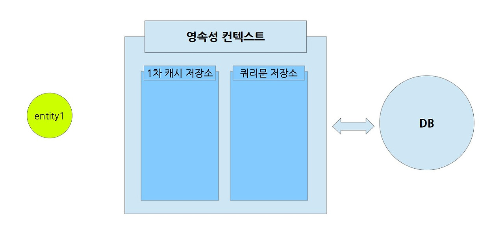

# Database & JPA

추가 일시: 2025년 3월 28일 오후 4:57
강의: Appcenter_Server

# 💾 Database & JPA

---

## 🍀 ORM은 무엇일까요? 스프링에서 ORM을 어떻게 이용할 수 있을까요?

---

### ✅ ORM은 무엇이고 왜 필요할까요?

ORM은 Object-Relational Mapping , 객체-관계 매핑으로 객체 지향 프로그래밍 언어에서 사용하는 객체 모델과 관계형 DB간의 불일치를 해결하기 위해 사용하는 기술입니다. 

이를 통해 개발자는 DB를 SQL문 대신 프로그래밍 언어의 객체 형태로 조작할 수 있습니다.

(ORM에 대한 GPT의 답변)

<aside>
📌

### **ORM이 필요한 이유**

1. **패러다임의 불일치 해결**
    - 객체 지향 프로그램은 데이터와 행동을 묶는 클래스 및 객체를 사용합니다.
    - 관계형 데이터베이스는 데이터를 표 형태로 저장하고 SQL 쿼리를 사용합니다.
    - ORM은 이 두 가지 패러다임 사이의 불일치를 줄이고 개발 효율성을 높입니다.
2. **생산성 향상**
    - SQL을 직접 작성할 필요가 없으므로, 개발자는 데이터베이스 접근 코드를 간편히 작성하고 유지보수할 수 있습니다.
    - CRUD(Create, Read, Update, Delete) 작업의 코드량이 현저히 줄어듭니다.
3. **유지보수 용이성**
    - 데이터베이스 구조 변경 시 매핑 정보만 수정하면 되므로, 코드의 다른 부분은 영향을 적게 받습니다.
    - 코드 가독성이 높아지고, 중복 코드가 감소합니다.
4. **데이터베이스 독립성**
    - 특정 데이터베이스 벤더에 종속되지 않고, 설정 변경만으로 다양한 데이터베이스를 사용할 수 있도록 지원합니다.
    - 예: MySQL에서 PostgreSQL 또는 Oracle로 쉽게 전환 가능
5. **코드 가독성과 추상화**
    - SQL 쿼리를 사용하지 않고 객체 중심으로 코드를 표현할 수 있어 비즈니스 로직에 집중할 수 있습니다.
    - 객체와 데이터베이스 테이블 간의 관계를 명확히 나타내 코드의 의도를 쉽게 이해할 수 있습니다.
</aside>

## 🍀영속성 컨텍스트는 무엇일까요?

---

영속성 컨텍스트는 JPA의 핵심 개념 중 하나로 엔티티의 생명주기를 관리하는 컨테이너를 의미합니다.

논리적인 영역으로 Server와 DataBase 중간에 위치합니다.

### ✅ 영속성 컨텍스트의 생명주기는 어떻게 되나요?

1️⃣ **비영속 상태**

엔티티가 영속성 컨텍스트와 관련이 없는 상태

```java
//비영속 상태

Entitiy entity1 = new Entity();
```



2️⃣ **영속 상태**

엔티티가 영속성 컨텍스트에서 관리되고 있는 상태

여러개의 엔티티를 persist()하더라도, 아직 DB에 접근하지는 않고 쿼리문을 보관하고 있게 됩니다.

```java
EntityManager em = emf.createEntityManager();
EntityTransaction tx = em.getTransaction();
tx.begin();

//영속성 컨텍스트가 관리하는 상태
em.persist(entity1);
em.persist(entity2);
```


아직은 DB에 접근하지 않고 영속성 컨텍스트 내에서만 관리되고 있습니다.

```java
//저장하고 있던 쿼리문을 DB에 반영
em.flush();
```


flush()를 통해 DB에 쿼리문을 반영하게 됩니다.

이후 같은 엔티티를 조회하면 DB에 접근하지 않고 1차 캐시 저장소에 있는 엔티티를 반환합니다.

3️⃣ **준영속 상태**

영속성 컨텍스트에서 관리되던 엔티티가 영속성 컨텍스트에서 관리되지 않음

```java
/* 영속성 컨텍스트에서 관리하던 엔티티를 준영속 상태로 만드는 3가지 방법 */

// 1. detach()를 사용하여 특정 엔티티를 준영속 상태로 만들 수 있다.
em.detach(entity2);

// 2. clear()를 사용하여 영속성 컨텍스트 내 모든 엔티티와 쿼리문을 초기화한다.
em.clear();

// 3. close()를 사용하여 영속성 컨텍스트 자체를 닫는다.
em.close();
```

1. detach()를 사용하여 특정 엔티티를 준영속 상태로 만들 수 있다.


영속성 컨텍스트에서 특정 엔티티를 준영속상태로 만들기 위해 detach()함수를 사용할 수 있습니다.

다만, 엔티티는 준영속상태가 되더라도 식별자(Primary Key)는 유지됩니다.

1. clear()를 사용하여 영속성 컨텍스트 전체를 초기화 할 수 있습니다.


1. close() 함수를 사용하여 영속성 컨텍스트 자체를 닫을 수 있습니다.


4️⃣ **삭제 상태**

엔티티를 영속성 컨텍스트에서 관리하지 않고, 쿼리문 저장소에 해당 엔티티를 DB에서 삭제하는 DELETE 쿼리문을 보관합니다.

```java
em.remove(entity2);
```


### ✅ 영속성 컨텍스트의 특징에는 어떤게 있을까요?

1. 1차 캐시

영속성 컨텍스트 내부에 1차 캐시가 존재하여, 엔티티를 조회했을 때 1차 캐시에 존재한다면 DB에 접근 할 필요가 없다.

1. 영속 엔티티의 동일성 보장

```java
Entity e1 = em.find(Entity.class, "entity1");
Entity e2 = em.find(Entity.class, "entity1");

// e1 == e2 -> true
```

1. 트랜잭션을 지원하는 쓰기 지연

flush 되기 전까지 DB에 쿼리를 날리지 않기 때문에 쓰기 지연을 이용한 트랜잭션을 지원한다.

(flush 호출에 대한 이슈)

1. 변경감지

```java
entity1.setName("seokhwan");
entity1.setAge(20);
```

영속성 컨텍스트에서 엔티티를 수정했을 때 일련의 과정 없이, 영속성 컨텍스트 내의 스냅샷과 엔티티를 비교하여 변경사항을 확인하고 UPDATE 쿼리문을 자동으로 생성한다.

1. 지연 로딩

지연 로딩은 연관된 엔티티를 즉시 DB에서 가져오지 않고, 실제 사용할 때까지 로딩을 늦추는 방식

post(글 관련 엔티티)와 member(회원 엔티티)가 다대일 관계로 매핑되어있을 때

member 엔티티를 즉시 DB에 접근하여 가져오지 않고

실제 사용할 때만 프록시 객체를 사용하여 DB에 접근한다.

```java
// public class PostEntity
// 작성자(회원)와의 다대일(N:1) 관계
   @ManyToOne(fetch = FetchType.LAZY)
   @JoinColumn(name = "userId") // FK
   private MemberEntity member;
```

<aside>
💡

**프록시 객체란?**

프록시 객체는 원본 엔티티 클래스를 상속한 형태로 생성됩니다.

프록시 객체는 최소한의 데이터만을 유지하는 특징이 있어 실제 엔티티의 식별자(id)만 가지고 있습니다.

나머지 데이터는 실제 엔티티가 필요할 때 데이터베이스에서 로딩됩니다.

---

 엔티티에 나이, 이름 등의 값이 있다고 생각해보자

프록시 객체는 생성시 식별자(id)만을 가지고 있다.

이 때, 만약 나이에 해당하는 값이 필요하다면 해당하는 값만을 포함하는 프록시 객체를 반환하게 된다.

이 프록시 객체는 영속성 컨텍스트내 1차 캐시에 저장되어 사용 될 수 있다.

</aside>

## 🍀연관관계 매핑은 무엇이고 어떻게 활용할 수 있을까요?

---

관계형 데이터베이스에서 외래 키(foreign key)를 사용하여 연결하는 방법입니다.

### ✅ 연관관계 매핑은 왜 필요할까요?

연관관계 매핑을 하지 않은 경우와 매핑한 경우를 비교하며 알아봅시다.

~~(Chat gpt 코드 작성해줘~)~~

매핑 X

```java
// 회원 클래스
public class Member {
    private Long id;
    private String name;
}

// 주문 클래스
public class Order {
    private Long id;
    private Long memberId; // 외래 키를 객체지향스럽지 않게 직접 사용
}
```

다음 코드를 보면 객체지향스럽지 않은 설계임을 알 수 있습니다.

객체는 객체를 참조해야하는데, 실제로는 외래 키 값으로 참조하고 있습니다.

때문에 객체간의 연관성을 직관적으로 파악하기 어렵고 불필요한 데이터를 찾아내는 과정이 필요합니다.

연관된 객체를 가져올 때마다 반복적으로 코드를 작성해야 합니다.

```java
Order order = orderRepository.findById(1L);
Long memberId = order.getMemberId();
Member member = memberRepository.findById(memberId); // 명시적 조회 필요!
```

매핑 O

```java
@Entity
public class Member {
    @Id @GeneratedValue
    private Long id;
    private String name;

    @OneToMany(mappedBy = "member")
    private List<Order> orders = new ArrayList<>();
}

@Entity
public class Order {
    @Id @GeneratedValue
    private Long id;

    @ManyToOne(fetch = FetchType.LAZY)
    @JoinColumn(name = "member_id")
    private Member member;
}

```

다음 코드를 보면 객체가 객체를 참조하여 외래 키를 직접 다루지 않고 ORM이 자동으로 관리함을 알 수 있습니다.

또한 객체를 통한 접근도 간단하고 직관적인 것을 알 수 있습니다.

```java
Order order = entityManager.find(Order.class, 1L);
Member member = order.getMember(); // 객체를 통해 간단히 접근!
```

### ✅ 연관관계 매핑에는 어떤 종류가 있을까요?

1. 일대일(1:1) 관계 (`@OneToOne`)

2. 일대다(1:N) 관계 (`@OneToMany`)

3. 다대일(N:1) 관계 (`@ManyToOne`)

4. 다대다(N:M) 관계 (`@ManyToMany`)

**단방향 매핑**

설계가 간단하고 코드가 직관적입니다.

관리가 쉽고 복잡성이 낮습니다.

**양방향 매핑**

양방향으로 접근이 가능하여 편리한 조회가 가능합니다.

복잡성이 증가합니다.

외래키를 가진 쪽이 연관관계 주인이 됩니다.

❓ 그럼 양방향 매핑으로 접근하면 서로 접근할 때 편하니까 양방향 매핑으로 코딩할게요…


양방향 매핑에는 여러 문제가 있다.

일단 복잡성이 증가한다. ← 말이 쉽지 생각만해도 머리 아픔

🔁 **순환 참조 문제**

객체 A가 객체 B를 참조하고 객체 B가 객체 A을 참조하는 양방향 매핑은 대표적인 순환 참조이다.

이러한 순환 참조는 소프트웨어 설계에서 자주 볼 수 있는 대표적인 **안티패턴** 중 하나이다.

순환 참조가 발생한다는 것은 서로에게 강하게 의존한다는 의미.

사실할 하나의 컴포넌트라는 의미이며, 책임이 제대로 구분되어 있지 않다는 의미.

❓ 그럼 양방향 매핑이 필요하면 어떻게 해야하나요?

양방향 매핑이 필요하다면 중간 다리 역할을 하는 연결 엔티티를 두고 다대일, 일대다로 나누어 표현하자.

```java
예시 상황:
 - [학생(Student)] ↔︎ [수업(Course)] 다대다 관계
 
수정 후:
 [Student] 1 — (일대다) → N [Enrollment] N ← (다대일) — 1 [Course]
```

### ✅ 영속성 전이는 무엇이고 어떻게 활용할 수 있을까요?

영속성 전이는 엔티티 간의 연관관계를 매칭할 떄 한 엔티티의 영속성 상태 변화를 다른 엔티티로 자동으로 전파하는 기능입니다.

부모 엔티티가 저장, 수정, 삭제 등의 변화가 있을 떄, 자식 엔티티의 상태까지 자동으로 관리하는 방식을 의미합니다.

영속성 전이를 통해 엔티티의 생명주기를 효율적으로 관리 할 수 있습니다.

영속성 전이의 유형

📌 **영속성 전이(Cascade)의 종류**

| CascadeType | 설명 및 활용 |
| --- | --- |
| **PERSIST** | 부모 엔티티가 저장될 때, 자식 엔티티도 함께 저장 |
| **REMOVE** | 부모 엔티티가 삭제될 때, 자식 엔티티도 함께 삭제 |
| **MERGE** | 부모 엔티티가 병합(merge)될 때, 자식 엔티티도 함께 병합 |
| **REFRESH** | 부모 엔티티가 refresh될 때, 자식 엔티티도 함께 refresh |
| **DETACH** | 부모 엔티티가 detach(준영속 상태 전환)될 때, 자식 엔티티도 함께 detach |
| **ALL** | 위의 모든 상태 변화가 자식 엔티티로 자동 전파 |

```java
@OneToMany(mappedBy = "member", cascade = CascadeType.ALL)
```

⚠️ **주의점 !**

다만, 부모-자식의 생명주기가 명확하게 동일한 경우에만 사용해야 합니다.

자식엔티티가 의도치 않게 삭제되는 상황이 발생할 수 있습니다.

## ☘️Entity는 무엇이고 생명주기는 어떻게 되나요? 생성자 패턴이 무엇일까요?

---

### ✅ Entity는 무엇인가요?

엔티티는 DB의 테이블과 자바 객체간의 ORM을 지원하는 객체 입니다.

비영속, 영속, 준영속, 삭제 삭태로 이루어져 있으며 영속상태일 때만 JPA가 관리하며, 비영속 또는 준영속 상태에서는 JPA가 관리하지 않습니다.

### ✅ Entity 객체 생성 방법으로 무엇이 있을까요?

**기본 생성자 사용**

```java
protected User() {} // JPA가 사용하는 기본 생성자
```

**생성자 패턴 사용**

```java
@Entity
public class User {

  @Id @GeneratedValue
  private Long id;

  private String username;
  private int age;

  protected User() {}

  public User(String username, int age) {
    this.username = username;
    this.age = age;
  }
}

// 객체 생성 시
User user = new User("john", 25);

```

**빌더 패턴 사용**

아마 해당 패턴을 공부했으면 하는 마음에 해당 주제가 있는 것 같다.

코드로 살펴보자

```java
@Entity
public class User {

  @Id @GeneratedValue
  private Long id;

  private String username;
  private int age;
  private String email;

  protected User() {}

  @Builder
  private User(String username, int age, String email) {
    this.username = username;
    this.age = age;
    this.email = email;
  }
}

User user = User.builder()
                .username("john")
                .age(30)
                .email("john@example.com")
                .build();

```

빌더 패턴을 사용하면 가독성을 높힐 수 있다.

로직이 복잡해지면 클래스가 커지고 지저분해지는 다른 패턴과 달리 빌더 패턴을 사용하면 다음과 같이 가독성이 올라간다.

다만, 간단한 객체에는 조금 과할 수 있다.

## 🔎 과제

**1. 현재 널리 사용되고 있는 서비스(당근마켓, 배달의 민족, 유튜브 등)의 ERD 설계해보기**
→ 전체 서비스가 아니어도 기능 중 일부 ERD도 가능!


**2. 설계된 ERD를 기반으로 Entity와 Repository Layer 구성해보기**


UserEntity

```java

package com.blog.appcenter_server_week2.Entity;

import jakarta.persistence.*;
import lombok.Getter;
import lombok.NoArgsConstructor;
import org.hibernate.annotations.ColumnDefault;

@Entity
@Getter
@NoArgsConstructor
@Table(name = "user_table")
public class UserEntity {

    @Id
    @GeneratedValue(strategy = GenerationType.IDENTITY) //auto_increment
    private Long id;

    @Column(nullable = false, unique = true)
    private String loginId;

    @Column(nullable = false)
    private String password;

    @Column(nullable = false, length = 20)
    private String nickname;

    @Column(nullable = false, length = 20)
    private String location;

    @Column
    private String profile_url;

    @Column
    private Double manner;

}
```

ProductEntity

```java
package com.blog.appcenter_server_week2.Entity;

import jakarta.persistence.*;
import lombok.Getter;
import lombok.NoArgsConstructor;

@Entity
@Getter
@NoArgsConstructor
@Table(name = "product_table")
public class ProductEntity {
    @Id
    @GeneratedValue(strategy = GenerationType.IDENTITY) //auto_increment
    private Long key;

    @Column(nullable = false)
    private Long price;

    @Column(nullable = false, length = 100)
    private String title;

    @Column(nullable = false, columnDefinition = "TEXT")
    private String description;

    @Column(nullable = false, length = 20)
    private String location;

    @Column(nullable = false)
    private Long heart;

    @Column(nullable = false)
    private int product_state;

    // 작성자(유저)와의 다대일(N:1) 관계
    @ManyToOne(fetch = FetchType.LAZY)
    @JoinColumn(name = "seller_id") // FK
    private UserEntity user;
}
```

UserRepository

```java
package com.blog.appcenter_server_week2.Repository;

import com.blog.appcenter_server_week2.Entity.UserEntity;
import org.springframework.data.jpa.repository.JpaRepository;

public interface UserRepository extends JpaRepository<UserEntity, Long> {
	Optional<UserEntity> findByLoginId(String loginId); //Spring에서 
}
```

ProductRepository

```java
package com.blog.appcenter_server_week2.Repository;

import org.springframework.data.jpa.repository.JpaRepository;
import com.blog.appcenter_server_week2.Entity.ProductEntity;

public interface ProductRepository extends JpaRepository<ProductEntity, Long>{

}
```

**3. Spring과 데이터베이스 연결해보기** 

```java
# database 연동 설정
spring:
  datasource:
    driver-class-name: com.mysql.cj.jdbc.Driver
    url: jdbc:mysql://localhost:3306/server_study?serverTimezone=Asia/Seoul&characterEncoding=UTF-8
    username: root
    password: root
  thymeleaf:
    cache: false

  # spring data jpa 설정
  jpa:
    database-platform: org.hibernate.dialect.MySQL8Dialect
    open-in-view: false
    show-sql: true
    hibernate:
      ddl-auto: create //처음이라 crate로 생성했음
```


server_study 생성된 모습