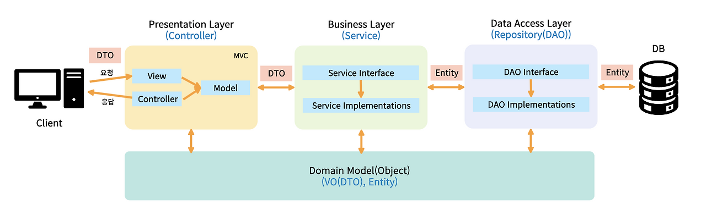

# Controller & Service Layer

---

## 공통 주제

### 🍀 Controller Layer는 무엇인가요?

1. Controller Layer는 어떤 역할을 하며, 어떤 구조로 이루어져 있나요?
    
    먼저 Controller가 무엇이었는지 되짚어 보자.
    
    **Controller**
    
    - 실제 요청을 처리하는 로직을 담은 클래스이다.
        - 서비스 계층을 호출해 비즈니스 로직을 처리한다.
    - 요청 파라미터를 받고, 필요한 처리를 한 후, 결과(Model)와 View 이름을 반환한다.
    - 개발자가 직접 구현하는 부분이다.
    
    Controller Layer는 여러 개의 Controller들이 모여 구성된 계층(Layer)를 뜻한다.
    
    
    
    Spring의 웹 계층은 위 그림처럼 4가지로 나뉜다.
    
    - **Domain Model**
    - Presentation Layer(**Controller**)
    - Business Layer(**Service** Layer)
    - Data Access Layer(**Repository** Layer)
    
    이처럼 시스템의 구성 요소를 여러 개의 **계층으로 분리**하여 **각 계층이 특정 역할을 수행**하도록 하는 패턴을 **계층형 아키텍쳐(Layered Architecture)**라고 한다.
    
    ⇒ 시스템의 유지보수성과 확장성을 향상
    
    위 그림에서, Presentation Layer는 사용자와 시스템 사이의 상호 작용을 처리한다. 즉, 사용자의 요청을 받아 처리한 후 응답을 반환해준다. Spring에서는 Controller의 역할이 이에 속한다.
    
    ```java
    @RestController //REST API 명시
    @RequestMapping("/api/users")
    public class UserController {
    
        private final UserService userService;
    
        public UserController(UserService userService) { //의존성 주입
            this.userService = userService;
        }
    
        @GetMapping("/{id}")
        public ResponseEntity<UserDto> getUser(@PathVariable Long id) {
            UserDto user = userService.findUser(id); //비즈니스 로직은 Service에서 처리
            return ResponseEntity.ok(user); //응답 반환
        }
    }
    ```
    
    1. 클라이언트 요청 받음 → 적절한 서비스 호출 → 응답 반환
    2. 직접 처리 X, Service Layer에 위임
    
2. ResponseEntity는 무엇이며, 어떻게 활용할 수 있나요?
    - Spring Framework에서 제공하는 클래스
    - HTTP 응답 제어에 사용 → 세밀한 제어 가능
    - HttpEntity<T>를 상속
        - HTTP request와 response에 사용될 수 있는 객체
        - 헤더와 바디를 가짐
    
    1. HTTP 상태 코드 설정
        1. 상태 코드: 클라이언트에게 요청 처리 결과를 알려줌
            - 2xx → 성공
            - 4xx → 클라이언트 오류
            - 5xx → 서버 오류
            - ⇒ 요청 결과를 이해하고 적절한 조치를 취하는데 도움을 줌
    2. Response Header 추가
        1. 클라이언트와 서버가 요청 또는 응답으로 부가적인 정보를 전송할 수 있도록 함
            
            
            | 분류 | 적용 대상 | 설명 |
            | --- | --- | --- |
            | General Header | 요청/응답 공통 | 메시지 전체에 관련된 일반적인 정보 |
            | Request Header | 요청 전용 | 클라이언트가 서버에 정보를 제공 (브라우저 정보, 인증 등) |
            | Response Header | 응답 전용 | 서버가 클라이언트에 정보를 제공 (서버 정보, 쿠키 등) |
            | Entity Header | 요청/응답 모두 | 메시지의 Body(실제 데이터)의 속성 관련 정보 |
    3. Response Body 관리
        1. 클라이언트에게 전달할 실제 데이터를 포함
        2. 일반적으로 JSON 형식으로 데이터 전송
    
    ```java
    @GetMapping
    public ResponseEntity<String> handleSuccess() {
        return ResponseEntity.ok("요청이 성공적으로 처리되었습니다.");
    }
    ```
    
    ```java
    @PostMapping
    public ResponseEntity<String> handleError() {
        return ResponseEntity.badRequest().body("잘못된 요청입니다.");
    }
    ```
    

### 🍀 Service Layer는 무엇인가요?

1. Service Layer는 어떤 역할을 하며, 어떤 구조로 이루어져 있나요?
    
    **Service**
    
    - 컨트롤러로부터 전달받은 요청을 처리하고, 필요한 데이터를 가공한다.
        - ⇒ 핵심 비즈니스 로직을 담당하는 계층이다.
    - 개발자가 직접 구현하는 부분이다.
    
    사용자 입력 검증, DB에 정보 저장, 이메일 인증 등…
    
    ```java
    @Service
    public class UserService {
    
        private final UserRepository userRepository;
    
        public UserDto findUser(Long id) {
            User user = userRepository.findById(id)
                                      .orElseThrow(() -> new RuntimeException("User not found"));
            return new UserDto(user);
        }
    }
    ```
    

### 🍀 Spring에서 요청을 어떤 방식으로 처리하나요?

1. 요청과 응답이란 무엇인가요?
    - 요청: 클라이언트 → 서버 (GET, POST 등)
        - 클라이언트의 의도
    - 응답: 서버 → 클라이언트 (상태 코드, 바디 등)
        - 서버의 처리 결과
    1. 요청과 응답에는 어떤 값이 담기나요?
        - 요청
            - HTTP 메서드: GET, POST, PUT, DELETE
            - URL: 요청하는 리소스의 경로(어떤 리소스를 요청하는가)
            - 헤더: 클라이언트 정보, 인증 정보, 콘텐츠 타입 등
            - 쿼리 파라미터: URL 뒤에 붙는 추가 조건
            - 바디: 주로 POST/PUT 요청에서 JSON/XML 등으로 데이터 전송
            
            <aside>
            POST /register HTTP/1.1 
            Content-Type: application/json
            Authorization: Bearer abcdef123456
            </aside>
          
            ```json
            {
            "username": "user",
            "password": "user123"
            }
            ```
            
        - 응답
            - 상태 코드:  요청 성공, 실패, 에러 여부
            - 헤더: 서버 정보, 쿠키 설정, 응답 타입 등
            - 바디: 응답 데이터(JSON, HTML 등)
            
            <aside>
            HTTP/1.1 201 Created
            Content-Type: application/json
            Set-Cookie: sessionId=xyz789; HttpOnly
            </aside>
            {
              "message": "회원가입 성공",
              "userId": 42
            }
            
            ```
            
    
2. Spring에서 요청을 어떻게 처리하나요?
    - 클라이언트 요청 → DispatcherServlet(역직렬화)
        - 클라이언트가 HTTP 요청을 보내면, 이 요청은 Spring의 DispatcherServlet에 의해 수신됨
        - DispatcherServlet은 모든 HTTP 요청을 중앙에서 관리하고, 적절한 핸들러(컨트롤러)로 요청을 전달하는 역할
    - 적절한 Controller로 전달
        - DispatcherServlet은 요청의 URL과 메서드 타입(예: GET, POST 등)을 기반으로 적절한 컨트롤러를 찾음
    - Service → Repository → DB 처리
        - 컨트롤러에 의해 서비스 계층 호출
        - 서비스는 필요한 데이터를 DB에서 가져오기 위해 Repository 호출
        - Repository는 DB와의 상호작용을 담당
    - 결과 반환 → Controller → DispatcherServlet → 클라이언트(직렬화)
        - DB에서 가져온 결과는 다시 서비스 계층을 통해 컨트롤러로 전달
        - 최종적으로 DispatcherServlet을 통해 클라이언트에게 응답으로 반환
        
        ```java
        @RestController
        public class UserController {
        
            @PostMapping("/register")
            public ResponseEntity<?> register(@RequestBody UserDto userDto) {
                // 1. 요청 JSON → UserDto 역직렬화
                // 2. 서비스 로직 실행
                // 3. 응답 JSON → 직렬화되어 반환
        
                return ResponseEntity
                        .status(HttpStatus.CREATED)
                        .body(Map.of("message", "회원가입 성공", "userId", 42));
            }
        }
        
        ```
        
    1. **스프링에서 객체의 직렬화와 역직렬화는 어떻게 이뤄질까요?**
        - 직렬화: Java 객체를 JSON 형식으로 변환하여 클라이언트에 전송
            - 클라이언트가 이해할 수 있는 형식으로 데이터를 전송하기 위해
            1. Controller가 Java 객체를 반환
            2. `@ResponseBody`, 혹은 `RestController`로 응답이 body에 직접 쓰여야 함을 인식
            3. 등록된 `HttpMessageConverter` 중 JSON 컨버터가 선택됨
            4. 내부적으로 `ObjectMapper.writeValueAsString()` 사용
            5. Java 객체 → JSON 문자열로 직렬화
            6. 클라이언트에게 응답 전송
            
        - 역직렬화: 클라이언트로부터 받은 JSON 데이터를 Java 객체로 변환
            - 서버가 클라이언트의 요청을 처리하기 위해 필요한 데이터 형식으로 변환
            1. 클라이언트가 HTTP 요청을 전송 (`Content-Type: application/json`)
            2. Spring MVC가 요청을 DispatcherServlet으로 전달
            3. Controller의 메서드에 `@RequestBody`가 선언된 파라미터 발견
            4. 스프링은 등록된 `HttpMessageConverter` 목록에서 JSON용 컨버터인 `MappingJackson2HttpMessageConverter` 를 선택
            5. 위 컨버터가 내부적으로 `ObjectMapper.readValue()`를 사용해 JSON 문자열 → Java 객체로 변환 (역직렬화)
            6. 그 결과 객체가 컨트롤러 메서드의 파라미터로 전달됨
        
    2. **ObjectMapper의 작동방식**
        - Jackson 라이브러리에서 제공하는 클래스 중 하나
            - Java 객체와 JSON 간의 변환(직렬화, 역직렬화)을 지원하는 Java JSON 처리 라이브러리
        - 내부적으로 JSON ↔ Java 객체 변환 담당(직렬화, 역직렬화 수행)
        - JSON 처리 방식을 세밀하게 조정 가능
        
    3. @RequestBody과 @ModelAttribute는 어떤 차이가 있으며 언제 사용해야 할까요?
        - 공통점
            - 목적: HTTP 요청 데이터를 Java 객체로 자동 연결
            - 사용 대상: Controller의 파라미터로 사용되는 DTO
        - @RequestBody
            - HTTP 요청의 바디 내용을 객체로 변환
            - 주로 JSON 데이터 처리에 사용
        - @ModelAttribute
            - 요청 파라미터를 객체로 변환
            - 주로 HTML 폼 데이터 처리에 사용
        
        ```java
        @PostMapping("/user")
        public ResponseEntity<String> createUser(@RequestBody UserDTO userDTO) {
            // JSON 데이터를 UserDTO로 변환
        }
        
        @PostMapping("/form")
        public ResponseEntity<String> submitForm(@ModelAttribute UserDTO userDTO) {
            // HTML 폼 데이터를 UserDTO로 변환
        }
        ```
        
    4. @PathVariable와 @RequestParam은 어떤 차이가 있으며 언제 사용해야 할까요?
        - @PathVariable: URL 경로의 일부를 변수로 사용
            - 경로에 식별자(id)를 넣고 싶을 때 사용
        - @RequestParam: 검색 조건, 필터, 옵션 등에서 사용(데이터가 선택적이고, 여러 개의 파라미터 가능할 때)
        
        | 구분 | @PathVariable | @RequestParam |
        | --- | --- | --- |
        | 위치 | URL 경로 변수 | 쿼리 파라미터 |
        | 예시 | `/users/{id}` | `/users?id=1` |
        | 사용 시 | 특정 자원 식별 | 필터링, 조건 검색 등 |
        
        ```java
        @GetMapping("/users/{id}")
        public ResponseEntity<User> getUser(@PathVariable Long id) {
            // URL 경로에서 id를 추출하여 사용자 조회
        }
        
        @GetMapping("/search")
        public ResponseEntity<List<User>> searchUsers(@RequestParam String name) {
            // 쿼리 파라미터에서 name을 추출하여 사용자 검색
        }
        
        @GetMapping("/user/{id}/detail") //함께 사용
        public String getUserDetail(@PathVariable Long id, @RequestParam String lang) {
            return "User ID: " + id + ", Language: " + lang;
        }
        ```
        

### 🍀 데이터 전달 객체란 무엇인가요? 그리고 Transaction은 무엇인가요?

1. Spring에서 데이터 전달 객체로 무엇이 있나요?
    
    데이터 전달 객체: DB와의 상호작용이나 네트워크 통신을 위해 데이터 전송에 사용되는 객체
    
    - 필요한 데이터만 포함하여 전송 → 데이터 전송의 효율성 향상, 네트워크 대역폭 절약
    
    DTO(Data Transfer Object)
    
    - 계층 간 데이터 교환
        - 왜 Entity 객체를 그대로 사용하지 않는가?
            - 계층을 분리하기 위해서
            - 필요한 정보만을 노출하기 위해서
            - 필요한 데이터만 전송하여 성능을 향상하기 위해서
            - 유지보수를 용이하게 하기 위해서
    - 불변성을 가지는 것이 좋음 (데이터 전송 목적 → 상태 유지가 일반적)
    
    1. DAO, DTO, VO는 각각 무엇이며, 어떤 차이점이 있나요?
        
        DAO(Data Access Object)
        
        - DB 데이터에 접근하기 위한 객체 (Service ↔ DB 연결)
            - DB 접근 로직과 비즈니스 로직 분리
        - ex) JPA에서, DB에 데이터를 CRUD 하는 Repository 객체들
        
        VO(Value Object)
        
        - 값 자체에 의미가 있는 불변 객체(생성 후 변경 불가)
            - setter 사용하지 않음
        - 도메인에서 한 개 또는 그 이상의 속성들을 묶어서 특정 값을 나타내는 객체
            - 단순 String 대신 Email, PhoneNumber VO로 의미 분리
        - 두 객체의 필드 값이 같으면, 동일한 객체로 간주
        
        ```java
        public class Main {
            public static void main(String[] args) {
                Address address1 = new Address("Seoul", "Songdo");
                Address address2 = new Address("Seoul", "Songdo");
        
                // 주소는 다름
                System.out.println(address1 == address2);  // false
        
                // 값은 같음 (VO 특성상 동일로 간주)
                System.out.println(address1.equals(address2));  // true
            }
        }
        ```
        
        <aside>
        
        ❓ 궁금한 점: VO도 데이터 전달객체인가?
        
        (’데이터 전달 객체’를 서치하면 DTO와 함께 묶어 소개하는 경우가 있어서 조금 헷갈립니다.)
        
        </aside>
        
2. **Transaction은 무엇인가요?**
    - 여러 DB 작업을 하나의 작업 단위로 묶은 것
        - 여러 개의 DB 연산(INSERT, UPDATE, DELETE)이 하나의 논리적인 작업 단위로 실행됨
        - 모든 작업이 성공하면 commit, 하나라도 실패하면 rollback (일관성 보장)
        
    1. ACID 원칙은 무엇인가요?
        - A - Atomicity(원자성) : 트랜잭션은 전부 성공하거나, 전부 실패해야 한다
            
            <aside>
            
            A → B로 돈을 이체하는 경우
            
            1. A 계좌에서 10만원 차감
            2. B 계좌에 10만원 추가
                
                → 하나라도 실패하면 둘 다 취소 되어야 데이터가 꼬이지 않음
                
            </aside>
            
        
        - C - Consistency(일관성) : 트랜잭션 전후 데이터가 정의된 규칙(무결성 제약 조건 등)을 항상 만족해야 한다
            
            <aside>
            
            1. 테이블에 "나이"는 반드시 0보다 커야 한다는 제약 조건이 있음
            2. 사용자가 나이를 -5로 입력하고 저장
                
                → 커밋 전에 제약 조건이 깨진다면, 저장 자체가 실패
                
            </aside>
            
        
        - I - Isolation(격리성) : 여러 트랜잭션이 동시에 실행되더라도, 각 트랜잭션이 서로 영향을 주지 않아야 한다.
            
            <aside>
            
            1. 사용자 A가 상품의 재고 수량을 수정 중 (트랜잭션1)
            2. 동시에 사용자 B가 같은 상품을 주문해서 재고를 차감하려고 함 (트랜잭션2)
                
                →  A의 수정이 완료되기 전, B가 먼저 재고를 읽어서 주문하면 잘못된 재고 수량으로 처리될 수 있음
                
                → 각각의 요청이 서로 영향을 미치지 않도록 격리
                
            </aside>
            
        
        - D - Durability(지속성) :  트랜잭션이 커밋된 후에는 시스템에 결함이 발생하더라도 데이터가 영구 반영되어야 한다.
            
            <aside>
            
            1. 사용자가 송금을 완료했고, 트랜잭션이 성공적으로 커밋됨
            2. 그 직후 서버가 다운되거나 전원이 꺼짐
                
                → 송금 내용은 사라지면 안 됨
                
                → DB는 커밋된 데이터를 디스크 등에 안전하게 저장해두어야 함
                
            </aside>
            
    
    b. Spring에서는 Transaction을 어떤 방식으로 관리하나요?(**@Transcational**)
    
    <aside>
    
    [클라이언트 요청]
    ↓
    [AOP 프록시 객체] → 트랜잭션 시작
    ↓
    [실제 서비스 객체 실행]
    ↓
    [AOP 프록시 객체] → 트랜잭션 커밋/롤백
    ↓
    [응답 반환]
    
    </aside>
    
    <aside>
    
    클라이언트 → 서비스 메서드 호출 (@Transactional)
    
    → 트랜잭션 시작
    
    → 영속성 컨텍스트 생성
    
    → DB 작업 (엔티티 저장/조회 등)
    
    → 메서드 종료 시점에 트랜잭션 커밋 (flush 발생)
    
    → 영속성 컨텍스트 종료(준영속 상태로 전환)
    
    </aside>
    
    ```java
    @Transactional
    public void transferMoney() {
        accountRepository.decreaseBalance(1, 1000); // A계좌에서 출금
        accountRepository.increaseBalance(2, 1000); // B계좌에 입금
    }
    ```
    
    1. `@Transactional`이 붙은 `transferMoney()` 메서드가 호출됨
    2. 스프링 AOP 프록시가 감지하여 트랜잭션 시작 
    3. `decreaseBalance()` 실행
    4. `increaseBalance()` 실행
    5. 예외가 발생하지 않으면 `COMMIT`
    6. 예외 발생 시 `ROLLBACK` 처리
    
    @Transaction 옵션
    
    - propagation
        - 하나의 트랜잭션 내에서 다른 메서드를 호출할 때, 기존 트랜잭션을 이어서 쓸지, 새 트랜잭션을 만들지 결정
        - `REQUIRED` (기본값) : 기존 트랜잭션이 있으면 참여, 없으면 새로 시작
    - isolation
        - 동시에 실행되는 트랜잭션 간의 데이터 접근 충돌을 어떻게 제어할 것인지 결정
        - `READ_COMMITTED` (이상 권장) : 커밋된 데이터만 읽음
    - rollbackFor / noRollabackFor
        - 롤백 대상 명시적 지정(롤백해야 할 예외/하지 말아야 할 예외)
            
            ```java
            @Transactional(rollbackFor = IOException.class)
            ```
            
    - readOnly
        - 데이터를 읽기만 하는 트랜잭션인 경우, 성능 향상을 위해 사용
            
            ```java
            @Transactional(readOnly = true)
            public List<User> findAllUsers() {
                return userRepository.findAll();
            }
            ```
            
    - timeout
        - 트랜잭션이 지정한 시간 내에 완료되지 않으면 자동 롤백 (단위: 초)
    
    | 옵션명 | 역할 | 기본값 |
    | --- | --- | --- |
    | propagation | 트랜잭션 전파 방식 설정 | REQUIRED |
    | isolation | 트랜잭션 격리 수준 설정 | DB 기본값 |
    | rollbackFor / noRollbackFor | 롤백 대상 지정 | RuntimeException만 자동 롤백 |
    | readOnly | 읽기 전용 트랜잭션 여부 | false |
    | timeout | 제한 시간 내에 커밋 안 되면 롤백 | -1 (제한 없음) |
    

## 🔎 과제


