# Controller & Service Layer

---

## 공통 주제

### 🍀 Controller Layer는 무엇인가요?

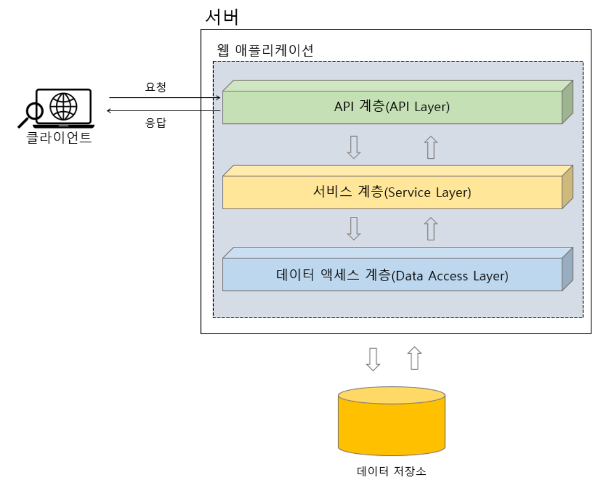

**REST API 기반 웹 애플리케이션의 계층**은 크게 API 계층(API Layer), 서비스 계층(Service Layer), 데이터 액세스 계층(Data Access Layer)으로 구분

위 사진의 API 계층에 해당됨(Controller )

1. Controller Layer는 어떤 역할을 하며, 어떤 구조로 이루어져 있나요?
    1. Spring의 4계층 구조에서 Presentation Layer를 담당하며, 주로 상요자의 요청을 받아 Service Layer에 처리를 위임하고 이에 대한 처리 결과를 View를 통해 반환하는 역할을 한다.
    2. HTTP 요청 처리(GET, POST, ..) ,파라미터 매핑, 서비스 호출, 응답 반환
    
    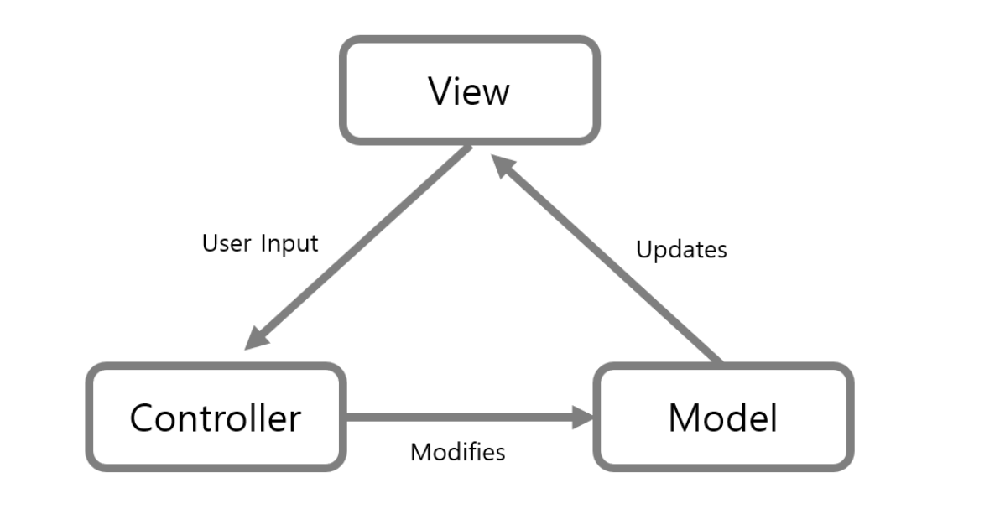
    
2. ResponseEntity는 무엇이며, 어떻게 활용할 수 있나요?
    1. ResponseEntity란, HttpEntity를 상속받는, 결과 데이터와 HTTP 상태 코드를 직접 제어할 수 있는 클래스
    2. HttpStatus, HttpHeaders, HttpBody를 포함
    3. 필요에 맞게 생성자를 선택해서 사용
    
    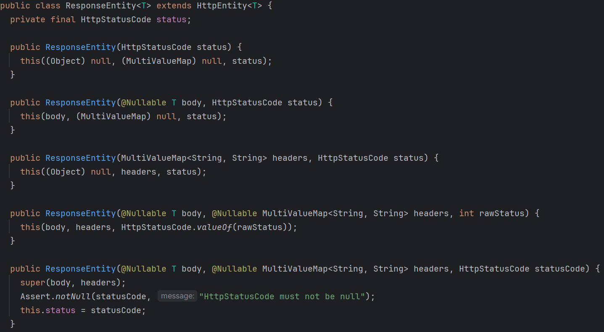
    
    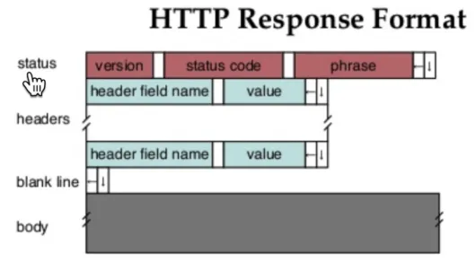
    

### 🍀 Service Layer는 무엇인가요?

**사용자의 요청에 대한 비즈니스 로직을 수행하는 계층**

Controller와 Repository 사이에서 핵심 로직을 처리하는 중간 관리자 역할

1. Service Layer는 어떤 역할을 하며, 어떤 구조로 이루어져 있나요?
    
    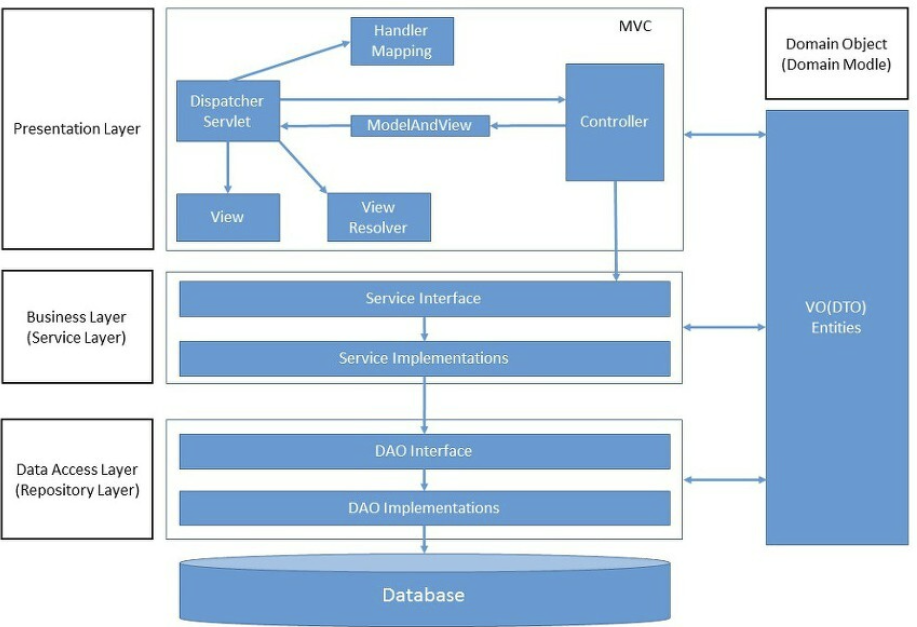
    
    - **비즈니스 로직의 분리와 중앙화 :** 도메인 객체간의 상호작용을 조정하고, Persistence Layer(DB와 연결하는 부분) 와 데이터를 주고 받으며, 한 기능 단위의 결과물을 Controller로 전달한다. 즉, Presentation Layer, Persistence Layer, Domain Model과 전부 상호 작용을 하며 핵심 비즈니스 로직을 처리하는 역할을 맡는다.

### 🍀 Spring에서 요청을 어떤 방식으로 처리하나요?

1. 클라이언트 요청 : 브라우저나 Postman 등에서 HTTP 요청 발생
2. DispatcherServlet : 모든 요청의 진입점. Front Controller 역할을 수행
3. HandlerMapping : 어떤 Controller가 이 요청을 처리할지 결정
4. Controller : 요청 처리 메서드 실행 (`@GetMapping`, `@PostMapping` 등)
5. Service : 비즈니스 로직 처리 (`@Service`)
6. Repository : DB와의 통신 담당 (`@Repository`, JPA 등)
7. 응답 생성 : 결과를 `ResponseEntity`, `ModelAndView`, `JSON` 등으로 변환
8. 클라이언트로 응답 반환 : 최종 응답을 HTTP로 전달

1. 요청과 응답이란 무엇인가요?
    1. 요청(Request) : 클라이언트가 서버에 보내는 데이터 요청 메시지
        1. 구성요소 : HTTP 메서드, URL, Headers, Body
    2. 응답(Response) : 서버가 클라이언트에게 보내는 결과 메시지
        1. 구성요소 : 상태  코드, Headers, Body
    
    1. 요청과 응답에는 어떤 값이 담기나요?
    
    ---
    
    1. HTTP 메서드 :  요청의 목적(GET, POST, PUT, PATCH, DELETE, ..)
    2. URL : 요청 리소스의 위치
    3. Request Header : 요청에 대한 부가 정보
        1. Content-Type : 전송 데이터 타입 (예 : application/json)
        2. Authorization : 인증 정보 (예 : JWT Token)
        3. Accept : 응답 받을 타입(예 : application/json)
    4. Request Param : 요청 파라미터(Query/String/Path Variable)
    5. Request Body : 요청 바디 (POST, PUT, PATCH 등에서 전송되는 실제 데이터)
    
    ---
    
    1. HTTP Status Code : 요청 처리 결과 상태를 숫자로 표현
    2. Response Header : 응답에 대한 정보
        1. Content-Type : 응답의 데이터 타입
        2. Set-Cookie : 쿠키 설정
        3. Cache-Control : 캐싱 관련 설정
    3. Response Body : 실제 데이터가 담기는 부분
    
2. Spring에서 요청을 어떻게 처리하나요?
    1. 클라이언트 요청 : 브라우저나 Postman 등에서 HTTP 요청 발생
    2. DispatcherServlet : 모든 요청의 진입점. Front Controller 역할을 수행
    3. HandlerMapping : 어떤 Controller가 이 요청을 처리할지 결정
    4. Controller : 요청 처리 메서드 실행 (`@GetMapping`, `@PostMapping` 등)
    5. Service : 비즈니스 로직 처리 (`@Service`)
    6. Repository : DB와의 통신 담당 (`@Repository`, JPA 등)
    7. 응답 생성 : 결과를 `ResponseEntity`, `ModelAndView`, `JSON` 등으로 변환
    8. 클라이언트로 응답 반환 : 최종 응답을 HTTP로 전달
    
    1. **스프링에서 객체의 직렬화와 역직렬화는 어떻게 이뤄질까요?**
        1. 직렬화 (**Serialization**) : 프로그램 내부에서 사용하는 객체나 데이터를 다른 프로그램에 전달하여 사용할 수 있도록 데이터의 형태를 바이트 (Byte) 형태로 변환하는 것을 의미
        2. 역직렬화 (**Deserialization**) : 바이트 형태로 받은 정보를 프로그램 내에서 다루는 것이 가능한 객체 형태로 다시 변환하는 것을 의미
        3. ObjectMapper가 스프링에서 직렬화/역직렬화를 해줌.
        
        - 스프링에서 자동으로 직렬화/역직렬화 가 되는 이유 :
            - implementation 'org.springframework.boot:spring-boot-starter-web’ 의존성을 추가하면 Jackson 라이브러리를 함께 가져옴. → 스프링은 Jackson 라이브러리 안에 있는 ObjectMapper를 사용해 자바 객체를 JSON으로 직렬화, 혹은 JSON을 자바 객체로 역직렬화 함
            
        
    2. **ObjectMapper의 작동방식**
    
    1. 직렬화(Serialize) : ObjectMapper가 리플렉션을 활용해서 객체로부터 JSON 형태의 문자열을 만들어 낸다.
    
    ```java
    String jsonResult = objectMapper.writeValueAsString(myDTO));
    ```
    
    1. 역직렬화(Deserialize) : ObjectMapper가 리플렉션을 활용해서 JSON 문자열로부터 객체를 만들어 낸다.
    
  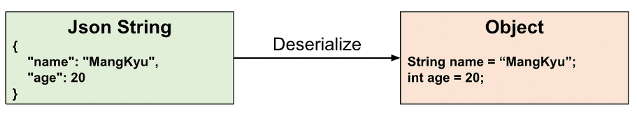
    
    기본 생성자로 객체를 생성함 → 필드값을 찾아서 값을 바인딩 해줌
    
    - 리플렉션(Reflection)이란?
        - “자바에서 '클래스', '필드', '메서드' 등의 정보를 런타임에 동적으로 조회하고 조작하는 기능” 즉, 컴파일 타임에 알 수 없는 객체에 대해 런타임에 알아내고 건드릴 수 있는 기술
    
    ```java
    public class User {
        private String name = "Alice";
        private int age = 25;
    }
    
    ----------------------reflection으로 분석-----------------
    // 필드 이름 -> JSON 키
    // 필드 값 -> JSON 값
    
    User user = new User();
    
    Class<?> clazz = user.getClass(); // 클래스 정보 얻기
    Field[] fields = clazz.getDeclaredFields(); // 모든 필드 얻기
    
    for (Field field : fields) {
        field.setAccessible(true); // private 필드에도 접근 가능
        System.out.println(field.getName() + " = " + field.get(user));
    }
    
    ---------------------- 출력--------------------------------
    name = Alice
    age = 25
    
    ```
    
    1. @RequestBody과 @ModelAttribute는 어떤 차이가 있으며 언제 사용해야 할까요?
        1. 공통점 : 클라이언트 측에서 보낸 데이터를 Java 코드에서 사용할 수 있는 오브젝트로 만들어줌
        2. @RequestBody : 클라이언트가 보내는 HTTP 요청 본문(JSON 및 XML 등)을 Java 오브젝트로 **변환**. HTTP 요청 본문 데이터는 Spring에서 제공하는 HttpMessageConverter를 통해 타입에 맞는 객체로 변환
        3. @RequestBody를 사용하면 요청 본문의 JSON, XML, Text 등의 데이터가 적합한 HttpMessageConverter를 통해 파싱되어 Java 객체로 **변환**
        4. @RequestBody를 사용할 객체는 필드를 바인딩할 생성자나 setter 메서드가 필요없다.
            1. 직렬화를 위해 기본 생성자는 필수다.
            2. 데이터 바인딩을 위한 필드명을 알아내기 위해 getter나 setter 중 1가지는 정의되어 있어야 한다.
            
        5. @ModelAttribute : 클라이언트가 보내는 HTTP 파라미터들을 특정 Java Object에 **바인딩(맵핑)** 하는 것
            1. 객체의 필드에 접근해 데이터를 바인딩할 수 있는 생성자 혹은 setter 메서드가 필요
            2.  Query String 및 Form 형식이 아닌 데이터는 처리할 수 없다.
        
        @RequestBody 를 썼을 때
        
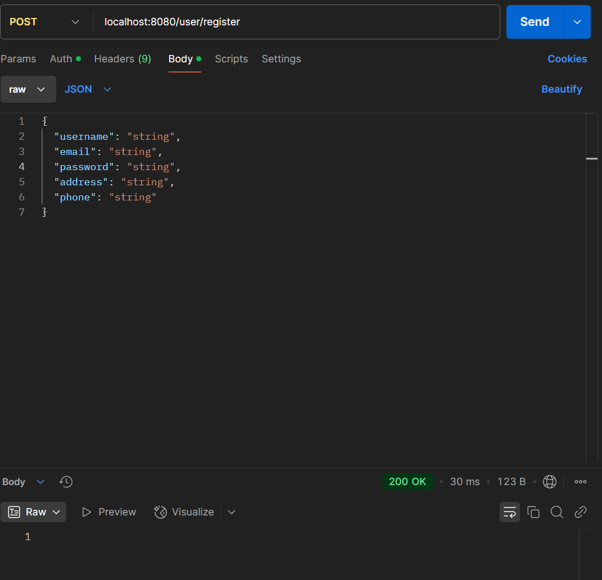
        
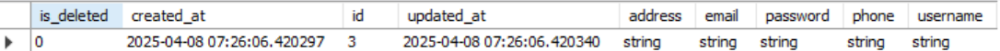
        
    
    @ModelAttribute 를 썼을 때
    
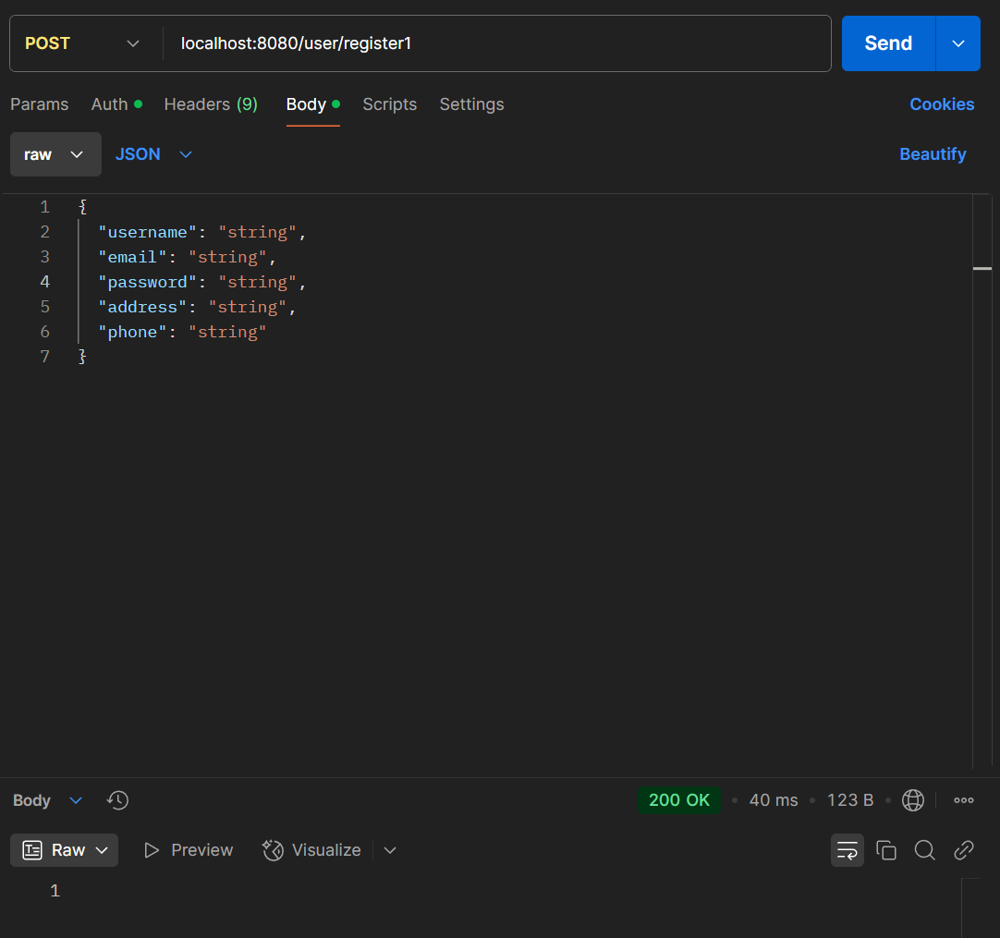
    

    
    값들이 NULL로 들어감.
    
    form-data 사용
    
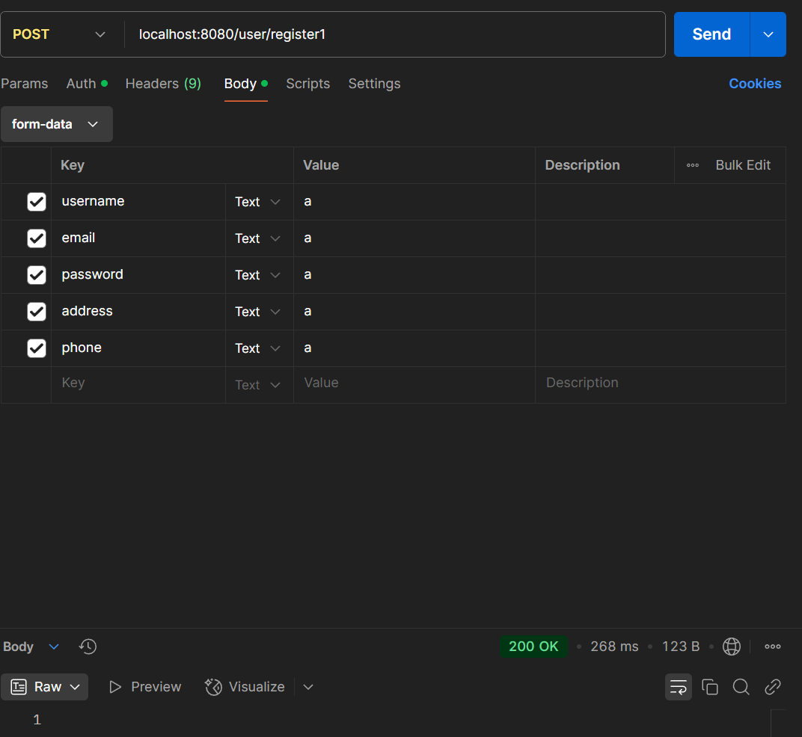
    

    
    값이 제대로 들어감
    
    1. @PathVariable와 @RequestParam은 어떤 차이가 있으며 언제 사용해야 할까요?
        1. 위치 
            1. @RequestParam: 쿼리 스트링 또는 폼 데이터에서 추출
            2. @PathVariable: URL 경로에서 추출
        2. 형식
            1. @RequestParam: ?key=value 형식으로 전달
            2. @PathVariable: 경로의 일부로 전달
        3. 필수 여부
            1. @RequestParam: 기본값을 설정하거나 required = false로 설정할 수 있음
            2. @PathVariable: 경로 변수는 필수이며, 기본값을 설정할 수 없음
        
        - 특정 “리소스 1개” 조회 → PathVariable 사용
        - 목록 조회하면서 필터 조건 줄 때 → RequestParam

### 🍀 데이터 전달 객체란 무엇인가요? 그리고 Transaction은 무엇인가요?

- 데이터 전달 객체는 계층 간에 데이터를 전달하기 위해 사용하는 객체.
    
    즉, 컨트롤러 → 서비스 → 레포 간에 데이터를 주고받을 때 사용하는 순수 데이터를 담는 용도의 객체 : 그냥 데이터를 싣고 다니는 트럭
    
- DTO 사용 이유 :
    - 계층 간 분리 : 컨트롤러, 서비스, DB가 서로 직접 의존하지 않게 해줌
    - 보안 : 민감한 필드 노출 방지
    - 데이터 형식 동일

- Transcation이란? → “성공하면 전부 반영, 실패하면 전부 롤백”
    
    DB나 서비스에서 데이터의 일관성과 신뢰성을 보장하기 위해 한 덩어리로 묶은 작업 단위
    
    DB의 상태를 변경시키는 작업의 단위 → 한꺼번에 수행되어야 할 연산을 모아놓은 것
    
1. Spring에서 데이터 전달 객체로 무엇이 있나요?
    - VO (Value Object)
    - DTO (Data Transfer Object)

1. 데이터 전달 객체를 왜 사용하나요?
    1. 엔티티 노출 방지(민감한 정보 노출 위험)
    2. 계층 간 역할 분리
    3. API 요구사항에 맞게 데이터 맞춤 제공
    4. 입력 검증 용이(@Valid, @NotNull, @Email)
    5. 엔티티 독립성 확보
        1. 엔티티는 DB에 맞게 설계
        2. DTO는 클라이언트/API에 맞게 설계
2. DAO, DTO, VO는 각각 무엇이며, 어떤 차이점이 있나요?
    - DTO (Data Transfer Object) : 다른 계층 또는 서비스간의 통신에서 사용되는 객체로, 그 목적은 단순히 데이터를 한 데 묶어 전달하는 것
        
        특징
        
        동등성 : DTO는 일반적으로 식별자(ID)나 일부 핵심 속성에 의해 동등성이 결정
        
        식별자가 같다면 동등하다고 판단
        
    
    - DAO (Data Access Object) : 실제 DB에 접근하여 CRUD 하는 객체
        
        JPA의 경우 JPARepository를 사용하는 경우가 DAO의 예시
        
        Repository 객체들이 DAO라고 볼 수 있다.
        
    
    - VO (Value Object) : 값 자체가 의미 있는 객체
        
        ```java
        public class Email {
            private final String value;
        
            public Email(String value) {
                if (!value.contains("@")) throw new IllegalArgumentException("이메일 형식 오류");
                this.value = value;
            }
        
            public String getValue() {
                return value;
            }
        }
        
        ------------------------------------------
        
        // Bad: 그냥 String 여러 개
        public void registerUser(String email, String phone, String address) { ... }
        
        // Good: 의미 있는 타입으로 분리
        public void registerUser(Email email, Phone phone, Address address) { ... }
        
        ```
        
        특징 
        
        불변성 : 생성 후 값이 바뀌지 않음(final)
        
        의미 있는 타입 : 단순 문자열이 아니라 "Email", "Phone", "Money" 등 의미 부여
        
        식별자가 없음 DB의 PK 같은 건 없음 (Entity와 구분됨)
        
    
    <비교 표>
    
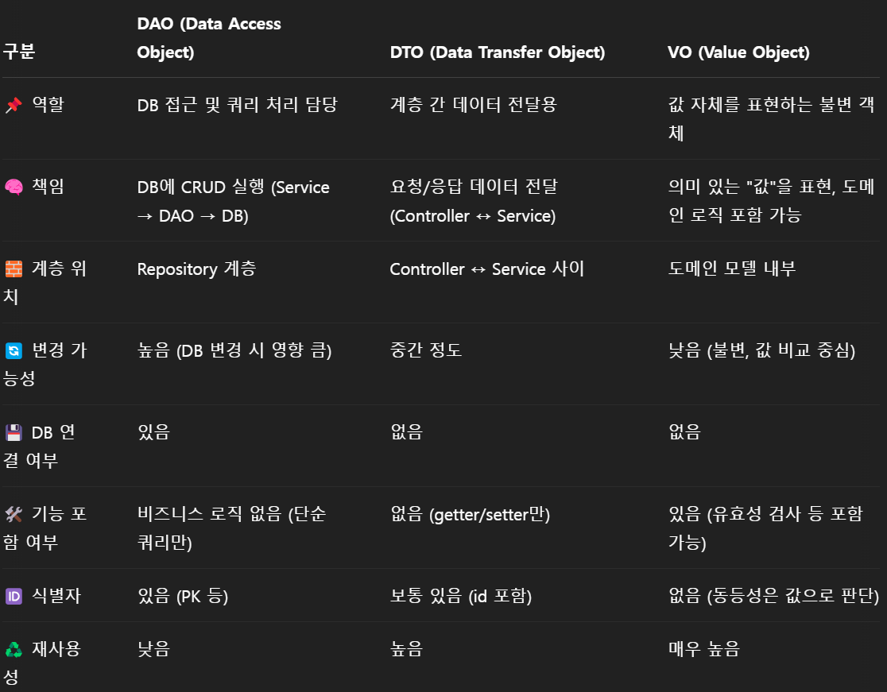
    

1. **Transaction은 무엇인가요?**
    
    DB나 서비스에서 데이터의 일관성과 신뢰성을 보장하기 위해 한 덩어리로 묶은 작업 단위
    
    DB의 상태를 변경시키는 작업의 단위 → 한꺼번에 수행되어야 할 연산을 모아놓은 것
    

1. ACID 원칙은 무엇인가요?
    1. **Atomicity (원자성)**
        1. 트랜잭션이 DB에 모두 반영되거나, 혹은 전혀 반영되지 않아야 된다 (All or Nothing).
    2. **Consistenty (일관성)**
        1. 트랜잭션의 작업 처리 결과는 항상 일관성 있어야 한다.
        2. 시스템이 가지고 있는 고정 요소는 트랜잭션 수행 전과 수행 후의 상태가 같아야 한다는 말로, DB의 제약조건을 위배하는 작업을 트랜잭션 과정에서 수행할 수 없음을 나타낸다.
        
        *ex) 송금 시 금액의 데이터 타입을 정수형(integer)에서 문자열(string)로 변경할 수 없음.*
        
    3. **Isolation (독립성)**
        1. 둘 이상의 트랜잭션이 동시에 병행 실행되고 있을 때, 어떤 트랜잭션도 다른 트랜잭션 연산에 끼어들 수 없다.
    4. **Durability (지속성)**
        1. 트랜잭션이 성공적으로 완료되었으면, 결과는 영구적으로 반영되어야 한다.
    
2. Spring에서는 Transaction을 어떤 방식으로 관리하나요?(**@Transcational**)
    - TransactionTemplate
    
    ```
    데이터 접근 기술에는 JdbcTemplate, JPA 등 여러가지가 존재한다. 
    이 기술이 바뀌면 트랜잭션을 사용하는 방법도 달라진다. 
    Spring에서는 이러한 상황을 고려해 트랜잭션에 대한 추상화를 지원한다.
    PlatformTransactionManager 인터페이스를 이용하면 된다. 
    해당 인터페이스는 총 3가지 메서드를 제공한다.
    
    getTransaction(): 현재 TransactionStatus를 return
    commit(): 변경 내역 커밋
    rollback(): 변경 내역 롤백
     
    
    TransactionTemplate은 위의 Transaction Manager를 주입 받아 사용한다.
    해당 클래스를 이용해 개발자가 트랜잭션 시작/종료 지점을 명시적으로 결정할 수 있게 된다.
    ```
    
    - **@Transactional 어노테이션**
    
    ```
    DB와 관련된, 트랜잭션이 필요한 클래스 혹은 메서드에
    @Transactional 어노테이션을 달기만 하면 된다. 
    
    // @Transactional의 우선 순위 (클래스 vs 메서드)
    @Transactional은 클래스, 메서드 모두에 적용 가능하다.
    이 경우, 메서드 레벨의 @Transactional 선언을 우선 적용한다.
    ```
    
    ```
    // 트렌젝션 격리 수준; Isolation Level
    READ UNCOMMITED : 커밋되지 않은 데이터 읽기
    READ COMMITED : 커밋된 데이터만 읽기
    REPEATABLE READ : 한 트랜잭션 내에서 같은 읽기 보장
    SERIALIZABLE : 팬텀 리드 현상 개선 //??
    ```
    

## 🔎 과제

<aside>
✅ ERD를 작성할 때 선택한 서비스의 대표 API를 최소 5개 이상 작성해봅시다. 

1. Controller, Service, Repository 계층을 각각 분리하여 작성합니다. 
2. Testing Tool을 활용해 테스팅한 결과를 발표 자료에 첨부해주세요.

</aside>

- GET

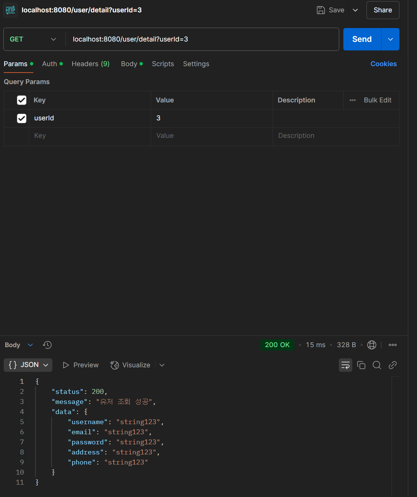

- POST

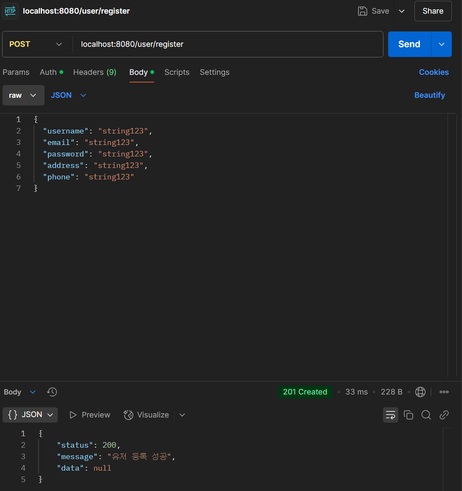

- DELETE

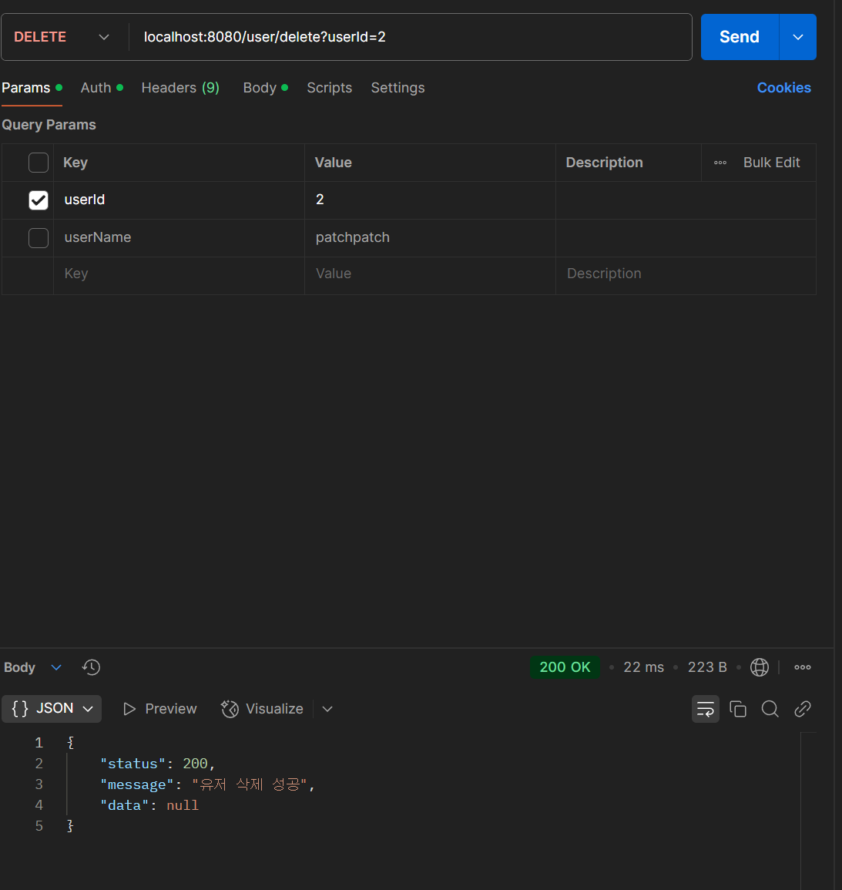

- PATCH

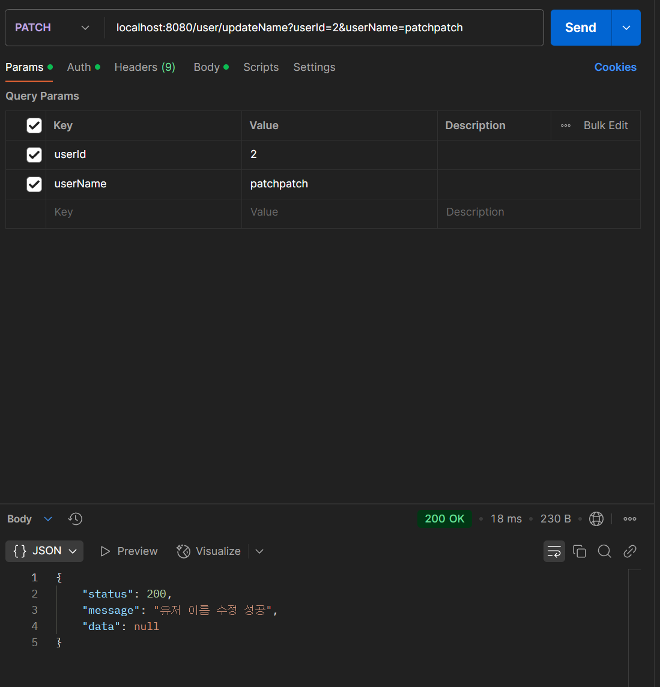

- PUT

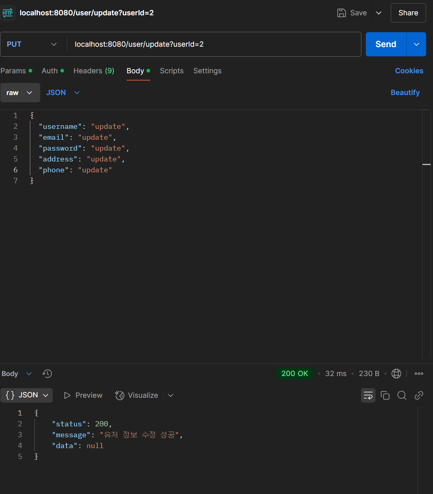