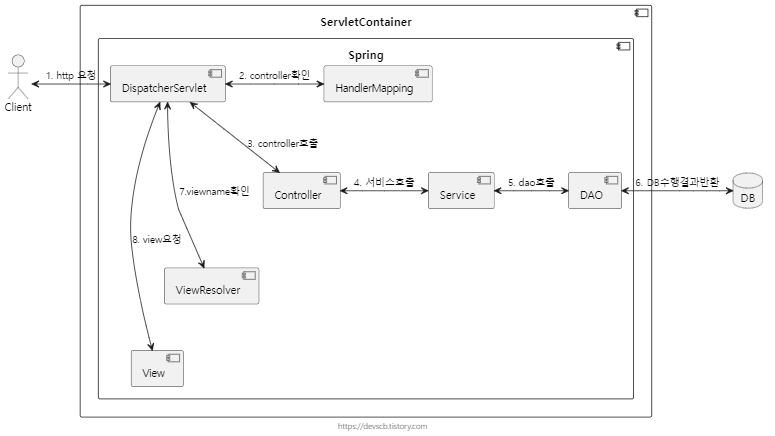

# Controller & Service Layer

추가 일시: 2025년 4월 4일 오후 3:50
강의: Appcenter_Server

# 🧱 Controller & Service Layer

---

## 🍀 Controller Layer는 무엇인가요?

---

Controller Layer는 사용자 MVC 패턴의 일부로써 Model과 View 사이를 중재하게 됩니다.

웹 애플리케이션에서 Client의 HTTP 요청을 응답 받고 해당 요청을 적절한 Service layer로 전달합니다.



### ✅ Response Entity는 무엇이며, 어떻게 활용할 수 있을까요?

Response Entity는 Spring Framework에서 제공하는 클래스로 HTTP 응답(상태 코드, 헤더, 본문)을 클라이언트에게 반환할 수 있도록 합니다.

**구조**

- HttpStatus: 응답의 상태 코드를 지정합니다. 예를 들어, `HttpStatus.OK`는 200 상태 코드를 의미하며, 이는 요청이 성공적으로 처리되었음을 나타냅니다.
- HttpHeaders: 응답의 헤더 정보를 포함합니다. 이를 통해 콘텐츠 타입, 캐시 제어 등 다양한 메타데이터를 설정할 수 있습니다.
- HttpBody: 실제 응답 데이터를 담는 본문입니다. JSON, XML 등의 형식으로 데이터를 포함할 수 있습니다

```java
@PostMapping
    public ResponseEntity<PostCreateResponseDto> savePost(@RequestParam Long userId, @RequestBody PostCreateRequestDto postCreateRequestDto) {
        PostCreateResponseDto post = contentsService.savePost(userId, postCreateRequestDto);
        return ResponseEntity.status(HttpStatus.OK).body(post);
    }
```

## 🍀 Service Layer는 무엇인가요?

---

**Service layer의 주요 역할**

- 비즈니스 로직의 캡슐화: 서비스 레이어는 애플리케이션의 비즈니스 규칙과 로직을 한 곳에 모아 관리합니다. 이를 통해 컨트롤러나 데이터 액세스 계층에 비즈니스 로직이 분산되는 것을 방지하고, 코드의 재사용성과 가독성을 높입니다.
- 트랜잭션 관리: 여러 데이터베이스 작업이 하나의 작업 단위로 실행되도록 트랜잭션을 관리하여 데이터의 일관성과 무결성을 보장합니다.
- 계층 간의 연결: 프레젠테이션 계층(예: 컨트롤러)과 데이터 액세스 계층 사이에서 중재자 역할을 수행하며 각 계층이 자신의 책임에 집중할 수 있도록 돕습니다.

```java
@Transactional
public PostCreateResponseDto savePost(Long userId, PostCreateRequestDto postCreateRequestDto) {
        MemberEntity member = memberRepository.findById(userId).orElseThrow(
                () -> new CustomException(NOT_EXIST_ID)
        );
        PostEntity postEntity = postRepository.save(postCreateRequestDto.toSave(member));
        return PostCreateResponseDto.from(postEntity);
    }
```

## 🍀 Spring에서 요청을 어떤 방식으로 처리하나요?

---

### ✅ 요청과 응답이란 무엇인가요?

**요청(Request)**

클라이언트가 서버에 특정 작업을 요청할 때 발생하는 메시지입니다.

웹 브라우저에서 웹페이지를 열거나, API를 통해 서버에 데이터를 요청할 때 생성됩니다.

HTTP Method, URL, Header, Body, Query Parameter 등을 포함합니다.

```java
POST /api/users HTTP/1.1
Host: example.com
Content-Type: application/json
Accept: application/json

{
    "username": "newuser123",
    "email": "newuser@example.com",
    "password": "securePassword!"
}
```

**응답(Response)**

서버가 클라이언트의 요청을 받아 처리한 뒤, 요청한 정보나 처리 결과를 돌려주는 메시지입니다.

요청이 처리되었는지, 처리 과정에서 어떤 문제가 있었는지에 대한 정보도 함께 전달합니다.

Status Code, Header, Body 등을 포함합니다.

```java
HTTP/1.1 201 Created
Content-Type: application/json

{
    "id": 101,
    "username": "newuser123",
    "email": "newuser@example.com",
    "createdAt": "2025-04-07T15:30:45Z"
}
```

### ✅ Spring에서 요청을 어떻게 처리하나요?

**스프링에서 객체의 직렬화와 역직렬화**

기억하지 못할수도 있지만 gradle에 해당 의존성을 추가했을겁니다.

```bash
implementation 'org.springframework.boot:spring-boot-starter-web'
```

이를 추가하면 Jackson 라이브러리를 함께 가져옵니다.

스프링은 Jackson 라이브러리 안에 있는 ObjectMapper를 사용해서 자바 객체를 JSON으로 직렬화, 혹은 JSON을 자바 객체로 역직렬화 합니다.

**ObjectMapper의 작동방식**


공식 문서에서 Jackson ObjectMapper는 JSON 오브젝트의 필드를 Java 오브젝트 필드에 매핑할 때 getter와 setter 메서드를 사용한다고 합니다.

getter나 setter 메서드의 접두사인 get과 set을 지우고, 나머지 문자의 첫 문자를 소문자로 변환한 문자열을 참조하여 필드명을 알아냅니다.

직렬화 과정

```java
ObjectMapper objectMapper = new ObjectMapper();

User user = new User("seokhwan", 24);

String jsonString = objectMapper.writeValueAsString(user);
```

역직렬화 과정

```java
ObjectMapper objectMapper = new ObjectMapper();

String jsonString = "{\"name\":\"seokhwan\",\"age\":24}";

User user = objectMapper.readValue(jsonString, User.class);
```

요청과 응답 과정

1. `@Restcontroller` 이 붙은 Controller는 JSON 응답을 처리합니다.
2. ResponseEntity.ok()가 반환될 때, 스프링은 HttpMessageConverter를 찾아 적절한 변환기를 선택합니다.
3. 요청 헤더의 Accept: application/json을 확인한 후 Jackson2HttpMessageConverter가 선택됩니다.
4. Jackson2HttpMessageConverter는 내부적으로 ObjectMapper를 사용하여 객체를 JSON 문자열로 변환합니다.
5. 변환된 JSON이 HTTP 응답 본문에 포함되어 클라이언트로 전송됩니다.

우리는 이 과정에서 `@Getter` 와 `@NoArgsConstructor` 를 붙혀 사용하게 됩니다.

`@Getter` 를 사용하는 이유는 Jackson 라이브러리가 Getter와 Setter를 통해 데이터를 읽고 쓰기 때문입니다. → 때문에 `@Getter` 를 사용하지 않으면 오류가 발생하게 됩니다.

`@NoArgsConstructor` 즉, 기본생성자가 필요한 이유는 스프링 MVC(Jackson)나 JPA(엔티티) 등은 리플렉션으로 객체를 생성하는데(역직렬화 과정에서) 이때 기본 생성자가 반드시 필요하기 때문입니다.

**@RequestBody와 @ModelAttribute는 어떤 차이가 있으며 언제 사용할까요?**

클라이언트에서 송신한 데이터를 Java 코드에서 사용할 수 있는 오브젝트로 만들어주는 두 어노테이션 입니다.

> @RequestBody의 역할은 클라이언트가 보내는 HTTP 요청 본문(JSON 및 XML 등)을 Java 오브젝트로 변환하는 것입니다.
HTTP 요청 본문 데이터는 Spring에서 제공하는HttpMessageConverter를 통해 타입에 맞는 객체로 변환됩니다.
> 
> - @RequestBody를 사용하면 요청 본문의 JSON, XML, Text 등의 데이터가 적합한 HttpMessageConverter를 통해 파싱되어 Java 객체로 변환 된다.
> - @RequestBody를 사용할 객체는 필드를 바인딩할 생성자나 setter 메서드가 필요없다.

> @ModelAttribute의 역할은 클라이언트가 보내는 HTTP 파라미터들을 특정 Java Object에 바인딩(맵핑) 하는 것입니다.
`/modelattribute?name=req&age=24` 같은 Query String 형태 혹은 요청 본문에 삽입되는 Form 형태의 데이터를 처리합니다.
> 
> - @ModelAttribute를 사용하면 HTTP 파라미터 데이터를 Java 객체에 맵핑한다.
>     - 따라서 객체의 필드에 접근해 데이터를 바인딩할 수 있는 생성자 혹은 setter 메서드가 필요하다.
> - Query String 및 Form 형식이 아닌 데이터는 처리할 수 없다.

**@PathVariable와 @RequestParam은 어떤 차이가 있으며 언제 사용할까요?**

둘 다 HTTP 요청 정보를 메서드 파라미터에 매핑하기 위한 어노테이션이지만, 데이터를 가져오는 위치와 의미에서 차이가 있습니다.

@PathVariable은 요청 URL 경로 자체에 변수가 포함되어 있을 때 사용됩니다.

ex) `GET /users/{userId}`

@RequestParam은 쿼리 파라미터나 폼 데이터에서 값을 가져올 때 사용됩니다.

ex) `GET /search?keyword=apple&order=desc`

## 🍀 데이터 전달 객체란 무엇인가요? 그리고 Transaction은 무엇인가요?

---

### ✅ Spring에서 데이터 전달 객체로 무엇이 있나요?

스프링 애플리케이션에서 데이터를 전달하거나 바인딩하기 위해 사용하는 객체들은 상황에 따라 여러 가지가 있습니다.

엔티티(Entity), DTO(Data Transfer Object), Form/Command 객체, VO(Value Object) 등이 있습니다.

**DAO, DTO, VO는 각각 무엇이며, 어떤 차이점이 있나요?**

<aside>
💡

**DAO**

DB에 접근해 CRUD 작없을 수행하는 클래스 입니다.

JDBC, JPA 등의 기술을 통해 DB와 통신합니다.

Repository가 그 역할을 합니다.

</aside>

<aside>
💡

**DTO**

계층간 데이터 전달을 위한 순수 데이터 객체입니다. (Controller ↔ Service ↔ Client)

스프링 MVC 컨트롤러에서 요청/응답 데이터를 담기 위해 사용합니다.

</aside>

<aside>
💡

**VO**

****VO를 만드려면 3가지 제약조건을 지켜야한다.(불변성, 동등성, 자가 유효성 검사)

- 불변성 -  setter와 가변 로직이 없는 불변상태여야 한다.
- 동등성 - 객체 주소값이 다르더라도 값이 같다면 동등한 객체로 판단한다.
- 자가 유효성 검사 - VO를 사용하면, VO 안에서 생성시에 유효성 검사를 진행 한 후에 생성되어야 한다.
</aside>

```java
public class ShapeProperty {
		
    // 불변성 (Immutable)
    private final int width;
    private final int height;

    public Shape(final int width, final int height) {
        // 자가 유효성 검사 (Self-Validation)
        validateWidth(width);
        validateHeight(height);
        
        this.width = width;
        this.height = height;
    }

    // 동등성 (Equality)
    @Override
    public boolean equals(Object o) {
        if (this == o) return true;
        if (o == null || getClass() != o.getClass()) return false;
        ShapeProperty that = (ShapeProperty) o;
        return width == that.width && height == that.height;
    }

    @Override
    public int hashCode() {
        return Objects.hash(width, height);
    }
}
```

```java
// 원시 타입 사용
public class Ladder {
		
    private final int width;
    private final int height;

    public void Ladder(int width, int height) {
    	validateWidth(width);
        validateHeight(height);
        
        this.width = width;
        this.height = height;
    }
}

// VO로 변경
public class Ladder {
		
    private final ShapeProperty shapeProperty;

    public void Ladder(final ShapeProperty shapeProperty) {
        this.shapeProperty = shapeProperty;
    }
}
```

**데이터 전달 객체를 왜 사용하나요?**

- 레이어 간 의존성 최소화
    - 엔티티(Entity) 같은 도메인 모델을 바로 Controller나 외부 API에 노출하면, DB 구조나 비즈니스 로직 변경이 다른 레이어에도 영향을 줍니다.
    - DTO로 데이터를 전달하면, 표현 계층과 도메인 계층 사이에 명확한 경계를 설정해 의존성을 줄입니다.

- 보안과 캡슐화
    - 엔티티에는 비밀번호나 민감한 내부 로직 등 외부로 드러내선 안 되는 정보가 포함될 수 있습니다.
    - DTO는 노출하고 싶은 필드만 구성해 민감 정보를 보호하고, 외부 인터페이스 설계를 단순화합니다.

- 데이터 구조 최적화
    - 클라이언트가 필요로 하는 형식대로 필드와 계층 구조를 맞출 수 있습니다.
    - JSON 응답에서 `name` 필드나 `age` 필드가 필요하다면, DTO 필드로만 가공해 제공할 수 있습니다.

- 유연성
    - UI 변경이나 API 스펙 변경이 필요할 때, DTO만 수정하면 되므로 도메인 모델에까지 영향을 주지 않습니다.

- 테스트 및 유지보수 용이
    - DTO는 주로 데이터 전달만 담당하기 때문에, 테스트 시 독립적으로 검증하기 편합니다.
    - DTO를 통해 도메인 로직과 프레젠테이션 로직을 분리하면, 코드 구조가 더 명확해집니다.

### ✅ Transaction은 무엇인가요?

다음은 트랜잭션의 정의입니다.

<aside>
🔄

트랜잭션(Transaction 이하 트랜잭션)이란

데이터베이스의 상태를 변화시키기 해서 수행하는 작업의 단위를 뜻한다.

</aside>

**질의어 한 문장이 작업의 단위라고 헷갈리면 안 됩니다!**

**ACID 원칙은 무엇인가요?**

ACID는 트랜잭션을 정의하는 4가지 중대한 속성을 가리키는 약어입니다.

원자성(Atomicity), 일관성(Consistency), 신뢰성(Reliability), 격리(Isolation), 영속성(Durability)

~~(잘 정리 되어있어서 가져와봤습니다.)~~

- **원자성(Atomicity)**

트랜잭션에 속한 각각의 문(데이터를 읽기, 쓰기, 업데이트 또는 삭제하기 위함)을 하나의 단위로 취급합니다. 문 전체를 실행하거나 그 문의 어떤 부분도 실행하지 않거나 둘 중 하나입니다. 이 속성이 있으면 예컨대 스트리밍 데이터 소스가 스트리밍 중에 갑자기 오류를 일으키더라도 데이터 손실과 손상이 방지됩니다.

- **일관성(Consistency)**

트랜잭션이 테이블에 변경 사항을 적용할 때 미리 정의된, 예측할 수 있는 방식만 취합니다. 트랜잭션 일관성이 확보되면 데이터 손상이나 오류 때문에 테이블 무결성에 의도치 않은 결과가 생기지 않습니다.

- **격리(Isolation)**

여러 사용자가 같은 테이블에서 모두 동시에 읽고 쓰기 작업을 할 때, 각각의 트랜잭션을 격리하면 동시 트랜잭션이 서로 방해하거나 영향을 미치지 않습니다. 각각의 요청이 실제로는 모두 동시에 발생하더라도, 마치 하나씩 발생하는 것처럼 발생할 수 있습니다.

- **영속성(Durability)**

트랜잭션 실행으로 인해 데이터에 적용된 변경 사항이 저장되도록 보장합니다. 시스템 오류가 발생해도 마찬가지입니다.

*이론은 알겠는데 그래서 트랜잭션이 뭔데?*

→ 예시 알아보는게 이해하는데 훨씬 좋은 것 같습니다.

~~요즘 유행한다는 지브리 컨셉~~


**상황**

한 사용자가 계좌 A에서 계좌 B로 100$를 이체하는 트랜잭션을 생각해봅시다.

1. 계좌 A의 잔액에서 100달러를 차감
2. 계좌 B의 잔액에 100달러를 추가

1) 원자성 (Atomicity)

- 원자성이 없으면, A에서 돈이 빠져나갔는데 B에 입금이 안 될 수 있습니다.
- 트랜잭션이 보장되는 시스템에서는 둘 중 하나라도 실패 시(예: 네트워크 장애) 전체 작업이 롤백돼서 A와 B 잔액이 모두 원상 복구됨.

2) 일관성 (Consistency)

- 은행 시스템은 “모든 계좌의 총합은 변하지 않는다”라는 규칙을 가지고 있을 수 있음.
- 위 이체 트랜잭션 전후로, A+B의 총합은 동일해야 함(= 이체가 실제로는 합계를 바꾸지 않음).

만약 일관성이 깨진다면, 예를 들어 A와 B 계좌의 합이 기존보다 100달러 부족하거나 더 많아지는 상황이 생길 수 있는데, 이는 시스템에서 허용되지 않아야 합니다.

3) 고립성 (Isolation)

- 동시에 계좌이체 트랜잭션이 여러 개 일어날 수 있음 (A→B, C→D 등).
- 트랜잭션 A가 계좌 A 잔액을 수정하기 전, 트랜잭션 B는 그 수정 전의 확정된 잔액만 볼 수 있어야 함.
- (또는 특정 격리 수준에서는 아예 해당 레코드 접근이 잠금(lock)으로 인해 대기될 수도 있음)

4) 지속성 (Durability)

- 이체가 완료된 다음 DB에 커밋이 되었다면, 서버가 갑자기 다운되어 재부팅되더라도 A/B 계좌 잔액 정보가 모두 정상적으로 남아 있어야 함.
- DB는 내부적으로 로그 파일(WAL: Write-Ahead Logging) 등을 사용해, 장애 복구 시 커밋된 내용을 되살림.

**Spring에서는 Transaction을 어떤 방식으로 관리하나요?(@Transcational)**

위의 예시 상황 코드입니다.

```java
@Service
public class AccountService {

    @Autowired
    private AccountRepository accountRepository;

    @Transactional
    public void transferMoney(Long fromAccountId, Long toAccountId, int amount) {
        Account fromAccount = accountRepository.findById(fromAccountId);
        Account toAccount = accountRepository.findById(toAccountId);

        fromAccount.withdraw(amount);
        toAccount.deposit(amount);

        accountRepository.save(fromAccount);
        accountRepository.save(toAccount);
    }
}

```

- 메서드 실행 전후에 트랜잭션을 자동으로 시작(begin)하고 종료(commit)합니다.
- 만약 예외가 발생하면 자동으로 롤백(rollback) 처리됩니다.

주요 속성들로 트랜잭션 동작 방식을 지정할 수 있습니다.

| 속성 | 설명 | 기본값 |
| --- | --- | --- |
| propagation | 트랜잭션 전파 방식 지정 | REQUIRED |
| isolation | 트랜잭션 격리 수준(Isolation level) 설정 | DEFAULT |
| timeout | 트랜잭션 제한 시간 초과 시 rollback (초 단위) | 기본값: -1 (무제한) |
| readOnly | 읽기 전용 트랜잭션 여부 (성능 최적화 가능) | false |
| rollbackFor | 특정 예외 발생 시 트랜잭션 롤백 | RuntimeException, Error |
| noRollbackFor | 특정 예외가 발생해도 롤백하지 않도록 설정 | 비어있음 |

**번외) @Transactional(readOnly = true)를 사용하는 이유와 주의할점**

**사용하는 이유**

- `readOnly=true` 설정 시, 스프링은 내부적으로 데이터 변경 체크 작업(flush)을 최소화하거나 생략하여 성능을 최적화해준다.
- 실수로 데이터를 변경하는 로직이 수행될 때, 이를 방지하거나 예외를 발생시켜 데이터 무결성을 보호할 수 있습니다.
- 명시적으로 읽기 전용임을 선언해 개발자 간 협업에서 안전성을 높일 수 있음.
- 코드상에서 해당 메서드가 데이터를 조회만 하는 메서드라는 걸 명시적으로 표현하는 역할을 해줌.

**반드시 조회용임을 보장하진 않음**

- `readOnly=true`가 강제로 변경을 막아주지는 않고, 성능 최적화나 힌트의 역할이 더 큼.

`readOnly=true`로 설정된 트랜잭션 내에서 insert, update, delete 작업이 발생하지 않도록 주의해야 합니다.

**과제하며 생긴 질문**

- dto는 recode class로 작성해야 하는가?
- Dto - Entity 변환 로직의 위치 (dto 정적메서드 or Service)

**과제**

POST(회원가입)


DB에 적용된 모습

PATCH


DB에 적용된 모습

POST(product 등록)


GET


PUT


DB에 적용 됨

DELETE


DB 삭제됨