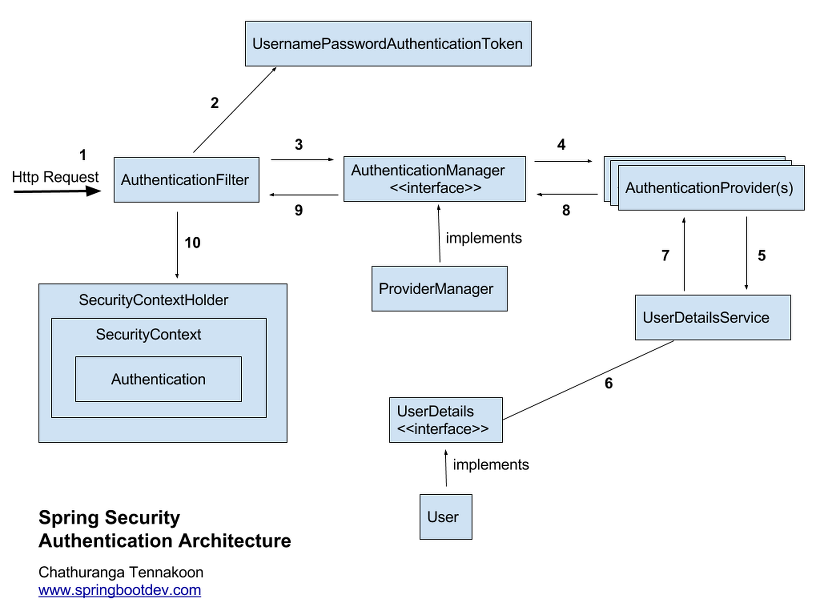

# Spring Security

---

## 공통 주제

### 🍀 Spring Security란 무엇인가요? CORS 에러가 무엇인가요?

1. Spring Security란 무엇인가요?
    
    > Spring Security is a framework that focuses on providing both authentication and authorization to Java applications.
    > 
    
    <Spring Security의 이점>
    
    인증, 인가 기능의 표준화 및 자동화 → 보안 관련 코드를 직접 작성하지 않아도 됨 → 핵심 로직에 집중 가능
    
    1. 인증과 인가란 무엇일까요?
        
        **인증(Authentication):** 사용자의 신원을 검증하는 프로세스(ex. ID와 PW로 로그인)
        
        **인가(Authorization):** 인증된 사용자가 어떠한 자원에 접근할 수 있는지를 확인하는 절차
        
        - Spring Security는 ‘Credential 기반 인증 방식’ 사용
            - Principal을 아이디로, Credential을 비밀번호로 사용
            - 접근 주체(Principal) : 보호 받는 Resource에 접근하려는 대상
            - 비밀번호(Credential) : Resource에 접근하는 대상의 비밀번호
            
        
        로그인 ⇒ 인증 / 회원가입 ⇒ 인증X
        
        (쉽게 구분하기)
        
        **인**간이 **증**명되냐 → 인증
        
        **인**간이 **가**능하냐(행위에 대한 권한) → 인가
        
        - 인가된 사람은 인증된 사람이다.
        - 인증된 사람은 인가된 사람이 아닐 수 있다.
        
        <예시 - 네이버 카페의 등급 기능>
        
        네이버 카페 ‘앱센터’의 회원 A가 있다고 가정하자. 해당 카페에는 ‘파트장’ 등급과 ‘파트원’ 등급이 존재하며, A는 현재 파트원 등급의 회원이다.
        
        A는 스터디 과제를 제출하기 위해 카페 ‘앱센터’의 링크에 접속했다. 그러나 앱센터는 회원에게만 공개된 카페였기 때문에 네이버에 로그인하지 않은 A는 접속이 불가능했다.**(인증X → 인가X)** 
        
        A는 우선 네이버 ID와 PW로 로그인하여 카페에 접속했다.**(인증O, 인가O)** 
        
        스터디 과제를 작성하고 업로드 버튼을 누르니 ‘파트장 등급이 되시면 쓰기가 가능한 게시판입니다’라는 메시지가 표시된다. A가 게시판 선택 과정에서 실수로 ‘파트장 공지방’을 선택한 것이다. **(인증O, 인가X)** 
        
        A는 ‘스터디 제출방’ 게시판을 선택하여 과제물을 업로드할 수 있었다. **(인증O, 인가O)**
        
    2. Spring Security의 구조
        
        
        
    
    1. Authentication
        - 현재 접근하는 주체의 정보·권한을 담는 인터페이스
        
        ```java
        public interface Authentication extends Principal, Serializable {
            // 현재 사용자의 권한 목록을 가져옴(ROLE_USER 등을 반환)
            Collection<? extends GrantedAuthority> getAuthorities();
            
            // credentials(주로 비밀번호)을 가져옴
            Object getCredentials();
            
            //요청 IP, 세션 ID, 소셜 로그인 토큰 등 인증 과정에서 필요했던 부가 정보
            Object getDetails();
            
            // Principal 객체를 가져옴.
            //보통 UserDetails 구현체나 사용자 이름(username)을 반환
            Object getPrincipal();
            
            // 인증 여부를 가져옴(현재 토큰이 authenticated=true 인지)
            boolean isAuthenticated();
            
            // 인증 여부를 설정함
            void setAuthenticated(boolean isAuthenticated) throws IllegalArgumentException;
        }
        ```
        
    
    b. SecurityContext
    
    - Authentication 객체를 저장하거나 꺼내오는 역할
    - 인증 자체를 수행하지는 않고, 이미 인증된 사용자 정보를 보관하는 그릇이다.
    
    c. SecurityContextHolder
    
    - SecurityContext 객체를 보관하고 관리한다.
    
    그러니까…
    
    Principal을 관리하는 Authentication을 관리하는 SecurityContext를 관리하는 SecurityContextHolder이다. (우와!)
    
    
    
    d. UsernamePasswordAuthenticationToken
    
    - 인증 전/후의 토큰 상태 구분하는 2개의 생성자가 존재하는 클래스
    
    ```java
    public class UsernamePasswordAuthenticationToken extends AbstractAuthenticationToken {
        // 주로 사용자의 ID에 해당함
        private final Object principal;
        // 주로 사용자의 PW에 해당함
        private Object credentials;
        
        // 인증 전 토큰 생성자(로그인 시도)
        public UsernamePasswordAuthenticationToken(Object principal, Object credentials) {
    		super(null); //권한 정보 없이 초기화
    		this.principal = principal;
    		this.credentials = credentials;
    		setAuthenticated(false);
    		//authenticated=false 
    	}
        
        // 인증 후 토큰 생성자(로그인 성공)
        // Collection<? extends GrantedAuthority> authorities => 현재 사용자의 권한 목록
        public UsernamePasswordAuthenticationToken(Object principal, Object credentials,
    			Collection<? extends GrantedAuthority> authorities) {
    		super(authorities);
    		this.principal = principal;
    		this.credentials = credentials;
    		super.setAuthenticated(true);  //인증 상태 true
    		//잘못된 사용을 막기 위해 super 사용
    	}
    }
    ```
    
    e. AuthenticationManager
    
    - 인증을 수행하는 인터페이스
        - 실질적으로는 AuthenticationProvider에 의해 검증된다.
        - AuthenticationManager는 진입점의 역할
    
    f. AuthenticationProvider
    
    - AuthenticationManager의 요청을 받아 실제로 검증한다.
    - 전달받은 토큰을 검증하고, 인증 성공 시 authenticated=true 상태의 새 Authentication 반환
    - 실패 시 AuthenticationException
    
    g. ProviderManager
    
    - AuthenticationManager의 구현체
    - 모든 provider를 차례대로 호출하여 인증 로직 수행
    
    ```java
    public class ProviderManager implements AuthenticationManager, MessageSourceAware, InitializingBean {
        public List<AuthenticationProvider> getProviders() {
    			return providers;
        }
        
        @Override
    	public Authentication authenticate(Authentication authentication) throws AuthenticationException {
    		Class<? extends Authentication> toTest = authentication.getClass();
    		AuthenticationException lastException = null;
    		AuthenticationException parentException = null;
    		Authentication result = null;
    		Authentication parentResult = null;
    		int currentPosition = 0;
    		int size = this.providers.size();
    		        
    	//for문으로 모든 provider를 순회하여 처리하고 result가 나올 때까지 반복
    		for (AuthenticationProvider provider : getProviders()) { 
    			...
    			try {
    			//실제 인증 시도
    				result = provider.authenticate(authentication); 
    				//인증 성공(null이 아닌 경우)
    				if (result != null) {
    					copyDetails(authentication, result); // 정보 복사
    					break; //성공했으니 break
    				}
    			}
    			//계정 상태 오류(잠금, 비활성화) 혹은 내부 서비스 오류-> 중단
    			catch (AccountStatusException | InternalAuthenticationServiceException ex) {
    				prepareException(ex, authentication);
    				// SEC-546: Avoid polling additional providers if auth failure is due to
    				// invalid account status
    				throw ex;
    			}
    			//그 외 인증 실패 시 lastException에 보관
    			catch (AuthenticationException ex) {
    				lastException = ex;
    			}
    		}
    }
    ```
    
    h. UserDetails
    
    - 사용자 정보를 담는 인터페이스
    - 인증 성공 → UserDetails 객체 생성 → Authentication 객체를 구현한 UsernamePasswordAuthenticationToken 생성에 사용
    - principal과 account의 차이?
        - principal → 인증된 사용자 객체(사용자가 누구인가)
        - account → principal이 속한 사용자 계정의 상태(state)
            - principal 정보 자체와는 별도로, 로그인 허용/비허용 여부를 결정하는 정보
    - 아래의 기본 UserDetails만으로는 필요한 정보를 모두 담을 수 없음 → 대부분의 경우 CustomUserDetails를 구현하여 사용한다.
    
    ```java
    public interface UserDetails extends Serializable {
    	//권한 목록
        Collection<? extends GrantedAuthority> getAuthorities();
    
        String getPassword();
    
        String getUsername();
    	//계정 만료 여부
        boolean isAccountNonExpired();
    	//계정 잠김 여부
        boolean isAccountNonLocked();
    	//비밀번호 만료 여부
        boolean isCredentialsNonExpired();
    	//사용자 활성화 여부
        boolean isEnabled();
    }
    ```
    
    1. UserDetailsService
    - (커스텀 구현을 통해)DB에서 유저의 정보를 조회하는 인터페이스
    - UserDetails 객체를 반환하는 하나의 메서드만을 가지고 있다.
        - 조회된 정보를 바탕으로 UserDetails 객체 반환
    
    ```java
    public interface UserDetailsService {
    	UserDetails loadUserByUsername(String username) throws UsernameNotFoundException;
    }
    ```
    
    1. Spring Security의 동작 과정
    
    
    
    1. 사용자가 로그인 정보와 함께 인증을 요청한다. (HTTP Request)
        - 인증용 엔드포인트(/login)으로 username과 password 전송
    2. HTTP Request가 AuthenticationFilter에 도착하고, UsernamePasswordAuthenticationToken(인증용 객체)를 생성한다. 
        - AuthenticationFilter는 요청에서 username과 password를 추출하여 UsernamePasswordAuthenticationToken를 생성한다.
            - 여기서 생성된 것이 Authentication 토큰 객체(인증용 객체)이다.
            - username → principal
            - password → credentials
    3. AuthenticationFilter는 AuthenticationManager(ProviderManager)에 객체를 전달한다.
    4. ProviderManager는 등록된 AuthenticationProvider들을  순회하며 인증 로직을 수행한다.
        - 요청을 통해 생성한 토큰의 검증
        
        ```java
        //for문으로 모든 provider를 순회하여 처리하고 result가 나올 때까지 반복
        		for (AuthenticationProvider provider : getProviders()) { 
        			...
        			try {
        			//실제 인증 시도
        				result = provider.authenticate(authentication); 
        				//인증 성공(null이 아닌 경우)
        				if (result != null) {
        					copyDetails(authentication, result); // 정보 복사
        					break; //성공했으니 break
        				}
        			}
        			//계정 상태 오류(잠금, 비활성화) 혹은 내부 서비스 오류-> 중단
        			catch (AccountStatusException | InternalAuthenticationServiceException ex) {
        				prepareException(ex, authentication);
        				// SEC-546: Avoid polling additional providers if auth failure is due to
        				// invalid account status
        				throw ex;
        			}
        			//그 외 인증 실패 시 lastException에 보관
        			catch (AuthenticationException ex) {
        				lastException = ex;
        			}
        		}
        ```
        
    5. AuthenticationProvider는 UserDetailsService를 호출하여 사용자 정보를 조회한다.
        - username을 key로 DB에 사용자 조회
    6. UserDetailsService가 DB 조회 결과를 바탕으로 UserDetails 구현체를 생성·반환한다.
    7. AuthenticationProvider는 반환된 UserDetails의 비밀번호·계정 상태를 검사한다.
    8. 인증이 완료되면 Authenticated 상태의 Authentication 객체를 반환한다.
        - authenticated=true 로 설정된 새 토큰 객체를 만들어 반환
    9. ProviderManager는 이 Authentication 결과를 그대로 AuthenticationFilter에 돌려준다.
    10. AuthenticationFilter가 받은 Authentication 객체를 SecurityContextHolder의 SecurityContext에 저장한다.
    
    > 클라이언트가 `/login` 으로 자격 증명 요청 
    → 필터가 인증 토큰 생성
    → ProviderManager가 여러 프로바이더에 위임
    → DaoAuthenticationProvider가 UserDetailsService로 DB 조회 및 검증
    → 성공 시 Authenticated 토큰 반환
    → SecurityContext에 저장
    > 

### 🍀 Jwt란 무엇이며, 어떤 역할을 하나요?

1. Jwt란 무엇인가요?
    - Json Web Token의 약자
    - 모바일이나 웹의 사용자 인증에 필요한 정보들을 암호화시킨 JSON 토큰
    - JWT 기반 인증은 JWT 토큰을 HTTP 헤더에 실어서 서버가 클라이언트를 식별하는 방식 → 정보 열람, 수정 등의 개인적인 작업을 수행할 수 있게 된다.
    - JWT는 JSON 데이터를 Base64 URL-safe Encode로 인코딩하여 직렬화(JSON으로 변환)한다. → 이게 대체 뭔지 알아보자…
    
    먼저, 인코딩(encoding)은 정보의 형태나 형식을 다른 형태, 형식으로 변환하는 처리(혹은 그 처리 방식)을 의미한다. 인코딩의 목적은 표준화, 보안, 처리 속도 향상, 저장 공간 절약 등 다양하다.
    
    Base64는 이진 데이터를 텍스트(ASCII)로 안전하게 바꿔 전송하는 방식이다. 
    
    
    
    그런데 위의 Base64 인코딩 표에서 어떤 문제점을 발견할 수 있다. 62에 해당하는 +와 63에 해당하는 /는 URL에서 문제를 일으킬 수 있다. URL에 +와 /의 역할을 떠올려 보자. +는 쿼리스트링에서 공백으로 해석되고, /는 경로 구분의 역할을 한다. 따라서 Base64 텍스트에 +나 /가 포함되면 실제 데이터와 다르게 해석될 수 있다. 이 문제를 해결하기 위해 사용하는 것이 아래의 Base64 URL-safe 방식이다. 
    
    
    
    1. 쿠키, 세션, 토큰 각각의 인증 방식은 무엇이고 각각 어떤 차이가 있을까요?
        1. 쿠키
            - 클라이언트-서버 통신에 필요한 정보들을 브라우저에 저장해둔 문자열
                1. 클라이언트 → 서버 : 로그인 등의 초기 요청
                2. 서버 → 클라이언트 : 응답 헤더의 Set-Cookie에 저장하고픈 정보를 담아 보낸다.
                3. 클라이언트 :  쿠키를 저장한다.
                4. 클라이언트 → 서버 : 쿠키를 포함하여 재요청
                5. 서버 : 쿠키로 사용자 식별
            - 브라우저에 저장된 쿠키들은 서버와의 통신 시 헤더에 담겨 전송된다.
            - 서버는 쿠키값을 이용해 클라이언트의 상태를 파악한다.
            
            장점
            
            - 브라우저가 자동으로 관리 → 요청 시 처리 속도가 빠르다
            - 만료일 전까지 유효하며 원한다면 클라이언트 측에서 쉽게 삭제할 수 있다.
            
            단점
            
            - 최대 용량 4KB → 작은 용량으로 제한되어 많은 데이터를 저장할 순 없다.
            - 데이터가 클라이언트에 보관되기 때문에 노출, 조작의 위험이 있다.
            
        2. 세션
        - 일정 시간 동안 같은 브라우저로부터 들어오는 일련의 요구를 하나의 상태로 보고, 그 상태를 일정하게 유지시키는 기술.
            - ⇒ 방문자가 웹 서버에 접속해 있는 상태를 하나의 단위로 보고 그것을 세션이라 한다.
            1. 클라이언트 → 서버 : 초기 요청
            2. 서버 → 클라이언트 : 쿠키에 sessionId가 있는지 확인 → 없다면 세션 생성 및 세션Id 발급하여 응답(Set-Cookie에 sessionId 담아서)
            3. 클라이언트(브라우저) : 쿠키를 사용하여 sessionId를 저장
            4. 클라이언트 → 서버 : 이후 모든 요청에 sessionId를 자동 포함
            5. 서버 : 요청의 sessionId로 사용자 정보 조회 → 세션이 유효하면 해당 정보로 요청 처리하여 응답(쿠키에는 식별자인 sessionId만 담고, 서버는 sessionId를 key로 삼아서 원본 데이터를 꺼내는 구조)
        - 쿠키를 기반으로 하지만 서버 측에서 관리한다.
        - 클라이언트의 구분을 위해 서버 측에서 sessionId를 부여한다.
        - 접속 시간이 제한되어 있다 → 클라이언트 종료 시/세션 타임 초과 시 세션이 파기된다.
        - 클라이언트에게는 sessionId만을 노출하여 민감한 정보를 보호한다.
        - 서버에서 관리하기 때문에 사용자가 많아질수록 메모리 사용량이 증가한다
            - → 데이터 누적으로 공간 부족, 성능 저하 등의 문제
        
        c. 토큰
        
        - 클라이언트 → 서버 : 초기 요청
        - 서버 → 클라이언트 : 정보 검증 후 토큰 발급하여 전달(Access Token/Refresh Token)
        - 클라이언트 → 서버 : 전달받은 토큰 저장해두고, 서버에 요청할 때마다 토큰을 함께 전달(http 헤더에 담아서)
        - 서버 → 클라이언트 : 토큰 검증하여 응답
    
    1. Jwt는 어떤 구조로 이루어져 있나요?
        
        JWT는 ‘.’을 구분자로 나누어지는 세 가지 문자열 Header, Payload, Signature의 조합이다.
        
        
        
        - Header
            - alg: 서명 암호화 알고리즘
            - typ: 토큰 유형
            - 작성된 JSON을 Base64 URL-safe방식으로 인코딩하여 넣는다.
        - Payload
            - 토큰에 담을 정보가 들어 있다
            - payloade에 담긴 정보의 한 조각을 클레임(claim)이라 부른다.
                - name/value의 한 쌍으로 이뤄진다.
                - Registered claim / Public claim / Private claim가 존재한다.
                    - Registed claim : 미리 정의된(등록된) 클레임
                        - iss(issuer; 발행자)
                        - exp(expireation time; 만료 시간),
                        - sub(subject; 제목),
                        - iat(issued At; 발행 시간),
                        - jti(JWT 고유 식별자, 중복 처리 방지위해 사용)
                    - Public claim: 공급자가 원하는 대로 지정 가능한 클레임. 충돌 방지를 위해 IANA 사이트에 정의된 내용을 따르거나 URI 형식으로 작성한다.
                        - 여러 시스템·서비스 간 공통으로 쓰이는 클레임
                        - 누구라도 이 이름을 쓰면 같은 의미라는 것을 보장하기 위해 IANA 사이트에 정의된 이름을 사용한다.
                            - roles(사용자 역할)
                            - email(사용자 이메일 주소)
                    - Private claim: 클라이언트와 서버 간의 협의 하에 사용되는(자체 합의된) 클레임.
                        - 특정 애플리케이션이나 한 쌍의 시스템 간에만 쓰임
                    - 마찬가지로 Base64 URL-safe 방식을 사용해 인코딩된다.
        - Signature
            - 헤더에서 정의한 알고리즘 방식(alg)을 사용한다.
            - ‘헤더+페이로드+서버 비밀 key값’ → alg로 암호화
            - 헤더와 페이로드는 단순히 인코딩된 값이므로 제3자가 디코딩하거나 조작할 수 있다. 하지만 시그니쳐는 서버에서 관리하는 key가 유출되지 않는 이상 디코딩할 수 없다. → 토큰의 위조, 변조 여부 확인 가능
            
            
            
    2. Jwt의 장점과 단점은 각각 무엇일까요?
        
        장점
        
        - 무상태(Stateless) 인증 → 서버가 클라이언트의 상태를 보존하지 않는다(이전 요청과 이어지지 않는다)
            - 서버에 별도의 인증 저장소를 두지 않아도 된다
            - 토큰 자체에 사용자 정보, 권한, 만료시간 등이 모두 포함되어 있다.
            - Signature로 위조, 변조를 방지한다.
        - 표준화된 포맷
            - JSON 기반 → 다양한 언어에저 지원된다.
            - 헤더/페이로드/서명의 구조가 명확하다.
        
        단점
        
        - 로컬 스토리지에 저장된 토큰이 탈취될 수 있다.
        - 한번 발급되면 만료 전까지 계속 사용 가능하다
            - → 토큰을 탈취당하면 무효화할 수 있는 방법이 없다.
        - 페이로드는 인코딩만 거치기 때문에 민감한 정보가 저장되어선 안된다(유출 위험)
        - JWT는 기본적으로 세션Id보다 크키가 크고, 길이에 따라 더욱 커질 수 있다.
            - → 크기가 커지면 네트워크에 부하를 줄 수 있다.
            
2. Spring에서 Jwt를 어떻게 활용할 수 있을까요?
    1. AccessToken과 RefreshToken은 각각 무엇일까요?
        
        JWT 토큰은 한번 발급되면 만료 전까지 계속 사용할 수 있어 탈취 시 무효화할 방법이 없다고 하였다. 이러한 위험을 방지하기 위해 우리는 유효 기간을 설정해야 한다. 하지만 유효기간을 무작정 짧게 설정한다면 사용자는 짧은 시간 동안 로그인을 여러 번 시도해야 한다. 때문에 우리는 유효기간이 다른 2개의 토큰, Access Token과 Refresh Token을 사용한다.
        
        Refresh Token은 말그대로 Refresh를 위한 Token이다. Access Token이 만료된 경우 서버에서 이를 확인하고 새로운 Access Token을 발급하기 위해 사용된다. 서버에서 토큰 상태를 제어할 수 없다는 취약점을 보완하기 위해 Refresh Token을 함께 발급하여 Access Token 자체를 계속 갱신하는 방식이다
        
        
        
        Access Token은 유효기간이 짧고( Microsoft ID 플랫폼의 경우 60~90분 할당), Refresh Token은 유효기간이 길다.(90일) 평소에는 Access Token을 사용하다가, Access Token이 만료되어 갱신된 경우에만 Refresh Token을 사용하게 된다.
        
        → 탈취의 위험성이 큰 Access Token의 만료 기간을 짧게 설정하고, Refresh Token을 주기적으로 재발급함으로써 피해를 최소화한다.
        
    2. 각 토큰은 클라이언트와 서버에서 어떤 방식으로 관리되어야 할까요?
        
        Access Token
        
        - 로컬 스토리지
            - 클라이언트 측에 데이터 영구 저장
            - 브라우저 닫아도 데이터 유지 → 명시적으로 삭제하지 않는 한 계속 존재
            - XXS 공격(JavaScript를 기반으로 한 악성 코드를 브라우저에서 실행되도록 하는 공격 방식)에 취약하여 탈취의 위험이 있다.
            - ⇒ 권장되지 않는다!
        - 세션 스토리지
            - 브라우저가 닫히면 데이터가 삭제된다.
            - 마찬가지로 XXS 공격에 취약하다.
            - ⇒ 권장되지 않는다!
        - 쿠키
            - 브라우저가 자동으로 모든 동일 도메인·경로 요청에 Cookie헤더로 전송
                - Access Token도 자동으로 포함
                - 토큰 크기에 따라 성능이 저하될 수 있다.
            - HttpOnly 쿠키로 JavaScript 접근 차단 → XSS 공격으로부터 탈취될 위험성이 낮다.
                - HttpOnly 쿠키: 브라우저 → 서버 요청 시만 전송되고, 클라이언트 자바스크립트로 읽을 수 없는 쿠키
            - 만료 설정에 따라 자동 삭제되거나 사용자에 의해 강제로 삭제될 수 있다.
            - CSRF(Cross-Site Request Forgery) 공격에 취약하다.
                - 토큰 값 자체를 탈취하진 않지만, 로그인된 상태에서 위험한 동작을 하게 만든다.
                    - 사용자가 이미 로그인한 상태일 때(토큰 보유), 같은 브라우저에서 공격용 웹페이지를 열면 그 페이지가 사용자 대신 조작된 요청을 원래 서비스에 자동으로 보낼 수 있는 공격
                    - 사용자가 A사이트에 로그인된 상태에서 공격자 B사이트를 방문하면, B사이트의 자바스크립트가 사용자 쿠키를 이용해 A사이트에 요청을 보낸다.
        - 메모리
            - 브라우저의 자바스크립트 메모리에 저장(private 변수로 저장)
                - 페이지를 새로고침하거나 탭을 닫으면 전부 사라진다 → 다시 로그인
                - private 변수로 저장하였으므로 CSRF 공격에 안전하다.
        
        Refresh Token
        
        - 브라우저의 HttpOnly Cookie에 저장하여 XSS 공격 방지
        - Refresh Token의 역할은 Access Token을 발급하는 것이다. 새로운 토큰을 발급할 뿐 DB에 변동이 생기지는 않는다.
            - → HttpOnly Cookie는 CSRF에 취약하지만, CSRF는 요청을 보낸 클라이언트의 주소를 이용하기 때문에? 토큰을 훔칠 수 없다?
                - CSRF는 사용자의 브라우저가 자동으로 포함하는 인증 정보를 악용하는 공격
                - 사용자의 쿠키 등을 포함한 조작된 요청을 보낼 수 있지만, 토큰을 저장한 곳과 토큰을 읽어서 유출하는 코드의 origin이 같지 않아서 SOP에 의해 다른 origin의 토큰을 읽지 못한다?

### 🍀 CORS란 무엇인가요?

1. Origin이 무엇인가요?
    - URL 구조에서 프로토콜, 호스트 네임(도메인), 포트 번호까지의 구성이 Origin에 해당한다.
    - 아래 이미지 속 [http://opentutorials.org:3000/main?id=HTML&page=12](http://opentutorials.org:3000/main?id=HTML&page=12를) 를 예로 들면, Origin은 http://opentutorials.org:3000 이다.
        
        
        
    - 같은 출처를 가진다 → Origin의 세 가지 구성 요소가 모두 일치한다.
        - 일치하지 않는 경우를 cross origin이라 부른다.
            - http ≠ https
            - opentutorials.org ≠ open-tutorials.org
2. SOP 정책이란 무엇인가요?
    - Same-Origin Policy ‘동일 출처 정책’
    - 같은 출처에서만 리소스를 공유할 수 있다는 정책이다.
        - 하나의 웹 페이지에서 다른 웹 페이지의 데이터에 접근하기 위한 스크립트가 존재할 때, 두 웹 페이지가 같은 origin인 경우에만 허가
            - 민감한 정보에 접근하려는 악의적 스크립트를 막을 수 있어 보안 ↑
            - 안전하지만 너무 제한적… → CORS로 해결
3. Spring에서 CORS를 어떤 방식으로 관리해야 할까요?
    - CORS(Cross-Origin Resource Sharing) ‘교차 출처 리소스 공유’
    - 추가적인 HTTP 헤더를 사용 → 한 origin에서 실행 중인 웹 어플리케이션이 다른 origin의 리소스에 접근할 수 있는 권한을 부여하도록

