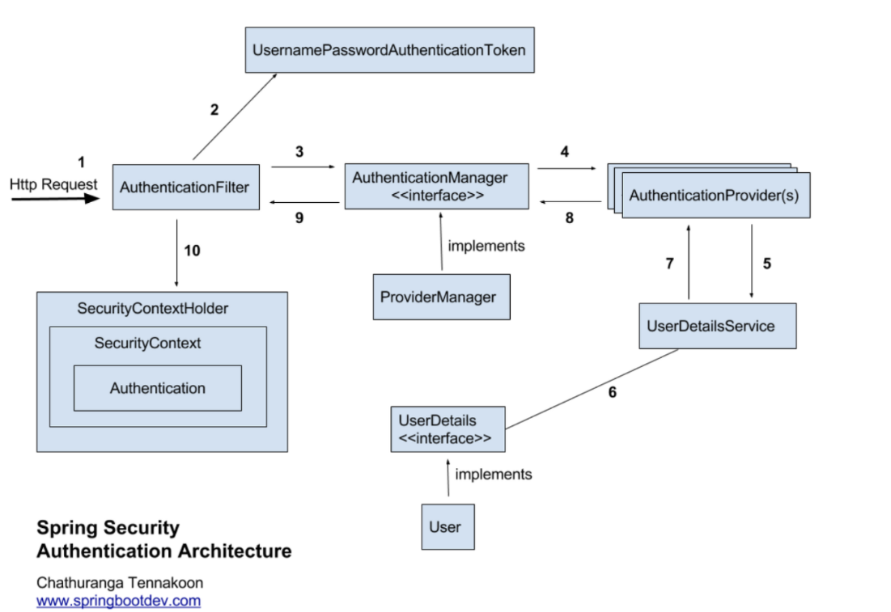
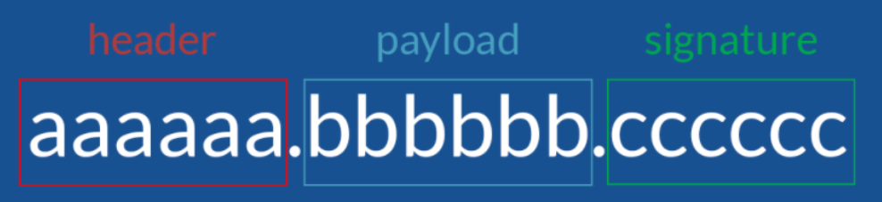
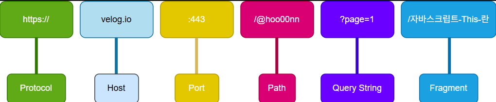

# Spring Security

---

## 공통 주제

### 🍀 Spring Security란 무엇인가요? CORS 에러가 무엇인가요?

**Spring Security**는 **인증, 권한 관리 그리고 데이터 보호 기능을 포함**하여 **웹 개발 과정에서 필수적인 사용자 관리 기능을 구현하는데 도움을 주는 Spring의 프레임워크**.

**개발자들이 보안 관련 기능을 효율적이고 신속하게 구현할 수 있도록 도와줌.**

CORS란?

교차-출처 리소스 공유(Cross-Origin Resource Sharing)

다른 출처라고도 말할 수 있고 다른 출처이기 때문에 발생하는 에러

CORS는 한 도메인이 도메인 간의 요청을 가진 다른 도메인의 리소스에 액세스할 수 있게 해주는 보안 메커니즘으로 최신 브라우저에서 구현된 **동일 출처 정책** 때문에 등장하게 됨.

**동일 출처 정책은 말 그대로 동일한 출처의 리소스에만 접근하도록 제한하는 정책**을 말함. 여기서 말하는 출처라는것은 프로토콜, 호스트명, 포트가 같다는 것을 의미함.

ex) 프론트엔드(예: `http://localhost:3000`)에서 백엔드(예: `http://localhost:8080`) API를 호출할 때

1. Spring Security란 무엇인가요?
    1. 인증과 인가란 무엇일까요?
        - 인증 : 유저가 누구인지 확인하는 절차, 회원가입하고 로그인 하는 것.
            - 인증(Authentication) 방식
                1. 세션 기반 인증 방식
                2. 토큰 기반 인증 방식
                3. OAuth 기반 인증 방식
        - 인가 : 유저에 대한 권한을 부여하는 것.
            - 인가(Authorizaion) 절차 → 권한 부여
                1. Authentication 절차를 통해 access token을 생성한다. access token에는 유저 정보를 확인할 수 있는 정보가 들어가 있어야 한다 (예를 들어 user id).
                2. 유저가 request를 보낼때 access token을 첨부해서 보낸다.
                3. 서버에서는 유저가 보낸 access token을 복호화 한다.
                4. 복호화된 데이터를 통해 user id를 얻는다.
                5. user id를 사용해서 database에서 해당 유저의 권한(permission)을 확인하다.
                6. 유저가 충분한 권한을 가지고 있으면 해당 요청을 처리한다.
                7. 유저가 권한을 가지고 있지 않으면 Unauthorized Response(401) 혹은 다른 에러 코드를 보낸다.
    2. Spring Security의 구조
        
        
        
        1. Security Filter Chain 
            1. 인증/인가 관련 요청을 가로채는 필터들의 묶음. `UsernamePasswordAuthenticationFilter` 등이 포함됨.
        2. AuthenticationManager
            1. 인증 처리의 핵심. 실제 인증 로직 (`UserDetailsService`, `AuthenticationProvider`)을 호출함.
        3. AuthenticationProvider
            1. 인증 수단을 처리하는 컴포넌트. DB 사용자 조회, 비밀번호 확인 등을 담당함.
        4. UserDetailsService
            1. 사용자 정보를 DB 등에서 조회하여 `UserDetails` 객체로 반환함.
        5. UserDetails
            1. 사용자 정보를 담는 객체. username, password, authorities 등이 있음.
        6. SecurityContextHolder
            1. 인증된 사용자 정보를 ThreadLocal에 저장해서 어플리케이션 전반에서 접근 가능하게 함.
        7. AccessDecisionManager
            1. 인가 결정 로직 수행. 사용자의 권한이 특정 리소스에 접근 가능한지를 판단함.
    3. Spring Security의 동작 과정
        
        **1. Http Request 수신**
        
        - > 사용자가 로그인 정보와 함께 인증 요청을 한다.
        
        **2. 유저 자격을 기반으로 인증토큰 생성**
        
        - > AuthenticationFilter가 요청을 가로채고, 가로챈 정보를 통해 UsernamePasswordAuthenticationToken의 인증용 객체를 생성한다.
        
        **3. FIlter를 통해 AuthenticationToken을 AuthenticationManager로 위임**
        
        - > AuthenticationManager의 구현체인 ProviderManager에게 생성한 UsernamePasswordToken 객체를 전달한다.
        
        **4. AuthenticationProvider의 목록으로 인증을 시도**
        
        - > AutenticationManger는 등록된 AuthenticationProvider들을 조회하며 인증을 요구한다.
        
        **5. UserDetailsService의 요구**
        
        - > 실제 데이터베이스에서 사용자 인증정보를 가져오는 UserDetailsService에 사용자 정보를 넘겨준다.
        
        **6. UserDetails를 이용해 User객체에 대한 정보 탐색**
        
        - > 넘겨받은 사용자 정보를 통해 데이터베이스에서 찾아낸 사용자 정보인 UserDetails 객체를 만든다.
        
        **7. User 객체의 정보들을 UserDetails가 UserDetailsService(LoginService)로 전달**
        
        - > AuthenticaitonProvider들은 UserDetails를 넘겨받고 사용자 정보를 비교한다.
        
        **8. 인증 객체 or AuthenticationException**
        
        - > 인증이 완료가되면 권한 등의 사용자 정보를 담은 Authentication 객체를 반환한다.
        
        **9. 인증 끝**
        
        - > 다시 최초의 AuthenticationFilter에 Authentication 객체가 반환된다.
        
        **10. SecurityContext에 인증 객체를 설정**
        
        - > Authentication 객체를 Security Context에 저장한다.
        
        최종적으로는 SecurityContextHolder는 세션 영역에 있는 SecurityContext에 Authentication 객체를 저장한다. 사용자 정보를 저장한다는 것은 스프링 시큐리티가 전통적인 세선-쿠키 기반의 인증 방식을 사용한다는 것을 의미한다.
        

### 🍀 Jwt란 무엇이며, 어떤 역할을 하나요?

1. Jwt란 무엇인가요?
    
    Json Web Token
    
    웹 상에서 정보를 Json형태로 주고 받기 위해 표준규약에 따라 생성한 암호화된 토큰으로 복잡하고 읽을 수 없는 string 형태로 저장
    
    1. 쿠키, 세션, 토큰 각각의 인증 방식은 무엇이고 각각 어떤 차이가 있을까요?
        - 쿠키
            
            ### 동작 방식:
            
            1. 사용자가 로그인하면 서버가 세션을 생성하고, 그 세션 ID를 **쿠키에 저장해서 클라이언트에 전달**함.
            2. 이후 사용자가 요청을 보낼 때 **브라우저가 쿠키에 저장된 세션 ID를 자동으로 포함**해서 보냄.
            3. 서버는 이 세션 ID를 확인하고, 로그인된 사용자 정보를 찾아서 요청을 처리함.
            
            ### 장점:
            
            - 자동으로 쿠키가 요청에 포함되어 편리함.
            - 보안 설정 (`HttpOnly`, `Secure`, `SameSite`)으로 보호 가능.
            
            ### 단점:
            
            - 서버가 세션 상태를 **메모리나 DB에 저장**해야 하므로 확장성이 떨어짐.
        - 세션
            
            ### 동작 방식:
            
            - **쿠키 기반 인증의 뒷단 구조**에 해당.
            - 클라이언트는 세션 ID만 갖고 있고, **모든 사용자 상태(로그인 정보)는 서버 세션 저장소**에 있음.
            
            ### 장점:
            
            - 민감한 데이터가 클라이언트에 노출되지 않음.
            
            ### 단점:
            
            - 서버에 사용자 수만큼 세션이 쌓임 → **서버 확장성 문제**.
            - 로드 밸런싱 시 세션 공유가 필요함 (예: Redis 세션 스토어).
        - 토큰
            
            ### 동작 방식:
            
            1. 사용자가 로그인하면 서버는 **서명된 토큰(JWT 등)을 생성해서 클라이언트에 전달**.
            2. 클라이언트는 이 토큰을 **로컬 저장소(LocalStorage 등)에 저장**.
            3. 이후 요청 시 `Authorization: Bearer <token>` 헤더에 토큰을 담아서 보냄.
            4. 서버는 이 토큰을 **검증만 하고, 상태를 따로 저장하지 않음 (Stateless)**.
            
            ### 장점:
            
            - **서버는 상태를 저장하지 않아도 됨 → 확장성 우수**.
            - 다양한 클라이언트에서 사용하기 적합.
            - 토큰에 사용자 정보나 만료 시간 등을 포함 가능.
            
            ### 단점:
            
            - 토큰 탈취 시 위험 (특히 LocalStorage에 저장 시).
            - 토큰은 기본적으로 **재발급/폐기가 어려움** (단, 리프레시 토큰으로 보완 가능).
    
    1. Jwt는 어떤 구조로 이루어져 있나요?
        1. JWT는 **헤더(header)**, **페이로드(payload)**, **서명(signature)** 세 파트로 나눠져 있으며, 아래와 같은 형태로 구성되어 있다.
            
            
            
            - **헤더 (Header)**어떠한 알고리즘으로 암호화 할 것인지, 어떠한 토큰을 사용할 것 인지에 대한 정보가 들어있다.
            - **정보 (Payload)**전달하려는 정보(사용자 id나 다른 데이터들, 이것들을 클레임이라고 부른다)가 들어있다.payload에 있는 내용은 수정이 가능하여 더 많은 정보를 추가할 수 있다. 그러나 노출과 수정이 가능한 지점이기 때문에 인증이 필요한 최소한의 정보(아이디, 비밀번호 등 개인정보가 아닌 이 토큰을 가졌을 때 권한의 범위나 토큰의 발급일과 만료일자 등)만을 담아야한다.
            - **서명 (Signature)**가장 중요한 부분으로 헤더와 정보를 합친 후 발급해준 서버가 지정한 secret key로 암호화 시켜 토큰을 변조하기 어렵게 만들어준다.한가지 예를 들어보자면 토큰이 발급된 후 누군가가 Payload의 정보를 수정하면 Payload에는 다른 누군가가 조작된 정보가 들어가 있지만 Signatute에는 수정되기 전의 Payload 내용을 기반으로 이미 암호화 되어있는 결과가 저장되어 있기 때문에 조작되어있는 Payload와는 다른 결과값이 나오게 된다.이러한 방식으로 비교하면 서버는 토큰이 조작되었는지 아닌지를 쉽게 알 수 있고, 다른 누군가는 조작된 토큰을 악용하기가 어려워진다

1. Spring에서 Jwt를 어떻게 활용할 수 있을까요?
    1. AccessToken과 RefreshToken은 각각 무엇일까요?
        1. AccessToken : 사용자의 인증 정보(권한 등)를 담고 있는 토큰
        2. RefreshToken : Access Token이 만료되었을 때 새로운 Access Token을 발급받기 위한 토큰
        
        ```java
          
          // AccessToken 발급 메서드
          public String generateToken(CustomUserDetails customUserDetails) {
            return Jwts.builder()
              .setSubject(customUserDetails.getUsername())
              .claim("Role", customUserDetails.getRole().name())
              .setIssuedAt(new Date())
              .setExpiration(new Date(System.currentTimeMillis() + expirationTime))
              .signWith(getSigningKey(), SignatureAlgorithm.HS512)
              .compact();
          }
        ```
        
    2. 각 토큰은 클라이언트와 서버에서 어떤 방식으로 관리되어야 할까요?
        
        Access Token은 Stateless 인증 이므로 서버에 저장하지 않는다.
        
        클라이언트 측에서 메모리 or HttpOnly 쿠키 or Authorization Header 에 저장 한다
        
        API 요청시 Authorizaion: Bearer <token> 형식으로 전달한다.
        
        Refresh Token은 클라이언트, 서버 둘 다 저장한다.
        
        클라이언트 → 나중에 Access Token이 만료됐을 때, 새로운 토큰을 요청할 수 있도록 Refresh Token을 갖고 있어야 함.
        
        서버 → 들어온 Refresh Token이 정상적인 것인지 검증하기 위해 비교용으로 저장
        
        클라이언트는 HttpOnly 쿠키에 Refresh Token을 저장하고, 서버는 DB 또는 Redis 등에 Refresh Token을 저장한다. (Redis 추천).
        
        서버는 사용자ID, 발급한 Refresh Token, 만료 시각, (선택)IP, User-Agent 등 보안 요소를 저장한다.
        
    

### 🍀 CORS란 무엇인가요?

CORS란?

교차-출처 리소스 공유(Cross-Origin Resource Sharing)

다른 출처(Origin)의 리소스를 웹 브라우저에서 요청할 수 있도록 허용하는 정책

- **브라우저가 보안을 위해 기본적으로 막는 "다른 출처 간의 요청"을 제어하는 표준**
- 이 제한을 완화할 수 있도록 서버가 명시적으로 허용하는 규칙

다른 출처(Origin) 란?

ex) 프로토콜 http vs https

호스트 [localhost](http://localhost) vs example.com

포트 번호 8080 vs 3000

URL 구조



1. Origin이 무엇인가요?
    1. 출처(Origin)란 URL 구조에서 **Protocol, Host, Port**를 합친 것
    
2. SOP 정책이란 무엇인가요?
    1. **동일 출처 정책(Same-Origin-Policy) → 다른 출처의 리소스 접근을 금지**
    2. 즉 [https://www.appcenter.com](https://www.manja.com/) URL로 서버에 요청을 보내면 서버는 [https://www.appcenter.com](https://www.manja.com/) URL로만 응답을 보낼 수 있다
3. Spring에서 CORS를 어떤 방식으로 관리해야 할까요?
    - @CrossOrigin 어노테이션
        - 컨트롤러 단위로 관리(개별 설정)
    - WebMvcConfigurer
        - → CorsConfig에서 인터페이스 구현
    - Spring Security에서 관리
        - Spring Security가 CORS 요청을 먼저 차단하기 때문에, Spring Security에서 CORS 설정을 함께 해줘야함.
        - CORS 설정이 제대로 적용되지 않는다면 Spring Security 설정에서 먼저 차단하고 있는 경우가 많기 때문에, 보안을 다루는 경우엔 Security Filter 내에서 CORS를 명시적으로 허용해주는 게 가장 확실

## 🔎 과제

<aside>
✅ **Spring Security를 적용해봅시다.**

1. Spring Security 구성하기
2. AccessToken 발급/검증 로직 구현하기
3. ROLE 에 따른 API 호출 허가 구현하기
</aside>

# 개인별 발표주제

[제목 없음](../../../../../../Users/82105/OneDrive/바탕%20화면/eonjun/제목%20없음%201ddba96e906f81d68884d8b8c162c128.csv)