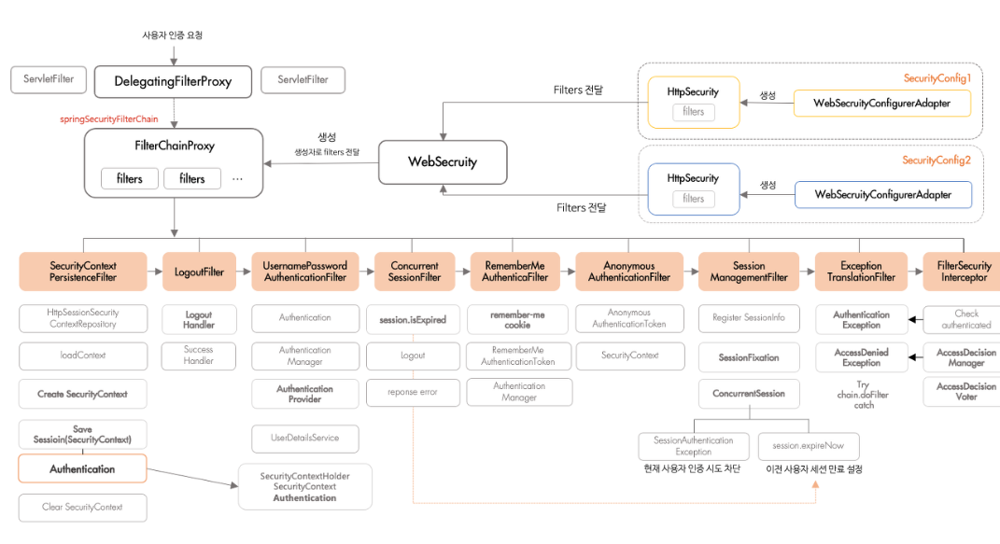

# 서버 스터디 4주차

### 🍀 Spring Security란 무엇인가요? CORS 에러가 무엇인가요?

1. Spring Security란 무엇인가요?
    - Spring Security란 애플리케이션의 보안(인증/인가 등)을 담당하는 프레임워크다.

1. 인증과 인가란 무엇일까요?
    
    <aside>
    💡
    
    인증(Authentication): 사용자의 신원 확인, 즉 유저 아이디와 비밀번호를 이용하여 로그인하는 과정
    
    인가(Authorization): 인증된 사용자의 권한 확인, 어떤 대상이 특정 행위를 할 수 있도록 허용하는 것
    
    </aside>
    
2. Spring Security의 구조 및 동작과정

- spring security의 구조는 filterchain 구조이다. 여러 필터가 순서(중요)대로 연결돼있고, 각 필터에서 보안 기능을 수행한다.

- 여기서 필터는 인증, 인가, 예외처리, 세션관리 등 많은 보안 기능을 쪼개 이 기능을 담당하도록 한 클래스이다.

- securityconfig(설정 클래스)에서 spring security에 대한 전반적인 관리, 제어를 할 수 있다.

```jsx
		@Bean
    public SecurityFilterChain filterChain(HttpSecurity http) throws Exception {
        http
                .csrf(csrf -> csrf.disable())
                .cors(cors -> cors.disable())
                .sessionManagement(session ->
                        session.sessionCreationPolicy(SessionCreationPolicy.STATELESS))
                // 접근 제어
                .authorizeHttpRequests(auth -> auth
                        .requestMatchers(
                                "/",
                                "/users/",
                                "/users/join",
                                "/users/login"
                        ).permitAll()
                        .anyRequest().authenticated())
                //JWT 필터 삽입
                .addFilterBefore(new JwtTokenFilter(jwtTokenProvider),
                        UsernamePasswordAuthenticationFilter.class);

        return http.build();
    }
```



1. Http Request
    - 사용자가 로그인 폼을 통해 사용자 이름(username)과 비밀번호(password)를 입력하고 요청을 보낸다.

1. DelegatingFilterProxy
    - 톰캣 등 서블릿 컨테이너가 보안 기능을 스프링에 위임하기 위해 있는 프록시 객체

1. FilterChainProxy
    - 여러 SecurityFilterChain중 request에 맞는 체인 선택, 체인 내부를 구성하는 체인들을 연쇄적으로 거침

1. UsernamePasswordAuthenticationFilter
    
    
    
    - 필터체인의 내부의 여러 필터 중 UsernamePasswordAuthenticationFilter는 request를 가로채 사용자 입력으로 UsernamePasswordAuthenticationToken 객체를 만든다. 이 토큰에는 입력된 아이디, 비밀번호가 들어있다.
    
    1. AuthenticationManager
        
        AuthenticationManager는 인터페이스다. 유연한 확장성과 다형성을 보장하기 위함이다. 이의 실제 구현체는 ProviderManager로, 여러 AuthenticationProvider의 중간 관리자 역할을 한다. 인증 방식에 맞게 알맞은 AuthenticationProvider를 찾아 위임한다.
        
        ```jsx
        // ProviderManager 코드 일부
        for (AuthenticationProvider provider : providers) {
            if (provider.supports(authenticationToken.getClass())) {
                
                return provider.authenticate(authenticationToken);
            }
        }
        
        ```
        
        ```jsx
        // UserController
        @PostMapping("/login")
            public ResponseEntity<String> logIn(@RequestBody UserSignupRequest request) {
                UsernamePasswordAuthenticationToken authenticationToken =
                        new UsernamePasswordAuthenticationToken(request.getEmail(), request.getPassword());
                Authentication authentication = authenticationManager.authenticate(authenticationToken);
        
                String token = jwtTokenProvider.createToken(authentication.getName());
        
                // 헤더에 담아 리턴
                HttpHeaders httpHeaders = new HttpHeaders();
                httpHeaders.add("Authorization", "Bearer " + token);
        
                return ResponseEntity.status(HttpStatus.OK).headers(httpHeaders).body(token);
            }
            
            
          
        ```
        
    2. AuthenticationProvider
    Authenticationprovider는 실제 인증을 수행하는 로직의 핵심이다. 
        
        
        DaoAuthenticationProvider(DB 기반 사용자 인증), AnonymousAuthenticationProvider(인증되지 않은 사용자에게도 허용), RememberMeAuthenticationProvider(브라우저 쿠키로 자동 로그인), JwtAuthenticationProvider(Jwt 토큰 기반 인증, 직접 구현) 등 많은 AuthenticationProvider 중에서 인증 방식에 맞는걸 선택해 인증 로직을 수행한다.
        
        ```jsx
        //JwtTokenFilter 코드의 일부
        if (jwtTokenProvider.validateToken(token)) {
                        Authentication auth = jwtTokenProvider.getAuthentication(token);
                        SecurityContextHolder.getContext().setAuthentication(auth);
                    }
                    
        //JwtTokenProvider 코드의 일부
        		public boolean validateToken(String token) {
                try {
                    Jwts.parser()
                            .setSigningKey(secretKey.getBytes(StandardCharsets.UTF_8))
                            .parseClaimsJws(token);
                    return true;
                } catch (JwtException | IllegalArgumentException e) {
                    return false;
                }
            }
            
        		public Authentication getAuthentication(String token) {
                String username = getSubject(token);
                UserDetails userDetails =
                        userDetailsService.loadUserByUsername(username);
        
                return new UsernamePasswordAuthenticationToken(
                        userDetails, token, Collections.emptyList());
            }
        ```
        
    3. UserDetailsService
    AuthenticationProvider는 UserDetailsService를 호출해서 DB에 있는 사용자 정보를 로딩한다.
    
    ```jsx
    // CustomUserDetailsService 코드 일부
    public UserDetails loadUserByUsername(String email)
                throws UsernameNotFoundException {
    
            User user = userRepository.findByEmail(email)
                    .orElseThrow(() -> new UsernameNotFoundException(email));
    ```
    
    1. UserDetails
        
        Spring Security에서 사용자의 정보를 담는 인터페이스다. 인터페이스는 아래와 같이 구성되어있고, DB에서 가져온 사용자 정보는 UserDetails 인터페이스를 구현한 객체(User 등)로 반환된다.
        
        ```jsx
        public interface UserDetails extends Serializable {
            Collection<? extends GrantedAuthority> getAuthorities();
        
            String getPassword();
        
            String getUsername();
        
            default boolean isAccountNonExpired() {
                return true;
            }
        
            default boolean isAccountNonLocked() {
                return true;
            }
        
            default boolean isCredentialsNonExpired() {
                return true;
            }
        
            default boolean isEnabled() {
                return true;
            }
        }
        ```
        
    2. UserDetails → AuthenticationProvider, 각 provider의 인증 방식에 맞게 인증 과정을 거친다.
    
    1. 인증 성공
    AuthenticationProvider가 인증 완료된 Authentication 객체를 반환한다.
    
    1. AuthenticationManager → AuthenticationFilter
    AuthenticationManager는 인증된 객체를 AuthenticationFilter로 다시 넘긴다.
    
    1. SecurityContextHolder
    최종적으로 SecurityContextHolder에 인증 정보를 저장한다.

```jsx
SecurityContextHolder.getContext().setAuthentication(auth);
```

1. 필터체인을 거친 후 컨트롤러 실행, 이후 거쳤던 필터체인을 역으로 돌아오면서 응답에 대한 후처리를 실행한다.

### 🍀 Jwt란 무엇이며, 어떤 역할을 하나요?

1. Jwt란 무엇일까요?

Jwt란 JSON 포맷을 이용해 사용자의 속성을 저장하는 토큰이다.

1. 쿠키, 세션, 토큰 각각의 인증 방식은 무엇이고 각각 어떤 차이가 있을까요?
    1. 쿠키
        - 브라우저가 서버로부터 받은 데이터의 일부를 클라이언트에 저장하는 방식이다. 주로 세션 ID같은 인증 관련 정보를 저장한다.
        
        - 로그인 없이 쇼핑몰 장바구니에 물건을 담을 수 있는 것도 쿠키 덕분이다. 로그인을 하지 않을 때는 http의 set-cookie 헤더를 통해 임시 세션 쿠키를 발급 받는다.
        
    2. 세션
        - 사용자가 로그인하면 서버는 사용자 정보를 세션 저장소에 저장하고, 세션 ID를 생성해 클라이언트에 전달한다.
        
        - 실제 인증에서는 쿠키와 세션이 함께 사용되는 경우가 많다.
        
        - 서버 내 메모리 조회는 빠르지만, 분산 저장하는 경우 네트워크 오버헤드가 커질 수 있다.
        
        - 서버가 여러 대 있으면 세션 동기화를 위해 중앙 세션 저장소가 필요하다. 서버 증설 시 복잡도가 증가한다.
        
    3. 토큰
        - 사용자가 로그인하면 서버가 인증 정보를 담은 토큰을 발급하고, 클라이언트는 토큰을 저장한다. request를 보낼 때 http 헤더에 토큰을 함께 보낸다.
        
        - 서버는 토큰을 검증해 인증을 처리한다. 토큰 자체가 정보를 보관하기 때문에 토큰을 이용하면 서버는 세션 저장소가 필요없다. 즉, stateless하다.
        
        - 서버가 stateless하기 때문에 확장성이 좋고 분산환경에 유리하다.
        
        - 다만 토큰이 탈취되면 만료되기 전까지 큰 문제가 생길 수 있고, 암호화 검증 과정에서 세션 방식보다 cpu 연산 부담이 크다.
        
2. Jwt는 어떤 구조로 이루어져 있나요?
    - Jwt는 header, payload, signature로 구성된다. 각 부분은 모두 base64를 통해 인코딩된다.
    
    - header
        
        alg, typ로 구성된다.
        
    
    ```jsx
    { 
       "alg": "HS256", // 해싱 알고리즘
       "typ": "JWT" // 토큰 타입
     }
    ```
    
    - payload
        - payload에는 토큰에서 사용할 정보들의 조각인 클레임이 담겨있다.
        
        - 클레임에는 registered claim, public claim, private claim 세 종류가 있다.
        
        - registered claim은 토큰 정보를 표현하기 위해 정해진 종류들의 데이터다.
        
        
        
        - public claim은 사용자 정의 클레임으로, 공개용 정보를 위해 사용된다. 충돌 방지를 위해 URI 포맷을 사용한다.
        
        ```jsx
        { 
            "https://mangkyu.tistory.com": true
        }
        ```
        
        - private claim은 사용자 정의 클레임으로, 서버와 클라이언트 사이에 임의로 지정한 정보를 저장한다.
        
        ```jsx
        { 
            "access_token": access 
        }
        ```
        
    
    - signature는 토큰을 인코딩하거나 유효성 검증을 할 때 사용하는 고유한 암호화 코드이다.
        - header와 payload값을 base64로 인코딩하고, 인코딩한 값을 비밀 키를 이용해 header에서 정의한 알고리즘으로 해싱을 하고, 이 값을 다시 base64로 인코딩하여 생성한다.
        
        
        
3. Jwt의 장점과 단점은 각각 무엇일까요?
    - OAuth를 이용해 카카오, 네이버 같은 외부 로그인을 쉽게 연동 가능
    - 이외 장단점은 토큰 인증 방식과 동일

1. Spring에서 Jwt를 어떻게 활용할 수 있을까요?
    1. AccessToken과 RefreshToken은 각각 무엇일까요?
        - AccessToken
            - 사용자가 로그인에 성공하면 서버가 발급하는 토큰이다.
            
            - 사용자가 인증됐음을 증명하고, 헤더에 담아서 서버에 전송한다.
            
            - 만료되면 더 이상 사용이 불가능하다. 하지만 RefreshToken 유효기간이 남아있다면 AccessToken을 재발급 받아 다시 로그인할 필요가 없다.
            
        - RefreshToken
            - AccessToken이 만료됐을 때 새로운 AccessToken을 발급받기 위해 사용하는 토큰이다.
            
            - RefreshToken을 서버에 보내면 서버는 유효한지 확인 후 새로운 AccessToken을 발급받는다. AccessToken보다 유효기간이 길다.
            
            - 만료되면 다시 로그인해 토큰을 재생성해야한다.
        
    2. 각 토큰은 클라이언트와 서버에서 어떤 방식으로 관리되어야 할까요?
        - AccessToken
            1. 클라이언트
            - 쿠키
                1. HttpOnly 플래그를 사용해 JavaScript에서 쿠키에 접근할 수 없게 함으로써 XSS 공격(웹페이지 악성 스크립트 삽입)에 대한 보안을 높일 수 있다.
                2. Secure 플래그를 사용해 HTTPS 연결에서만 쿠키가 전송되게 하여 중간자 공격 ( MITM )으로부터 보호할 수 있다.
                3. SameSite 쿠키 속성을 통해 CSRF 공격(사용자 세션을 이용해 의도치 않은 요청 실행)을 방어할 수 있다.
            
            - 로컬 저장소
                1. 클라이언트 측에 데이터를 영구적으로 저장하는 방식이다.
                    
                    → 브라우저를 닫아도 데이터가 유지된다.
                    
                2. XSS 공격에 취약, 탈취당할 위험이 있다.
            
            - 세션 저장소
                1. 브라우저가 닫히면 데이터가 삭제, 같은 탭에서만 유효
                2. XSS 공격에 취약
            
            - 메모리
                1. 클라이언트의 메모리에 저장하는 방식이다.
                2. 매 요청 시마다 API 호출 시 AccessToken에 접근이 쉬워지지만, 페이지를 이동하면 AccessToken이 소멸한다.
                3. SPA(Single Page Application)에서 주로 사용한다.
                4. 페이지를 새로고침 시, 다시 로그인이 필요하다.
                5. XSS 공격에 쉽게 탈취되지 않는다.
                
            1. 서버
            - 서명만 검증하고, 별도의 저장소에 관리하지 않는다.
        
        - RefreshToken
            1. 클라이언트
                1. 보안을 위해 HttpOnly 플래그, Secure 플래그를 사용해 쿠키에 저장한다.
                2. 탈취 당할 경우, 만료될 때까지 문제가 생길 수 있으므로 노출되지 않게 주의해야 한다.
            2. 서버
                1. 일반적으로 암호화된 데이터베이스에 저장한다.
                2. 토큰을 사용할 때마다 유효성 검사, 만료 확인으로 보안을 강화한다.

---

업데이트 예정

### 🍀 Jwt란 무엇이며, 어떤 역할을 하나요?

1. Origin이 무엇인가요?
2. SOP 정책이란 무엇인가요?
3. Spring에서 CORS를 어떤 방식으로 관리해야 할까요?

만약 요청에 출처 없다면?
(1) 사용자는 평소처럼 bank.com에 로그인
↓
[브라우저]
쿠키 저장됨: [bank.com](http://bank.com/) → SESSIONID=abc123

(2) 로그아웃하지 않은 채 [evil.com](http://evil.com/) 방문
↓
evil.com에는 이런 HTML이 숨어있음:


(3) evil.com이 직접 요청하는 게 아니라
"사용자의 브라우저가 bank.com에 요청을 보냄"
↓
이때, 요청은 bank.com을 향하므로
브라우저는 자동으로 [bank.com](http://bank.com/) 쿠키를 같이 보냄

(4) 결과: [bank.com](http://bank.com/) 입장에서는
"세션ID=abc123인 사용자가 요청한 것처럼" 보임
→ 송금 실행됨 😱

CORS 에러는 브라우저가 다른 origin에 접근하려 할 때 발생하는 보안 정책임.

Origin은 프로토콜 + 도메인 + 포트를 조합한 것

SOP는 같은 origin만 리소스 공유 가능, CORS는 SOP를 위반하지만 CORS 정책을 따르면 허용하겠다는 것.
예시 - 프론트, 백 포트번호 다를 때?

[https://teddy0.tistory.com/7](https://teddy0.tistory.com/7)[https://velog.io/@hope0206/Spring-Security-구조-흐름-그리고-역할-알아보기](https://velog.io/@hope0206/Spring-Security-%EA%B5%AC%EC%A1%B0-%ED%9D%90%EB%A6%84-%EA%B7%B8%EB%A6%AC%EA%B3%A0-%EC%97%AD%ED%95%A0-%EC%95%8C%EC%95%84%EB%B3%B4%EA%B8%B0)[https://velog.io/@dh1010a/SpringSecurity-스프링시큐리티의-기본-개념과-구조](https://velog.io/@dh1010a/SpringSecurity-%EC%8A%A4%ED%94%84%EB%A7%81%EC%8B%9C%ED%81%90%EB%A6%AC%ED%8B%B0%EC%9D%98-%EA%B8%B0%EB%B3%B8-%EA%B0%9C%EB%85%90%EA%B3%BC-%EA%B5%AC%EC%A1%B0)

.png)

authenticationfilter부분에서 체인 형태로 동작. 순서도 중요함.

삭제 api에서 userid 직접쓰면 큰일남 

securityconfig에서 requestMatchers에 hasrole을 이용해 권한에 따른 api 사용 가능하게 함

requestMatcher에 HttpMethod.~ url하면 각 CRUD마다 url 같아도 구별 가능

authenticate 함수 타고 들어가보기