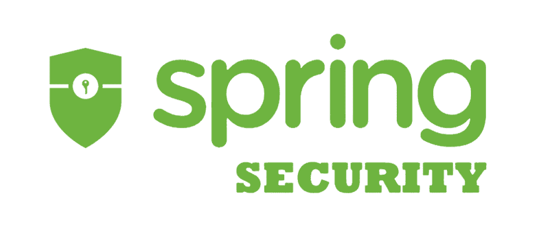
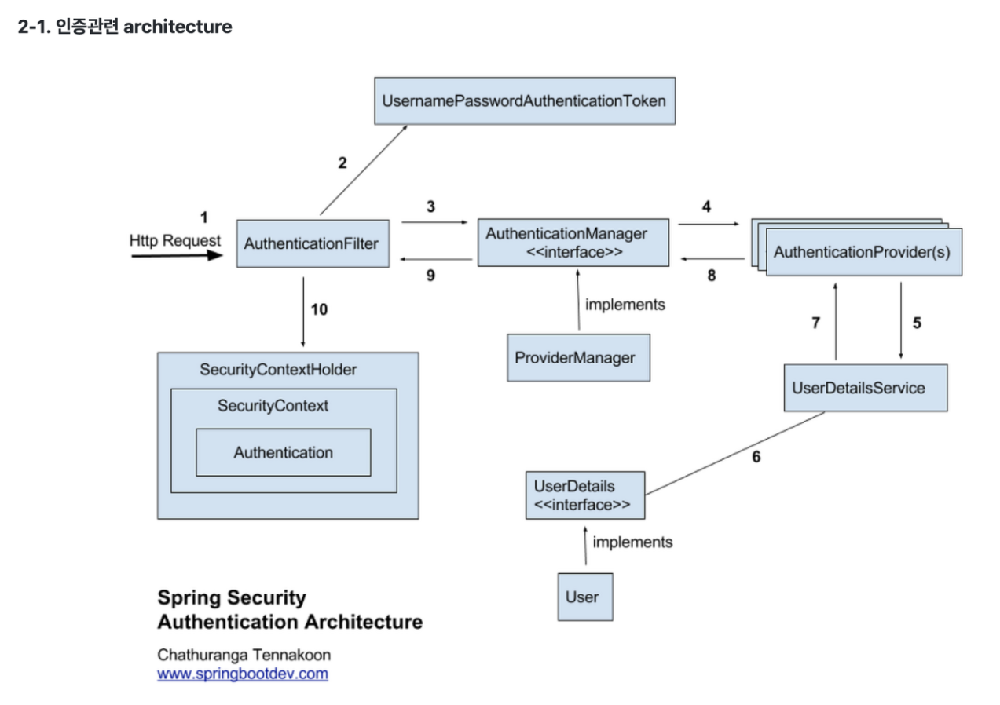

# Spring Security

추가 일시: 2025년 4월 23일 오후 10:00
강의: Appcenter_Server

# 🔐 Spring Security

---

## 🍀 Spring Security란 무엇인가요? CORS 에러가 무엇인가요?

---

### ✅ Spring Security란 무엇인가요?



> Spring Securtiy는 인증, 권한 관리 그리고 데이터 보호 기능을 포함하여 웹 개발 과정에서 필수적인 사용자 관리 기능을 구현하는데 도움을 주는 Sping의 강력한 프레임워크입니다.

일반적으로 개발 시 가장 먼저 작업하는 부분이 사용자 관리 부분으로 가볍게는 회원가입부터 로그인, 로그아웃, 세션 관리, 권한 관리까지 온라인 플랫폼에 맞춰 다양하게 작업되는 인가 & 보안 기능은 개발자에게 많은 시간을 요구하는데요.

Spring 생태계 내에서 이러한 요구사항을 효과적으로 지원하기 위해 개발된 것이 Spring Securtiy로 개발자들이 보안 관련 기능을 효율적이고 신속하게 구현할 수 있도록 도와줍니다.
> 

한 줄 정리

→ 보안 관련 기능을 개발자가 쉽게 구현할 수 있도록 한다!

**인증과 인가란 무엇일까요?**

- 인증 (Authentication) : 해당 사용자가 본인이 맞는지 확인합니다.
- 인가 (Authorization) : 인증된 사용자가 요청한 자원에 접근 가능한지를 결정합니다.

**Spring Security의 내부 구조 및 인증 처리과정**



<aside>
🔑

**인증 처리과정**

1. 요청이 들어오면 AuthenticationFilter(UsernamePassAuthenticationFilter)를 통해 요청에 따른 UsernamePasswordAuthenticationToken을 생성한다.
2. 생상된 토큰은 AuthenticationManager에 전달된다
3. AuthenticationManager는 전달받은 토큰을 AuthenticationProvider에게 전달한다.
4. UserDetailsService를 통해 로그인 요청자의 정보와 데이터베이스에 저장된 사용자 정보를 비교한 후, 사용자 정보 있을 경우 이를 AuthenticationProvider에게 전달한다.
5. AuthenticationProvider는 전달받은 사용자 정보에서 패스워드 정보를 추출하여, 요청자가 제출한 로그인 폼 데이터의 패스워드와 비교한다.
6. 일치할 경우 인증 토큰을 생성하여 이를 AuthenticationManager에게 반환한다.
7. AuthenticationManager는 토큰 유효성을 확인하고 사용자 인증 객체를SecurityContextHolder에 저장한다.
8. 인증 정보가 존재하지 않으면 SecurityContextHolder에서 사용자의 정보를 제거한다.
9. 인증 정보가 존재할 경우 사용자에게 인증된 세션이 발급된다.
</aside>

## 🍀 Jwt란 무엇이며, 어떤 역할을 하나요?

---

### ✅ Jwt란 무엇인가요?

Json Web Token으로 Json format으로 사용자에 대한 속성을 저장하는 Web Token 입니다.

**쿠키, 세션, 토큰 각각의 인증 방식은 무엇이고 각각 어떤 차이가 있을까요?**

**쿠키**


Cookie는 웹 서버가 사용자의 웹 브라우저에 저장하는 작은 데이터 조각.

이를 통해 서버는 사용자의 이전 방문 정보, 로그인 상태 등을 기억할 수 있다.

쿠키는 주로 사용자 인증, 세션 관리, 사용자의 선호 설정 저장 등에 사용된다.

key-value 형식의 문자열 형태로 저장

```json
{   
	"Set-Cookie" : "id=user123",
	"Set-Cookie" : "pw=pw1234@"
}
```

쿠키의 가장 큰 장점은 간단한 구현과 빠른 처리 속도이다.

다만, 쿠키는 클라이언트 측에 저장되기 때문에 보안에 취약하다는 단점이 있다.

쿠키 정보가 암호화되지 않은 상태로 전송되면 정보가 노출될 수 있다.

쿠키는 브라우저마다 별도로 저장되므로, 같은 사용자가 다른 브라우저를 사용할 경우 정보가 공유되지 않는 문제가 있다.

<aside>
🍪

쿠키 전송 흐름

1. 클라이언트가 페이지를 요청
2. 서버에서 쿠키 생성
3. HTTP 헤더에 쿠키를 포함하여 응답
4. 브라우저가 종료되어도 쿠키 만료 기간이 있다면 클라이언트에서 보관
5. 같은 요청을 할 경우 HTTP 헤더에 쿠키를 함께 보냄
6. 서버에서 쿠키를 읽어 이전 상태 정보를 변경 할 필요가 있을 때 쿠키를 업데이트하여 변경된 쿠키를 HTTP 헤더에 포함시켜 응답
</aside>

**세션**


Session은 일정 시간 동안 같은 사용자(브라우저)로부터 들어오는 일련의 요구를 하나의 상태로  보고, 그 상태를 유지시키는 기술.

일정 시간은 방문자가 웹 브라우저를 통해 웹 서버에 접속한 시점부터 웹 브라우저 종료 시점.

즉, 브라우저가 종료되기 전까지 클라이언트의 요청을 유지하게 해주는 기술을 세션이라 한다.

웹 서버에 웹 컨테이너의 상태를 유지하기 위한 정보를 저장한다.

**웹 서버에 저장되는 쿠키(session cookie)이다.**

브라우저를 닫거나, 서버에서 세션을 삭제했을 때 삭제가 되기 때문에 쿠키보다 보안 우수.

저장 데이터의 제한이 없다. (쿠키는 도메인당 20개의 쿠키, 하나의 쿠키는 최대 4KB) 

<aside>
💡

세션 전송 흐름

1. 클라이언트가 서버에 접속 시 세션 ID를 발급 받음
2. 클라이언트는 세션 ID에 대해 쿠키를 사용해서 저장하고 가지고 있음
3. 클라이언트는 서버에 요청할 때, 이 쿠키의 세션 ID를 같이 서버에 전달해서 요청
4. 서버는 세션 ID를 전달 받아 별다른 작업 없이 세션 ID로 세션에 있는 클라이언트 정보를 가져와서 사용
5. 클라이언트 정보를 가지고 서버 요청을 처리하여 클라이언트에게 응답
</aside>

- 쿠키와 세션은 비슷한 역할을 하며, 동작원리도 비슷하다 → 세션도 쿠키를 사용하기 때문
- 가장 큰 차이점은 사용자 정보가 저장되는 위치.
- 쿠키는 서버의 자원을 사용하지 않고, 세션은 서버의 자원을 사용함.
- 보안적 측면에서 세션이 더 우수하며, 요청 속도는 쿠키가 더 빠르다.
- 쿠키는 브라우저가 종료되도 만료기간에 따라 유지 될 수 있다.
- 세션은 브라우저가 종료되면 삭제

**토큰**


- 토큰 기반 인증은 사용자의 상태를 클라이언트 측에서 관리한다.
- 사용자가 로그인하면 서버는 클라이언트에게 Access Token을 발급한다.
- 이 토큰은 사용자를 인증하고 권한을 부여하는 데 사용된다, 클라이언트는 모든 요청에서 이 액세스 토큰을 포함하여 서버로 보낸다.
- 서버는 액세스 토큰을 검증하고, 해당 토큰이 유효하면 사용자를 인증하고 요청을 처리한다.
- 토큰은 일반적으로 JWT(JSON Web Token) 형식으로 사용되며, 클라이언트는 토큰을 디코딩 하여 사용자 정보 및 권한을 확인할 수 있다.

**Jwt는 어떤 구조로 이루어져 있나요?**


JWT는 헤더·내용·서명을 점 두 개로 이어 붙이고, 각 구간은 Base64URL로 인코딩해 만든 3-파트 토큰

- 헤더

알고리즘과 토큰 유형으로 구성되어있다.

typ: 토큰의 타입을 지정

alg: 알고리즘 방식을 지정하며, 서명(Signature) 및 토큰 검증에 사용 ex) HS256(SHA256) 또는 RSA

- 내용

iss: 토큰 발급자(issuer)

sub: 토큰 제목(subject)

aud: 토큰 대상자(audience)

exp: 토큰 만료 시간(expiration)

nbf: 토큰 활성 날짜(not before)

iat: 토큰 발급 시간(issued at)

jti: JWT 토큰 식별자(JWT ID), 중복 방지를 위해 사용하며, 일회용 토큰(Access Token) 등에 사용

- 서명

헤더의 서명 알고리즘을 사용하여 인코딩된 헤더와 인코딩된 페이로드에 서명합니다.

서명은 JWT 발급자가 누구인지 확인하고 도중에 메시지가 변경되지 않았는지 확인하는 데 사용됩니다.

**Jwt의 장점과 단점은 각각 무엇일까요?**

- JWT는 인증에 필요한 모든 정보를 담고 있기 때문에 인증을 위한 별도의 저장소가 없어도 된다.
- 세션(Stateful)과 다르게 서버는 무상태(StateLess)가 된다.
- 확장성이 우수하다.
- 토큰 기반으로 다른 로그인 시스템에 접근 및 권한 공유가 가능하다.
- OAuth의 경우 소셜 계정을 통해서 다른 웹서비스에 로그인 할 수 있다.
- 모바일에서도 잘 동작한다.(세션은 모바일x)

- JWT는 발급 후 서버가 일방적으로 폐기할 수 없다. 만료 전 탈취되면 블랙리스트 DB를 관리해야 한다.
- 쿠키/세션과 다르게 토큰의 길이가 길어, 인증 요청이 많아질수록 네트워크 부하가 심해진다.
- Payload의 정보가 제한적이다. Payload는 암호화 되지않기 때문에 디코딩하면 누구나 정보를 확인할 수 있다.

### ✅ Spring에서 Jwt를 어떻게 활용할 수 있을까요?

JWT 토큰은 탈취한 사람이 인증을 통과 할 수 있기 때문에 유효기간을 두어야한다.

다만 유효기간을 짧게하면 사용자가 로그인을 자주해야하는 불편함을 겪는다.

때문에 이를 해결하기 위해 유효기간이 다른 JWT 토큰 2개 AccessToken과 RefreshToken을 사용한다.

**AccessToken과 RefreshToken은 무엇일까요?**

로그인 인증에 성공한 클라이언트는 AccessToken과 RefreshToken 두 개를 서버로부터 받는다.

AcessToken : 클라이언트는 헤더에 AccessToken을 넣고 API통신을 한다.

RefreshToken : AccessToken의 유효기간이 만료되면 헤더에 RefreshToken을 넣어 API를 재요청한다.

만약 RefreshToken도 만료된다면 서버는 401 error code를 보내고 클라이언트는 재로그인해야한다.

## 🍀 CORS란 무엇인가요?

---


**Cross-Origin Resource Sharing**

교차 출처 리소스 공유로 도메인이 다른 서버끼리 리소스를 주고 받을 때 보안을 위해 설정된 정책

예를 들어 도메인이 다른 API 서버에서 데이터를 가져오려고 할 때 해당 API 서버에서 CORS 허용 설정이 되어있지 않으면 API접근이 거부된다.

### ✅ Origin이 무엇인가요?

Origin은 출처를 의미하며 URL 구조에서 Protocol, Host, Port를 합친것을 의미한다.


Cross origin은 Protocol, domain, port 중 하나라도 다른 경우 발생한다.

### ✅ SOP 정책이란 무엇인가요?

**Same-origin policy**

동일 출처 정책으로 하나의 Origin에서 로드된 자원이 Protocol, domain, port이 일치하지 않는 자원과 상호작용하지 못하도록 제한하고, 동일 출처에서만 접근이 가능하도록 하는 정책입니다.

### ✅ Spring에서 CORS를 어떤 방식으로 관리해야 할까요?

Spring 환경에서 CORS (Cross-Origin Resource Sharing)는 필요한 구간에만, 가장 앞단에서, 최소 권한 원칙으로 관리하는 것이 핵심이다.

1. 컨트롤러 메서드 단위

`@CrossOrigin` 어노테이션을 클래스에 붙여 특정 리소스만 열어주는 방법

```java
@CrossOrigin(origins = "https://app.example.com", maxAge = 3600,
             allowedHeaders = {"Content-Type","Authorization"},
             methods = {RequestMethod.GET, RequestMethod.POST},
             allowCredentials = "true")
@GetMapping("/api/data")
public DataDto find() {...}
```

코드 근처에서 정책이 보인다는 장점이 있지만 엔드포인트가 늘어날수록 반복 정의 해야한다.

1. 전역 CORS 레지스트리

```java
@Configuration
public class WebConfig implements WebMvcConfigurer {
  @Override
  public void addCorsMappings(CorsRegistry reg) {
    reg.addMapping("/api/**")
       .allowedOriginPatterns("https://*.example.com")
       .allowedMethods("GET","POST","PUT")
       .allowCredentials(true)
       .maxAge(3600);
  }
}
```

## 🔎 과제

<aside>
✅ **Spring Security를 적용해봅시다.**

1. Spring Security 구성하기
2. AccessToken 발급/검증 로직 구현하기

</aside>