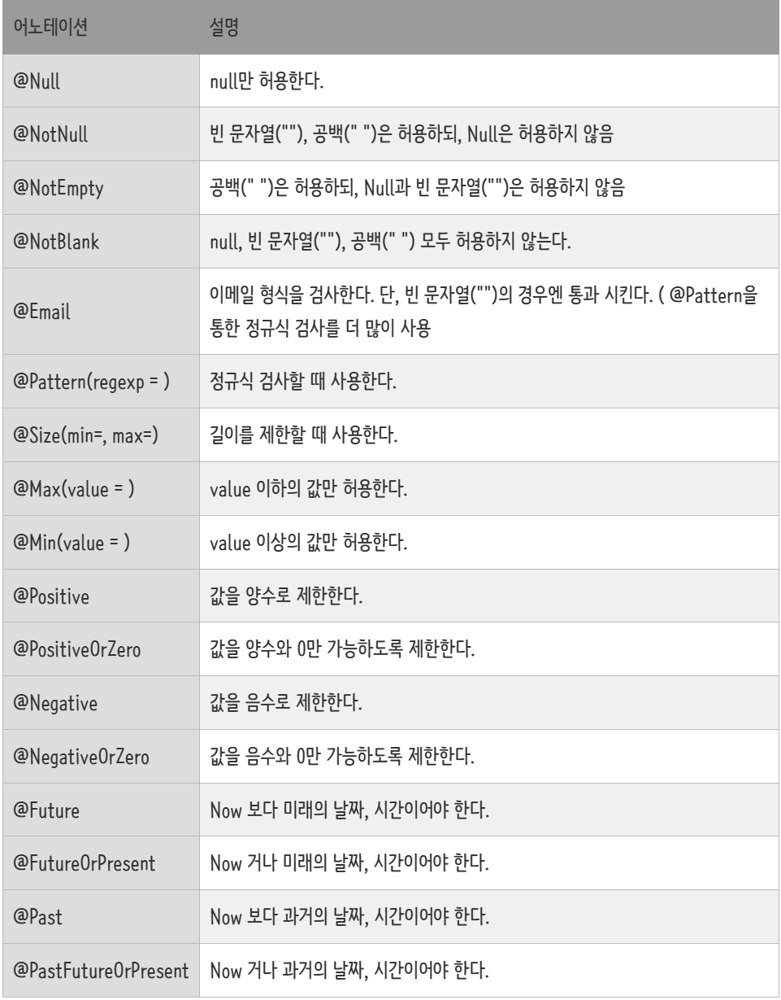
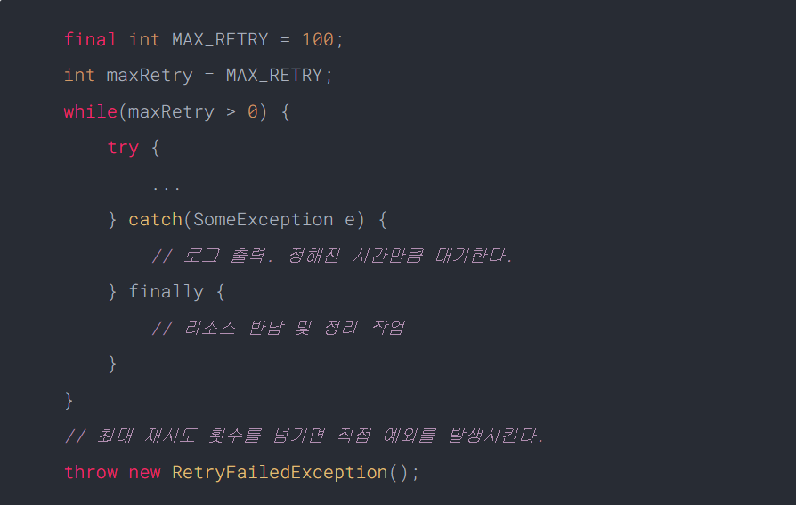
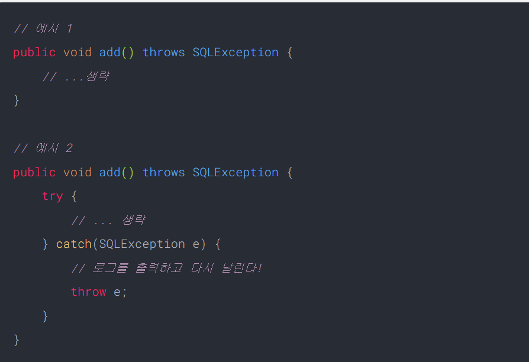
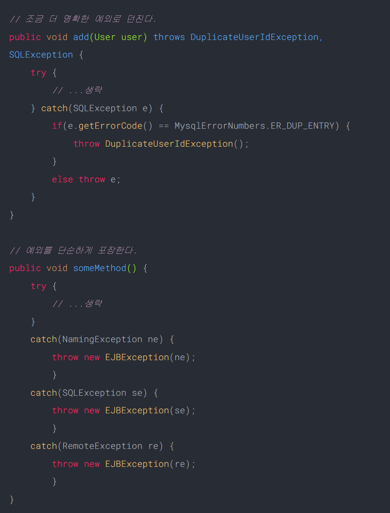
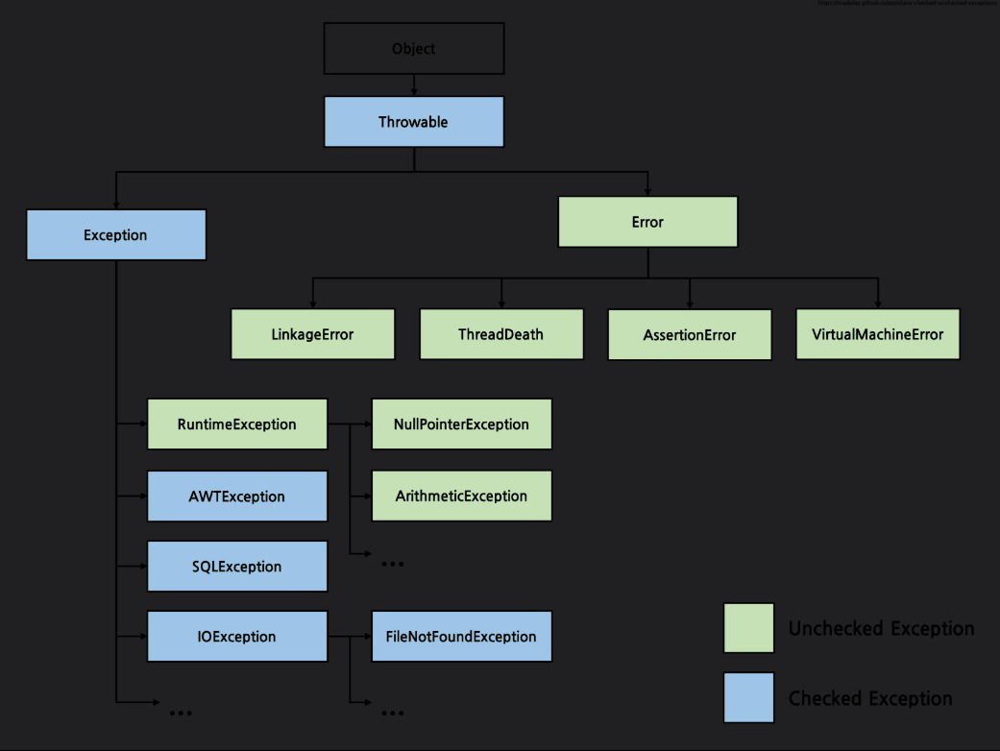

# Validation & Exception Handling

---

## 공통 주제

### 🍀 유효성 검사는 무엇이고 Spring에서 어떻게 적용할 수 있나요?

1. 유효성 검사란?
    1. 유효성 검사의 의미와 이유는 무엇인가요?
        - 유효성 검사(validation)는 데이터가 서버나 데이터베이스로 전달되기 전에, 개발자가 정한 조건에 맞는지 확인하는 과정. 즉, 개발자가 정한 조건에 맞는지 확인하는 과정
        - 유효성 검사를 하는 이유:
            - 데이터 품질 향상 :
                - 정확하지 않은 데이터가 데이터베이스에 저장되는 것을 방지 → 데이터 신뢰도 향상
            - 오류 예방:
                - 유효하지 않은 데이터로 인해 발생하는 오류를 사전에 방지 → 시스템 안정성 향상
            - 사용자 경험 개선:
                - 유효하지 않은 데이터를 입력할 경우 사용자에게 오류 메시지 표시 → 사용자 경험 개선
    2. 유효성 검사를 해야 하는 이유는 무엇일까요?
        1. Controller Layer에서 Request Body 검사를 함으로써 API 명세를 정확히 지킬 수 있음
        2. 프론트엔드 개발자의 개발중 실수를 즉각적으로 알려줌
        3. 비즈니스 로직상 올바르지 않은 형태의 데이터가 DB에 저장되는 것을 방지함
2. Spring에서의 유효성 검사는 어떻게 할까요?
    
    ```java
    Spring에서는 일종의 어댑터인 LocalValidatorFactoryBean가 제약 조건 검증을 처리한다.
    이를 이용하려면 LocalValidatorFactoryBean을 빈으로 등록해야 하는데
    , SpringBoot에서는 아래의 의존성만 추가해주면 해당 기능들이 자동 설정된다.
    // https://mvnrepository.com/artifact/org.springframework.boot/spring-boot-starter-validation
    implementation group: 'org.springframework.boot', name: 'spring-boot-starter-validation'
    ```
    
    1. 어디에서 유효성 검사를 실시해야 할까요?
        - 유효성 검사는 일반적으로 Controller Layer에서 수행하는 것이 가장 보편적이다.
            - 요청 바인딩과 동시에 검증할 수 있다
                - `@Valid` 혹은 `@Validated` 애너테이션을 이용해 DTO를 검증하면, 컨트롤러 진입 전에 `BindingResult` 또는 `MethodArgumentNotValidException`이 발생하여 글로벌 예외 처리로 연결됨
                
                ```java
                BindingResult란 @Valid or @Validated와 함께 사용되는 객체
                검증 결과(성공/실패)를 담는 역할을 함
                예외를 던지지 않고 컨트롤러 내에서 직접 검증 결과를 처리할 수 있게 해줌
                
                @PostMapping("/users")
                public ResponseEntity<?> register(
                    @Valid @RequestBody UserDto userDto,
                    BindingResult bindingResult
                ) {
                    if (bindingResult.hasErrors()) {
                        // 에러가 있을 경우 직접 처리
                        Map<String, String> errors = new HashMap<>();
                        bindingResult.getFieldErrors().forEach(error -> {
                            errors.put(error.getField(), error.getDefaultMessage());
                        });
                        return ResponseEntity.badRequest().body(errors);
                    }
                
                    // 검증 성공 시
                    return ResponseEntity.ok("회원가입 성공");
                }
                
                ```
                
                ```java
                MethodArgumentNotValidException란 @Valid를 사용했지만
                , BindeingResult를 생략한 경우 사용된다.
                유효성 검사에 실패하면 Spring이 자동으로 예외를 던짐(MethodArgumentNotValidException)
                MethodArgumentNotValidException 예외는 @RestControllerAdvice에서
                처리해서 에러 응답을 통일할 수 있음.
                
                @RestControllerAdvice(annotations = RestController.class, basePackages = {"study.server.domain.user"})
                public class GlobalExceptionHandler {
                
                  // 유효성 검사 실패 처리
                  @ExceptionHandler(MethodArgumentNotValidException.class)
                  public ResponseEntity<ApiResponse<?>> handleValidationException(MethodArgumentNotValidException ex) {
                    Map<String, String> errors = new HashMap<>();
                    ex.getBindingResult().getFieldErrors()
                      .forEach(error -> errors.put(error.getField(), error.getDefaultMessage()));
                
                    return ResponseEntity
                      .status(400)
                      .body(ApiResponse.error(400, "입력값 오류", errors));
                  }
                ```
                
            - 비즈니스 로직과 분리된다
                - Service Layer는 핵심 도메인 로직에 집중하고, 입력값 검증 같은 것은 Controller가 담당하는 게 관심사의 분리 측면에서 좋다
            - 자동 응답 처리 가능
                - `@RestControllerAdvice`에서 유효성 검사 실패 시 자동으로 에러 응답 포맷을 처리할 수 있어, 일관된 에러 응답이 가능
    2. Bean Validation은 무엇이며 왜 등장하게 됐나요?
        1. 어노테이션 형태로 제약 조건을 달아줘서 쉽게 검증할 수 있도록 돕는 API이다.
        2. 자바 객체의 데이터 유효성 검사(Validation)를 표준화하기 위해 등장한 명세
        3. Bean Validation은 인터페이스로 된 명세일 뿐이고 실제 동작할 수 있도록 구현한 것이 `Hibernate Validator`이다 (Spring에서 기본으로 사용)
        4. 등장한 이유
            - 다양한 시점(서비스, 컨트롤러)에서 자동으로 검증 가능
            - 관심사의 분리 (비즈니스 로직 ↔ 유효성 로직)
            - 재사용성 ↑, 유지보수성 ↑
    3. @Valid와 @Validated 의 차이는 무엇인가요?
        - @Valid 동작 원리
            
            ```
            모든 요청은 프론트 컨트롤러인 디스패처 서블릿을 통해 컨트롤러로 전달된다. 
            전달 과정에서는 컨트롤러 메소드의 객체를 만들어주는 ArgumentResolver가 동작하는데, 
            @Valid 역시 ArgumentResolver에 의해 처리가 된다.
            대표적으로 @RequestBody는 Json 메세지를 객체로 변환해주는 작업이
            ArgumentResolver의 구현체인 RequestResponseBodyMethodProcessor가 처리하며,
            이 내부에서 @Valid로 시작하는 어노테이션이 있을 경우에 유효성 검사를 진행한다.
            (이러한 이유로 @Valid가 아니라 커스톰 어노테이션인 @ValidMangKyu여도 동작한다.)
            만약 @ModelAttribute를 사용중이라면 ModelAttributeMethodProcessor에 의해 @Valid가 처리된다.
            
            그리고 검증에 오류가 있다면 MethodArgumentNotValidException 예외가 발생하게 되고,
            디스패처 서블릿에 기본으로 등록된 예외 리졸버(Exception Resolver)인 
            DefaultHandlerExceptionResolver에 의해 400 BadRequest 에러가 발생한다.
            
            이러한 이유로 @Valid는 기본적으로 컨트롤러에서만 동작하며
            기본적으로 다른 계층에서는 검증이 되지 않는다.
            다른 계층에서 파라미터를 검증하기 위해서는 @Validated와 결합되어야 함
            
            ```
            
        - @Validated란?
            
            ```java
            입력 파라미터의 유효성 검증은 컨트롤러에서 최대한 처리하고 넘겨주는 것이 좋다. 하지만 개발을 하다보면 불가피하게 다른 곳에서 파라미터를 검증해야 할 수 있다. Spring에서는 이를 위해 AOP 기반으로 메소드의 요청을 가로채서 유효성 검증을 진행해주는 @Validated를 제공하고 있다.@Validated는 JSR 표준 기술이 아니며 Spring 프레임워크에서 제공하는 어노테이션 및 기능이다.다음과 같이 클래스에 @Validated를 붙여주고, 유효성을 검증할 메소드의 파라미터에 @Valid를 붙여주면 유효성 검증이 진행된다.
            
            @Service
            @Validated
            public class UserService {
            
            	public void addUser(@Valid AddUserRequest addUserRequest) {
            		...
            	}
            }
            ```
            
            유효성 검증에 실패하면 @Valid의 MethodArgumentNotValidException 예외가 아닌 ConstraintViolationException 예외가 발생 → 동작 원리가 달라서
            
        - @Validated의 동작 원리
            
            ```
            특정 ArgumnetResolver에 의해 유효성 검사가 진행되었던 @Valid와 달리, 
            @Validated는 AOP 기반으로 메소드 요청을 인터셉터하여 처리된다. 
            @Validated를 클래스 레벨에 선언하면 해당 클래스에 유효성 검증을 위한 
            AOP의 어드바이스 또는 인터셉터(MethodValidationInterceptor)가 등록된다. 그리고 해당 클래스의 메소드들이 호출될 때 AOP의 포인트 컷으로써 요청을 가로채서 유효성 검증을 진행한다.
            이러한 이유로 @Validated를 사용하면 컨트롤러, 서비스, 레포지토리 등 
            계층에 무관하게 스프링 빈이라면 유효성 검증을 진행할 수 있다. 
            대신 클래스에는 유효성 검증 AOP가 적용되도록 @Validated를, 
            검증을 진행할 메소드에는 @Valid를 선언해주어야 한다.
            이러한 이유로 @Valid에 의한 예외는 MethodArgumentNotValidException이며, 
            @Validated에 의한 예외는  ConstraintViolationException이다.
            
            <Validated의 또다른 기능(유효성 검증 그륩의 지정)>
            동일한 클래스에 대해 제약조건이 요청에 따라 달라질 수 있다. 
            예를 들어 일반 사용자의 요청과 관리자의 요청이 1개의 클래스로 처리될 때, 
            다른 제약 조건이 적용되어야 할 수 있는 것이다. 
            이때는 검증될 제약 조건이 2가지로 나누어져야 하는데, 
            Spring은 이를 위해 제약 조건이 적용될 검증 그룹을 지정할 수 있는 
            기능 역시 @Validated를 통해 제공
            ```
            
    4. @Valid가 동작되는 시점은 어디일까요?
        1. 메서드 인자가 바인딩될 때(메서드 호출 전)
            1. @Controller, @RestController에서 요청을 받을 때,
            Spring이 HTTP 요청 데이터를 객체(@RequestBody, @ModelAttribute 등)로 바인딩한 뒤,
            해당 객체에 대해 검증기를 통해 유효성 검사를 수행하는 시점
            
    5. 유효성 검사를 위한 어노테이션은 어떤 것들이 있을까요? (@Email, @NotNull 등)
        1. @NotNull : 전역적으로 not nullable 제약
        2. @NotBlank : 일반적인 1글자 이상 String 필드
        3. @NotEmpty : List 필드 (Collection, Map 포함)
        4. @Size : String, List의 사이즈 제약
        5. @Positive : id 값 (FK, PK)
        6. @Max, @Min : 최대값, 최소값 제약
        7. @Pattern : regex 패턴 제약
        8. @Email : 이메일 regex 패턴 제약



### 🍀 에러와 예외의 차이는 무엇일까요? Spring에서의 예외처리는 어떻게 진행할까요?

1. 예외 처리의 개념
    1. 에러와 예외의 차이는 무엇인가요?
        1. 오류는 시스템이 종료되어야 할 수준과 같이 수습할 수 없는 심각한 문제를 의미
            1. 개발자가 미리 예측하여 방지할 수 없다.
            2. ex) StackOverflowError, OutOfMemoryError
        2. 예외는 개발자가 구현한 로직에서 발생한 실수나 사용자의 영향에 의해 발생
            1. 개발자가 미리 예측하여 방지할 수 있기 때문에 상황에 맞는 예외 처리를 해야한다. 예외는 오류와 다르게 개발자가 임의로 예외를 던질 수 있다.
            2. ex) NullPointException, IllegalArgumentException
    2. 예외 처리의 방법  (예외 복구, 예외 처리 회피, 예외 전환)
        - 예외 복구
            - 예외 복구는 예외 상황을 파악하고 문제를 해결하여 정상 상태로 돌려놓는 방법.
            - 예외를 잡아서 일정 시간이나 조건만큼 대기하고 재시도를 반복
            - 최대 재시도 횟수를 넘기게 될 경우에 예외 발생
            
            
            
        - 예외 회피
            - 예외 처리를 직접 담당하지 않고 호출한 쪽으로 던져 회피하는 방법
            - 예외 처리의 필요성이 있다면 어느 정도는 처리하고 위임하는 것이 좋다.
            
            
            
        - 예외 전환
            - 예외 회피와 비슷하게 메서드 밖으로 예외를 던지지만, 그냥 던지지 않고 적절한 예외로 전환해서 넘기는 방법
            - 조금 더 명확한 의미를 전달하기 위해 적합한 의미를 가지는 예외로 변경
            - 예외 처리를 단순하게 만들기 위해 포장할 수도 있다.
            
            
            
    3. 자바의 예외 클래스는? (Checked Exception / Unchecked Exception)
        
        Exception은 Checked Exception과 Unchecked Exception으로 구분할 수 있다.
        
        간단하게 RuntimeException을 상속하지 않는 클래스는 Checked Exception,
        
        반대로 상속한 클래스는 Unchecked Exception으로 분류할 수 있다.
        
        자바에서 예외는 **RuntimeException을 상속**하지 않고 꼭 처리해야 하는 **Checked Exception**과 반대로 명시적으로 처리하지 않아도 되는 **Unchecked Exception**로 기본적으로 구분할 수 있다.
        
        
        
        1. Checked Exception (예외 처리 강제됨)
            - **컴파일 시점**에 예외 처리 여부를 검사
            - 반드시 `try-catch`로 처리하거나 `throws`로 던져야 함
            - **주로 외부 환경과의 상호작용에서 발생** (파일, 네트워크, DB 등)
            - ex) IOException, SQLException, ClassNotFoundException, FileNotFoundException
            
            ```java
            public void readFile() throws IOException {
                BufferedReader reader = new BufferedReader(new FileReader("file.txt"));
            }
            ```
            
        2. Unchecked Exception (예외 처리 선택적)
            - **런타임 시점**에 발생
            - 컴파일러가 예외 처리 강제하지 않음
            - **프로그래머의 실수로 발생하는 경우가 대부분**
            - ex) NullPointerException, IllegalArgumentException, IndexOutOfBoundsException, ArithmeticException
            
            ```java
            public void divide(int a, int b) {
                int result = a / b; // b가 0이면 ArithmeticException 발생
            }
            ```
            
        
2. Spring에서의 예외 처리
    1. @ControllerAdvice, @ExceptionHandler 은 무엇이며 또한 이들을 활용한 예외처리 방식은 무엇인가요?
        
        @ControllerAdvice로 모든 컨트롤러에서 발생할 예외를 정의
        @ExceptionHandler를 통해 발생하는 예외마다 처리할 메소드를 정의
        
        - `@ControllerAdvice`
            - `@Controller`나 `@RestController`에서 발생한 예외를 한 곳에서 관리하고 처리할 수 있게 도와주는 어노테이션
            - `try-catch` 를 통한 예외 처리는 코드라인도 길어지고 가독성이 떨어짐
            - 예외 발생 시 json 형태로 결과를 반환하기 위해서는 `@RestControllerAdvice` 를 사용하면 됨
            - 동일한 유형의 Error Response 반환
            - 확장성이 용이한 Custom Exception 사용
            
            ```java
            @RestControllerAdvice(annotations = RestController.class, basePackages = {"study.server.domain.user"})
            public class GlobalExceptionHandler {
            ```
            
        - `@ExceptionHandler`
            - 예외 처리 상황이 발생하면 해당 Handler로 처리하겠다고 명시하는 어노테이션
            - 어노테이션 뒤에 괄호를 붙여 어떤 ExceptionClass 를 처리할지 설정할 수 있음
                - `@ExceptionHandler(00Exception.class)`
            - Controller 내에서, ControllerAdvice 내에서 모두 ExceptionHandler 를 호출할 수 있음
                - Controller 내에서 호출한 경우가 우선순위를 가짐
            
            ```java
              // 공통 CustomException 처리
              @ExceptionHandler(CustomException.class)
              public ResponseEntity<ApiResponse<?>> handleCustomException(CustomException ex) {
                ErrorCode code = ex.getErrorCode();
                return ResponseEntity
                  .status(code.getStatus())
                  .body(ApiResponse.error(code.getStatus().value(), code.getMessage()));
              }
            ```
            
    2. ControllerAdvice와 RestControllerAdvice의 차이가 무엇인가요?
        - @ControllerAdvice
            - **View를 반환하는 MVC Controller에서 사용**
            - 리턴값을 기준으로 동일한 이름의 view를 찾아서 반환
            - 반환 타입 : View
        - @RestControllerAdvice = ControllerAdvice + ResponseBody
            - REST API 환경에서 사용
            - 반환 타입 : JSON (또는 HTTP ResponseBody)
    3. ControllerAdvice 내 우선 순위와 ExceptionHandler 내 우선 순위
        1. ControllerAdvice
            1. 여러 ControllerAdvice가 있다면 @Order 또는 @Ordered 인터페이스로 우선순위를 지정할 수 있음.
            
            ```java
            @ControllerAdvice
            @Order(1) // 낮을수록 우선순위 높음
            public class FirstAdvice { ... }
            
            @ControllerAdvice
            @Order(2)
            public class SecondAdvice { ... }
            
            ```
            
            - `@Order`가 명시되지 않은 경우 → 기본값 `Ordered.LOWEST_PRECEDENCE` 적용
            
            - @Ordered : Spring이 제공하는 인터페이스
            - `getOrder()` 메서드를 오버라이드하여 우선순위 지정
            
            ```java
            @ControllerAdvice
            public class SecondAdvice implements Ordered {
                @Override
                public int getOrder() {
                    return 2; // 낮을수록 우선순위 높음
                }
            }
            
            ```
            
            주로 `@ControllerAdvice`에는 `@Order`를 많이 쓰고, `Filter` 등 Bean에 우선순위 줄 때는 `Ordered`를 구현
            
        2. ExceptionHandler
            1. 예외가 여러 핸들러에 의해 처리될 수 있다면, **가장 구체적인 타입**을 처리하는 핸들러가 우선
            
            ```java
            @ExceptionHandler(RuntimeException.class)
            public ResponseEntity<?> handleRuntime(RuntimeException e) { ... }
            
            @ExceptionHandler(NullPointerException.class)
            public ResponseEntity<?> handleNPE(NullPointerException e) { ... }
            ```
            
            - `NullPointerException`발생 시 → `handleNPE()` 호출됨 (더 구체적이기 때문)
            - `IllegalArgumentException` 발생 시 → `handleRuntime()` 호출됨 (포괄적인 핸들러)

## 🔎 이번 주 과제

<aside>
✅ 전 주에 작성한 API에 유효성 검사 적용하기 + 예외 처리 적용하기

 [커스텀 예외의 4가지 Best Practices [링크 참고]](https://parkadd.tistory.com/69)

</aside>

## 개인별 발표주제

[제목 없음](제목%20없음%201ebba96e906f81bba6b2e00064483e68.csv)