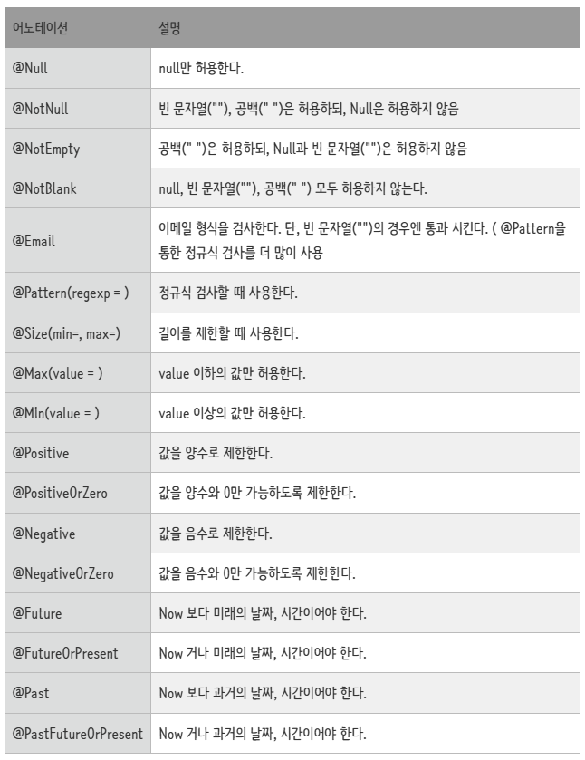
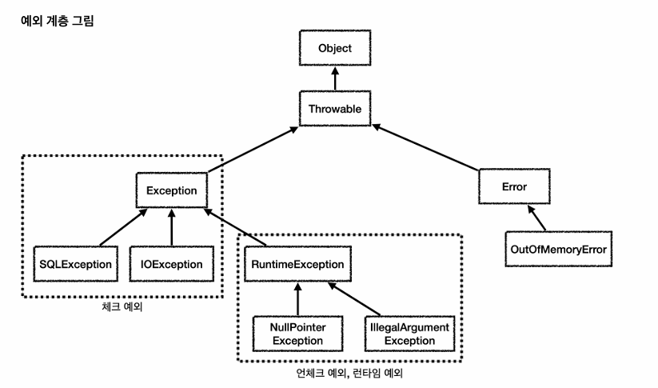
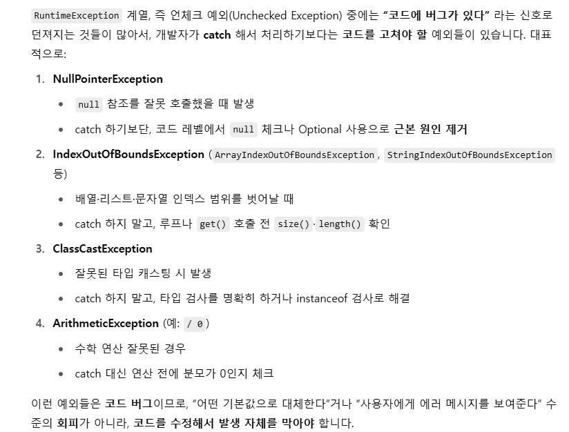
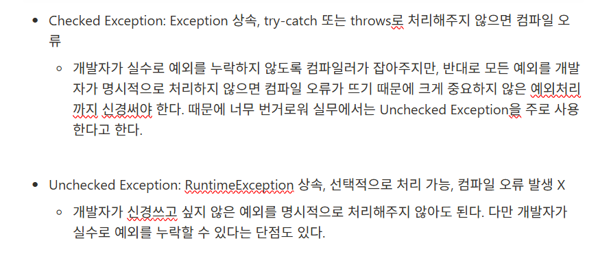

# 서버 스터디 5주차

### 🍀 유효성 검사는 무엇이고 Spring에서 어떻게 적용할 수 있나요?

1. 유효성 검사란?
    1. 유효성 검사의 의미와 이유는 무엇인가요?
        - 의미: 유효성 검사는 클라이언트가 전송한 입력값이 유효한지 검증하는 과정이다. 예를 들면 회원가입 비밀번호를 입력하는 과정에서 “비밀번호는 8자 이상, 특수문자가 들어가야 합니다.” 라는 문구가 뜨거나, 이메일 입력에 123과 같이 잘못된 값을 넣었을 때 “이메일 형식이 잘못되었습니다.”라는 문구를 띄워주는 것도 유효성 검사다.
        
    2. 유효성 검사를 해야 하는 이유는 무엇일까요?
        - 이유:
            1. 데이터 무결성 보장: 잘못된 값이 DB나 비즈니스 로직으로 들어오는 것을 방지한다.
            2. 보안 강화: `SQL injection`, `XSS` 등 공격을 차단 (1차적인 보안 강화, 완벽하지는 못함)
                - SQL 인젝션을 방어하려면 파라미터화 쿼리(SQL과 데이터 분리) 필요
                    
                    ```jsx
                    // SQL injection 방어 O
                    @Query(value = "SELECT * FROM users WHERE username = :username",   // ← ? 자리 확보
                           nativeQuery = true)
                    List<User> findByUsername(@Param("username") String username);  
                    ```
                    
                    ```jsx
                    // SQL injection 방어 X, 
                    @Query(value = "SELECT * FROM users WHERE username = '" + 
                                   "${username}" +    // ‼️ ${}는 그대로 치환
                                   "'", nativeQuery = true)
                    List<User> findByUsernameInsecure(@Param("username") String username);
                    ```
                    
                
                - XSS를 안전하게 방어하려면 Output Encoding(<, >, “, ‘ 등 스크립트가 될 수 있는 글자들을 &lt;, $#34; 등으로 치환해 단순 텍스트로 인식하게 함으로 스크립트가 될 수 없도록 함)이 필요하다.
                
            3. 사용자, 개발자 편리성: 프론트엔드에 구체적인 오류메시지 반환 가능, 개발자는 구체적인 오류 메시지를 통해 개발 생산성이 향상된다.
            
2. Spring에서의 유효성 검사는 어떻게 할까요?
    1. 어디에서 유효성 검사를 실시해야 할까요?
        - 컨트롤러 계층에서 `@RequestBody`, `@ModelAttribute`로 바인딩(HTTP 요청 문자열 데이터 ↔ 자바 객체 필드 매핑) 할 때 검증한다.
        
        ```jsx
        @PostMapping("/login")
            public ResponseEntity<UserResponse> logIn(@RequestBody @Valid UserLogInRequest request) {
                return ResponseEntity.status(HttpStatus.OK).body(userService.logIn(request));
            }
        ```
        
        - 서비스 계층에서 비즈니스 로직에 대해 검증한다.
        
        ```jsx
        public void updateUser(Long userId, UserUpdateRequest request) {
                User user = userRepository.findById(userId).orElseThrow(()->new CustomException(ErrorCode.USER_NOT_FOUND));
                user.UpdateInfo(passwordEncoder.encode(request.getPassword()),
                        request.getName(),
                        request.getPhoneNumber(),
                        request.getAddress());
            }
        ```
        
    2. Bean Validation은 무엇이며 왜 등장하게 됐나요?
        - Bean Validation은 표준화된 방식으로 제약 조건을 선언하고 검사하기 위한 사양이다.
        - 과거엔 각 애플리케이션, 프레임워크마다 검증 코드를 직접 작성했다. 프로젝트 내에서도 검증 로직이 흩어져 있어 유지보수와 재사용이 어려웠다.
            
            → 이를 해결하기 위해 검증을 표준화한 것이 Bean Validation이다. NotNull, NotBlank 등 제약 어노테이션으로 검증을 명확하게 드러낼 수 있다.
            
        
    3. @Valid와 @Validated 의 차이는 무엇인가요?
        1. 업데이트 예정
        
    4. @Valid가 동작되는 시점은 어디일까요?
        1. 업데이트 예정
        
    5. 유효성 검사를 위한 어노테이션은 어떤 것들이 있을까요? (@Email, @NotNull 등)
    
    
    
    ```jsx
    @Getter
    public class UserSignupRequest {
    
        @NotBlank(message = "이메일은 필수로 입력해야 합니다.")
        private String email;
    
        @NotBlank(message = "비밀번호는 필수로 입력해야 합니다.")
        private String password;
    
        @NotBlank(message = "이름은 필수로 입력해야 합니다.")
        private String name;
    
        @NotBlank(message = "전화번호는 필수로 입력해야 합니다.")
        @Pattern(regexp = "^\\d{2,3}-\\d{3,4}-\\d{4}$",
                message = "전화번호 형식은 010-1234-5678")
        private String phoneNumber;
    
        @NotBlank(message = "주소는 필수로 입력해야 합니다.")
        private String address;
    
        public UserSignupRequest(String email, String password, String name, String phoneNumber, String address) {
            this.email = email;
            this.password = password;
            this.name = name;
            this.phoneNumber = phoneNumber;
            this.address = address;
        }
    }
    ```
    

### 🍀 에러와 예외의 차이는 무엇일까요? Spring에서의 예외처리는 어떻게 진행할까요?

1. 예외 처리의 개념
    1. 에러와 예외의 차이는 무엇인가요?
        - 에러: JVM 또는 시스템 수준의 치명적인 문제, 잡아서 처리하려고 하면 안 됨. 재설계나 최적화, 환경을 바꿔 문제를 해결해야 함.
        - 예외: 애플리케이션 로직에서 처리 가능한 문제
        
    2. 예외 처리의 방법  (예외 복구, 예외 처리 회피, 예외 전환)
        - 예외 복구: `try–catch` 블록에서 직접 처리
        - 예외 처리 회피: `throws`로 호출자에게 위임
        - 예외 전환: 낮은 수준 예외를 비즈니스 예외로 래핑 (예: `SQLException` → `DataAccessException`)
        
    3. 자바의 예외 클래스는? (Checked Exception / Unchecked Exception)
        
        
        
        - Checked Exception: Exception 상속, try-catch 또는 throws로 처리해주지 않으면 컴파일 오류
            - 개발자가 실수로 예외를 누락하지 않도록 컴파일러가 잡아주지만, 반대로 모든 예외를 개발자가 명시적으로 처리하지 않으면 컴파일 오류가 뜨기 때문에 크게 중요하지 않은 예외처리까지 신경써야 한다. 때문에 너무 번거로워 실무에서는 Unchecked Exception을 주로 사용한다고 한다.
            
        - Unchecked Exception: RuntimeException 상속, 선택적으로 처리 가능, 컴파일 오류 발생 X
            - 개발자가 신경쓰고 싶지 않은 예외를 명시적으로 처리해주지 않아도 된다. 다만 개발자가 실수로 예외를 누락할 수 있다는 단점도 있다.
            
            
            
            
            
        
2. Spring에서의 예외 처리
    1. @ControllerAdvice, @ExceptionHandler 은 무엇이며 또한 이들을 활용한 예외처리 방식은 무엇인가요?
        - @ControllerAdvice: 여러 컨트롤러에서 던져지는 예외를 처리하는 전역 예외 처리기
        - @ExceptionHandler: 특정 예외를 잡아 처리하는 메서드, 각 컨트롤러 내부에 둘 수도 있음.
        
        ```jsx
        @RestControllerAdvice
        public class GlobalExceptionHandler {
        
            // 컨트롤러단 유효성 검사
            @ExceptionHandler(MethodArgumentNotValidException.class)
            public ResponseEntity<ErrorResponse> handleValidation(
                    MethodArgumentNotValidException e) {
        
                Map<String, String> errors = new HashMap<>();
                e.getBindingResult().getFieldErrors().forEach(fe ->
                        errors.put(fe.getField(), fe.getDefaultMessage())
                );
        
                return ErrorResponse.validationFailed(errors);
            }
        
            //서비스단 예외처리
            @ExceptionHandler(CustomException.class)
            public ResponseEntity<ErrorResponse> handleCustomException(CustomException e) {
                return ErrorResponse.toResponseEntity(e.getErrorCode());
            }
        }
        ```
        
        위 코드와 같이 GlobalExceptionHandler를 만들어, 여러 컨트롤러에서 발생한 예외를 처리하도록 해 응답을 표준화하고 중복을 제거하는 방식으로 이용한다.
        
    2. ControllerAdvice와 RestControllerAdvice의 차이가 무엇인가요?
        - @ControllerAdvice: 뷰 반환하는 컨트롤러 전용
        - @RestControllerAdvice: @ControllerAdvice + 모든 메서드에 @ResponseBody 적용, JSON/XML 등 응답 바디 직접 반환
        
    3. ControllerAdvice 내 우선 순위와 ExceptionHandler 내 우선 순위
        - ControllerAdvice: @Order 어노테이션 사용해 순서 지정, 값이 낮을 수록 먼저 적용된다.
            
            → 핸들러가 여러 개로 분리되어 있을 때 예외가 잘못된 핸들러에서 처리되지 않게 하기 위함
            
            ```jsx
            @ControllerAdvice
            @Order(1)    // 낮은 숫자일수록 먼저 적용
            public class FirstAdvice { … }
            
            @ControllerAdvice
            @Order(2)
            public class SecondAdvice { … }
            ```
            
        - ExceptionHandler: 같은 ControllerAdvice 안에 여러 ExceptionHandler가 있을 때는 구체 타입 예외 메서드가 먼저 적용됨. (NullPointerException 핸들러가 Exception 핸들러보다 먼저 적용)