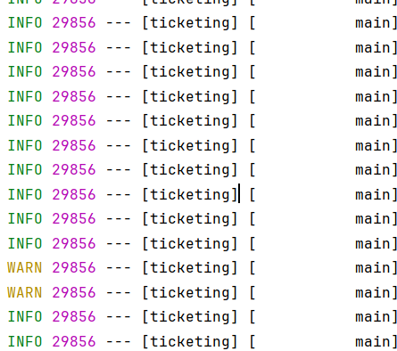

# Logging & Swagger

---

## 공통 주제

### 🍀 Logging은 무엇이며 Spring에서 어떻게 적용할 수 있을까요?

1. Logging 전략은 무엇이고 왜 세워야 할까요?
    
    로컬 환경에서의 문제 분석 → 디버깅
    
    서버 안의 문제 분석 → 로그
    
    이때 로그란, 서버에서 발생한 모든 활동을 기록한 데이터이다. 우리는 실시간으로 기록되는 로그를 보고 서버 안의 활동을 간접적으로 관찰할 수 있다.
    
    빠른 분석 및 해결을 위해 적절한 로그 메시지가 필요하다. 로그의 내용, 레벨, 기록 장소, 보관 기간 등을 결정하는 것이 Logging 전략에 해당한다.
    
    Logging 전략이 필요한 이유는 아래와 같다.
    
    1. 에러 발생 시 원인 파악을 위해
    2. 서비스 상태, 접근 기록 등을 확인하기 위해
    3. 의심스러운 요청을 기록하고 확인하기 위해
    4. 성능 최적화를 위해(성능이 저하되는 특정 구간을 파악하여 해결)
    
2. Log Level은 무엇이고 어떻게 적용해야 할까요?
    
    로그 레벨은 로그 메시지의 중요도를 나타내는 수준이다. 모든 레벨의 로그를 전부 기록할 경우, 중요한 로그를 파악하기 어려우며 파일의 크기에 영향을 준다. 따라서 로그 레벨과 그 중요도에 따라 해당 로그의 기록 여부를 결정한다.
    
    로깅 시스템에서 로그 레벨을 설정하면, 설정된 로그 레벨 이상의 중요도를 가진 메시지만 기록된다.
    
    | Log Level |  |
    | --- | --- |
    | TRACE | 가장 상세. 실행 흐름과 디버깅 정보 상세히 기록. |
    | DEBUG | 디버깅 목적으로 사용됨. 개발 단계에서 상세한 정보 기록. |
    | INFO | 상태 변경 등의 정보성 메시지 기록. |
    | WARN | 경고성 메시지 기록. 예상치 못한 문제나 잠재적인 오류 상황 알림. 실행은 가능하나, 향후 에러의 원인이 될 수 있음. |
    | ERROR | 에러 메시지 기록. 요청 처리하는 중 문제가 발생항 상태. 프로그램 동작에 큰 문제가 발생하여 즉시 조사 필요. |
    | FATAL | 가장 심각한 에러 메시지 기록. 프로그램 동작을 중단시킬 수 있는 치명적 오류. 복구가 불가능하거나 매우 어려운 상황. |
    
3. Spring에서 Logging을 적용하는 방법에는 어떤 것이 있나요?
    
    로그를 println으로 찍는다면? → 상세하지 않고, 방대한 정보를 관리하기 어렵다
    
    ⇒ Slf4j(Simple Logging Facade For Java) 
    
    자바에서 쓰이는 다양한 로깅 관련 라이브러리들을 하나의 통일된 방식으로 사용하게 해주는 인터페이스들 set이다. 실제 로그 기록은 Logback, Log4j, java.util.logging 같은 구현체들이 수행한다. 어떤 로깅 구현체를 사용하더라도 항상 같은 방식으로 코드를 작성할 수 있는 것이다. (코드 레벨에서)방식이 통일되니 일관성을 유지할 수 있고, 구현체를 변경해도 코드를 수정할 필요가 없으며, 유지보수가 편리해진다.
    
    ```java
    //회원가입
        @Transactional
        public PersonSignupResponseDto signup(PersonSignupRequestDto personSignupRequestDto) {
            log.info("[회원가입 시도] loginId: {}", personSignupRequestDto.getLoginId());
            if (personRepository.existsByLoginId(personSignupRequestDto.getLoginId())) {
                log.warn("[회원가입 실패] 중복된 loginId: {}", personSignupRequestDto.getLoginId());
                throw new CustomException(ErrorCode.DUPLICATE_LOGIN_ID);
            }
    
            Person person = Person.builder()
                    .loginId(personSignupRequestDto.getLoginId())
                    .password(passwordEncoder.encode(personSignupRequestDto.getPassword()))
                    .createdDate(LocalDateTime.now())
                    .role(Role.ROLE_USER) // USER 권한 부여
                    .grade(Grade.WELCOME) // 최초 등급 WELCOME 부여
                    .build();
            personRepository.save(person);
            log.info("[회원가입 성공] loginId: {}", person.getLoginId());
            return PersonSignupResponseDto.from(person);
        }
    
        //로그인
        @Transactional
        public PersonLoginResponseDto login(PersonLoginRequestDto personLoginRequestDto) {
            log.info("[로그인 시도] loginId: {}", personLoginRequestDto.getLoginId());
            Person person = personRepository.findByLoginId(personLoginRequestDto.getLoginId())
                    .orElseThrow(() -> {
                        log.warn("[로그인 실패] 존재하지 않는 ID: {}", personLoginRequestDto.getLoginId());
                        return new CustomException(ErrorCode.ID_NOT_FOUND);
                    });
    
            if (!passwordEncoder.matches(personLoginRequestDto.getPassword(), person.getPassword())) {
                log.warn("[로그인 실패] 비밀번호 불일치 - loginId: {}", personLoginRequestDto.getLoginId());
                throw new CustomException(ErrorCode.UNAUTHORIZED_LOGIN);
            }
            // 토큰 생성
            String token = jwtTokenProvider.generateAccessToken(person.getLoginId());
            log.info("[로그인 성공] loginId: {}", person.getLoginId());
            return PersonLoginResponseDto.from(person, token);
        }
    ```
    

그런데… @Slf4j 어노테이션만 사용하고 따로 구현체 설정을 안 했는데요? 

→ 스프링 부트에서는 자동으로 Logback과 연결된다. 우리는 @Slf4j만을 사용했지만, 실제로는 Logback이 로그를 찍고 있는 것이다. 

우리가 인텔리제이 콘솔에서 확인하던 아래의 로그 포맷도 Logback이었다. 



|  | Logback | Log4j2 | JUL(java.util.logging) |
| --- | --- | --- | --- |
| 속도 | 빠름 | 매우 빠름 | 느림 |
| 설정 파일 | `logback.xml`, `logback-spring.xml` | `log4j2.xml` | `logging.properties` |
| 기능  | 유연한 레벨 설정, 필터, 비동기 로깅 | 고성능 비동기, JSON 로그 등 | 단순함 |
|  | Spring Boot 기본 | 고성능 대용량 시스템에서 사용 | 거의 안 씀(단순 자바 프로젝트에만 사용) |

```java
logging.file.path=logs   #logs/spring.log 생성
logging.level.root=INFO #레벨 설정
```

### 🍀 Swagger는 무엇이며 어떻게 활용할 수 있을까요?

1. Swagger는 무엇일까요?
    
    REST API 문서를 자동 생성하는 도구이다. API를 수동으로 문서화한다면 API를 수정할 때마다 문서를 수정해야 한다. 스웨거를 사용하면 문서를 자동 갱신하기 때문에 이 어려움을 해소할 수 있고, 스웨거 UI를 통해 API 테스트를 진행할 수 있다. 
    
2. Spring에 Swagger를 어떻게 적용할 수 있을까요?(with Authorization)
    1. Swagger Config
        - 현재는 모든 API에 JWT 인증을 적용했지만, 전역 설정을 제거할 경우 개별 API에 `@SecurityRequirement(name = "bearer")` 를 붙여준다.
        
        ```java
        @Configuration
        public class SwaggerConfig {
        
            @Value("${swagger.server-url}")
            private String serverUrl;
            private static final String securitySchemeName = "bearer"; //스키마 이름 정의
        
            @Bean
            public OpenAPI openAPI() {
                Server server = new Server();
                server.url(serverUrl);
        
                //JWT 인증 방식 정의
                SecurityScheme securityScheme = new SecurityScheme()
                        .name(securitySchemeName) //스키마 이름
                        .type(SecurityScheme.Type.HTTP) //HTTP 인증 방식
                        .scheme("bearer") //bearer 사용
                        .bearerFormat("JWT") //JWT 형식 명시
                        .in(SecurityScheme.In.HEADER); //토큰을 HTTP 헤더에 포함시킴
        
                //전체에 JWT 보안 적용
                SecurityRequirement securityRequirement = new SecurityRequirement()
                        .addList(securitySchemeName);
        
                return new OpenAPI()
                        .addServersItem(server)
                        .components(new Components()
                        .addSecuritySchemes(securitySchemeName, securityScheme))
                        .addSecurityItem(securityRequirement)
                        .info(apiInfo());
            }
        
            //기본 정보
            private Info apiInfo() {
                return new Info()
                        .title("Server Study")
                        .description("API test")
                        .version("1.0.0");
            }
        }
        ```
        
    2. Controller Layer
        - @Operation
            - API 엔드포인트 작업에 대한 설명 추가, 세부 정보 제공
            - summary : 작업 요약
            - description : 구체적 설명
            - @ApiResponse : API 응답에 대한 설명과 상태 코드 정의
        
        ```java
        
            @Operation(summary = "회원가입", responses = {
                    @ApiResponse(responseCode = "200", description = "회원가입 성공"),
                    @ApiResponse(responseCode = "400", description = "요청값 오류"),
                    @ApiResponse(responseCode = "409", description = "중복된 ID")
            })
            @PostMapping("/signup")
            public ResponseEntity<PersonSignupResponseDto> signup(@Valid @RequestBody PersonSignupRequestDto requestDto) {
                return ResponseEntity.ok(personService.signup(requestDto));
            }
        
            @Operation(summary = "로그인", responses = {
                    @ApiResponse(responseCode = "200", description = "로그인 성공"),
                    @ApiResponse(responseCode = "401", description = "비밀번호 불일치"),
                    @ApiResponse(responseCode = "404", description = "존재하지 않는 사용자")
            })
            @PostMapping("/login")
            public ResponseEntity<PersonLoginResponseDto> login(@Valid @RequestBody PersonLoginRequestDto loginRequest) {
                return ResponseEntity.ok(personService.login(loginRequest));
            }
        ```
        
        - 스웨거를 깔끔하게 작성하려면?
            - @ApiResponse를 커스텀 어노테이션으로 대체하기
                
                → API마다 Response 내용이 다르기 때문에 일일이 만들어서 붙여줘야 할 것 같은데… 불편하다. 
                
            - 인터페이스로 분리해서 관리
                
                → 인터페이스 만들어서 @Operation, @ApiResponse 등을 선언하고 실제 컨트롤러에서는 implements 해서 로직만 관리하자
                
                ```java
                @RequestMapping("/api/persons")
                public interface PersonApiDocs {
                
                    @PostMapping("/signup")
                    @Operation(summary = "회원가입")
                    @ApiResponses({
                            @ApiResponse(responseCode = "200", description = "회원가입 성공"),
                            @ApiResponse(responseCode = "400", description = "요청값 오류"),
                            @ApiResponse(responseCode = "409", description = "중복된 ID")
                    })
                    ResponseEntity<PersonSignupResponseDto> signup(@Valid @RequestBody PersonSignupRequestDto requestDto);
                
                    @PostMapping("/login")
                    @Operation(summary = "로그인")
                    @ApiResponses({
                            @ApiResponse(responseCode = "200", description = "로그인 성공"),
                            @ApiResponse(responseCode = "401", description = "비밀번호 불일치"),
                            @ApiResponse(responseCode = "404", description = "존재하지 않는 사용자")
                    })
                    ResponseEntity<PersonLoginResponseDto> login(@Valid @RequestBody PersonLoginRequestDto loginRequest);
                ///...
                }
                
                ```
                
                
                
                
                
    3. DTO
        - @Schema
            - description : 속성 설명
            - example : 예시 값 정의
        
        ```java
        @Getter
        public class ShowCreateRequestDto {
        
            @NotBlank(message = "제목을 입력해주세요.")
            @Schema(example = "제목")
            private String showTitle;
        
        //...
        
            @NotNull(message = "공연 상태를 입력해주세요.")
            @Schema(example = "BEFORE_RESERVATION / DURING_RESERVATION / COMPLETED")
            private ShowState showState;
        }
        ```
        
        