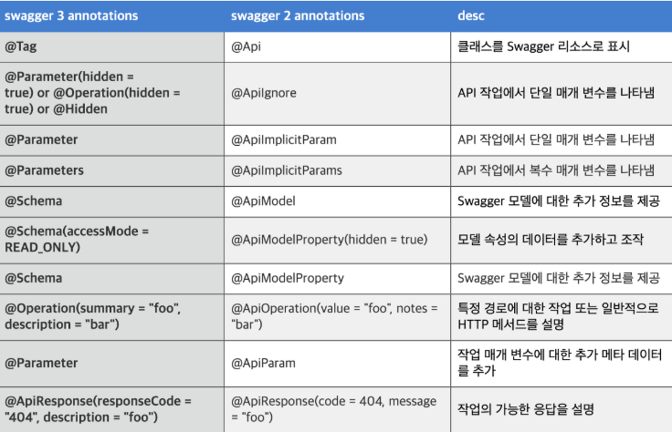

# Logging & Swagger

---

## 공통 주제

### 🍀 Logging은 무엇이며 Spring에서 어떻게 적용할 수 있을까요?

1. Logging 전략은 무엇이고 왜 세워야 할까요?
    - 로컬 환경과 달리 운영서버에서 실행중인 애플리케이션은 디버깅 기능을 통한 문제 분석이 사실상 불가능 하다.
    - 서버 안에서 어떤 일이 일어나고 있는지는
    서버의 특정 파일에 실시간으로 기록되는 '로그' 를 통해서만 간접적으로 관찰
    - 넷마블의 로깅 팁!
        1. ERROR와 WARN 로그에는 꼭 **스택 트레이스**와 **콘텍스트 정보**를 넣는 것이 좋다.
            
            ```java
            스택 트레이스: 예외가 어디서 발생했는지를 알 수 있게 하는 정보입니다. 
            	예외 객체 (Exception)를 로그에 함께 넘기면 로그에 메서드 호출 순서가 쭉 나옵니다.
            
            콘텍스트 정보: 해당 에러가 발생했을 때 어떤 유저였는지, 
            	어떤 요청이었는지 등의 추가 정보입니다.
            	
            log.error("회원 정보 조회 실패. userId={}, requestId={}", userId, requestId, e);
            
            ```
            
        2. INFO 레벨 로그에는 작업의 중간 진행상황을 기록하기 보다, 하나의 작업 단위가 완료되면 해당 작업을 요약한 내용을 기록하는 것이 좋다.
            
            ```java
            log.info("회원가입 완료. userId={}, email={}", user.getId(), user.getEmail());
            ```
            
        3. 편리하게 그룹화할 수 있도록 고유한 에러 코드를 필드에 추가하는 것이 좋다.
            
            ```java
            에러에 고유한 에러 코드를 붙이면, 어떤 문제가 어디서 발생했는지 쉽게 필터링할 수 있습니다.
            
            이유: 로그 수집 시스템(Sentry, ELK, Datadog 등)에서 특정 에러만 검색하거나 분류할 수 있습니다.
            
            log.error("[ERR-USER-001] 회원 정보 조회 실패. userId={}", userId, e);
            ```
            
        4. 통합 테스트 단계에서부터 로깅 내용을 신경써서 관찰하거나, 아예 로깅 내용을 테스트코드에 포함하는 것이 좋다. 이 과정에서 내용이 부실한 로그나 레벨이 맞지 않는 로그를 색출할 수 있기 때문이다.
        5. 로그 발생 원인은 가능한 친절하게 작성하는 것이 좋다.
            - `"에러 발생"` 같은 모호한 메시지가 아니라,
            - `"회원 조회 중 DB 연결 실패"`처럼 **무엇을 하다 에러가 났는지** 구체적으로 작성해야 합니다.
        6. 민감한 정보는 필터링하거나 수집되지 않게 주의를 기울이는 것이 좋다.
2. Log Level은 무엇이고 어떻게 적용해야 할까요?
    1. **TRACE** < **DEBUG** < **INFO** < **WARN** < **ERROR** 
    - Error : 서비스에 문제가 될 수 있는 중요한 상황
    - Warn : 치명적이지는 않지만 일반적이지 않은 상황
    - Info : 정보를 기록
    - Debug : 개발 단계에서 자세한 내용을 확인
    - Trace : 개발 단계에서 자세한 내용을 확인
    
    공통 : 요청 시간(timestamp), 로깅용 멤버 식별자, 요청URL
    
    ERROR : 에러 메시지, stackTrace
    
    WARN : 경고 메세지(가능한 상세히)
    
    INFO : 응답 코드, ResponseBody, 에러 코드
    
3. Spring에서 Logging을 적용하는 방법에는 어떤 것이 있나요?
    
    <인터페이스>
    
    - SLF4J(Simple Logging Facade for Java)
        - 로깅 추상화(인터페이스)
        - 다양한 로깅 구현체(Logback, Log4j 등)에 대해 **일관된 API**를 제공.
        - 직접 로그를 출력하지 않고, **뒤에 있는 구현체에 위임**함.
        - 로깅 Facade 패턴
        - 기존에 사용하는 로깅 시스템을 교체하고 싶을 때, 소스 코드를 수정하지 않고 의존성 설정만 바꾸면 손쉽게 교체 가능
        - 기본 구현체는 Logback → 다른 구현체로 수정 가능
    
    <구현체>
    
    - log4j
        - Apache Software Foundation 에서 개발한 로깅 프레임워크
        - xml, properties로 환경을 구성 가능
        
        ```java
        # 1
        log4j.rootLogger=DEBUG, consoleAppender, fileAppender, sql
         
        # 2
        log4j.appender.consoleAppender=org.apache.log4j.ConsoleAppender
        log4j.appender.consoleAppender.Threshold=All
        
        # 3
        log4j.appender.consoleAppender.layout=org.apache.log4j.PatternLayout
        log4j.appender.consoleAppender.layout.ConversionPattern=[%d] [%-5p] %c %x - %m%n
         
        # 4
        log4j.appender.fileAppender=org.apache.log4j.DailyRollingFileAppender
        log4j.appender.fileAppender.File=c:/log/log4j.log
        # 5
        log4j.appender.fileAppender.DatePattern='.'yyyy-MM-dd
        log4j.appender.fileAppender.Threshold=All
        log4j.appender.fileAppender.layout=org.apache.log4j.PatternLayout
        log4j.appender.fileAppender.layout.ConversionPattern=[%d] [%-5p] [%13F\:%L] - %m%n
        ```
        
        - Log4Shell 이라는 취약점 때문에 잘 사용하지 않는다
    
    - logback
        - spring-boot-starter-web안에 spring-boot-starter-logging의 logback이 기본적으로 포함되어 있어서 별다른 dependency 추가 없이 사용 가능
        - Automatic Reloading 기능을 제공하여 별도에 재시작없이 설정을 변경하여 사용할 수 있음
            - ex) 특정 부분에서 더 자세한 로그를 봐야할 필요성이 있다면 INFO로 변경해야 하는데, 이를 서버의 종료 없이 컨트롤이 가능
        
    - log4j2
        - Log4j2는 Log4j를 보안한 라이브러리.
        - Facade 패턴으로 구현되어 다른 Log 라이브러리들과 사용할 수 있음.
        - Log4j 2의 가장 눈에 띄는 기능들 가운데 하나는 비동기 성능.
        - Log4j 2는 LMAX 디스럽터를 활용하는데, 이 라이브러리는 커널 락의 필요성을 줄이며 12배만큼 로깅 성능을 제공
        - 파일뿐만 아니라 HTTP, DB, Kafka에 로그를 남길 수 있으며 비동기적인 로거를 지원
        - 동일 환경에서 Log4j 2는 1초에 18,000,000개 이상의 메시지를 기록할 수 있는 반면 Logback과 Log4j 1 등은 초당 2,000,000개 미만의 메시지를 기록할 수 있다
    
    Log4j2 사용을 위해서는 spring-boot-starter-logging 모듈을 exclude하고 spring-boot-starter-logging-log4j2 의존성을 주입해야한다
    
    Logback과 달리 멀티 쓰레드 환경에서 비동기 로거(Async Logger)의 경우 Log4j 1.x 및 Logback보다 성능이 우수함.
    
    ```java
    <included>
        <property name="QUERY_LOG_PATH" value="logs/query"/>
        <property name="QUERY_LOG_FILE_NAME" value="query"/>
    
        <appender name="QUERY_FILE" class="ch.qos.logback.core.rolling.RollingFileAppender">
            <filter class="ch.qos.logback.classic.filter.LevelFilter">
                <level>TRACE</level>
            </filter>
    
            <encoder>
                <pattern>
                    %d{yyyy-MM-dd HH:mm:ss} %n    > %msg%n
                </pattern>
            </encoder>
    
            <rollingPolicy class="ch.qos.logback.core.rolling.SizeAndTimeBasedRollingPolicy">
                <fileNamePattern>${QUERY_LOG_PATH}/${QUERY_LOG_FILE_NAME}.%d{yyyy-MM-dd}_%i.log</fileNamePattern>
                <maxFileSize>3MB</maxFileSize>
                <maxHistory>100</maxHistory>
            </rollingPolicy>
        </appender>
    
    		// AsyncAppender 설정
        <appender name="QUERY_FILE_ASYNC" class="ch.qos.logback.classic.AsyncAppender">
            <appender-ref ref="QUERY_FILE" />
            <queueSize>512</queueSize>
            <discardingThreshold>0</discardingThreshold>
            <includeCallerData>false</includeCallerData>
            <neverBlock>true</neverBlock>
            <maxFlushTime>1000</maxFlushTime>
        </appender>
    
        <logger name="org.hibernate.SQL" level="DEBUG" additivity="false">
            <appender-ref ref="QUERY_FILE_ASYNC"/>
        </logger>
        <logger name="org.hibernate.type.descriptor.sql.BasicBinder" level="TRACE" additivity="false">
            <appender-ref ref="QUERY_FILE_ASYNC"/>
        </logger>
        <logger name="org.hibernate.type.descriptor.sql.BasicExtractor" level="TRACE" additivity="false">
            <appender-ref ref="QUERY_FILE_ASYNC"/>
        </logger>
    
    </included>
    ```
    
    이런식으로 설정….
    
    파일로 남기는 설정인 RollingFileAppender를 AsyncAppender로 감싸기만 하면 됨
    
    [https://tlatmsrud.tistory.com/32](https://tlatmsrud.tistory.com/32)
    

### 🍀 Swagger는 무엇이며 어떻게 활용할 수 있을까요?

1. Swagger는 무엇일까요?
    1. 개발자가 REST 웹 서비스를 설계, 빌드, 문서화, 소비하는 일을 도와주는 대형 도구 생태계의 지원을 받는 오픈 소스 소프트웨어 프레임워크
    2. 장점 : 
        1. API 문서에서 동적으로 API를 조작할 수 있다.
        2. pring REST Docs를 테스트를 통해 API 스펙과 문서가 일치하도록 강제한다. 하지만 Swagger는 애노테이션만 추가하면 되므로 API 문서를 위해 작성해야 하는 코드양이 적다
    3. 단점 : 
        1. 코드 상에 API 관련한 애노테이션을 추가해야 해서 코드 가독성이 떨어진다.
        2. API 스펙 변경이 일어날 때, 애노테이션 변경이 필요하다. 즉, 문서와 API 스펙이 일치함을 보장해주지 않는다.
2. Spring에 Swagger를 어떻게 적용할 수 있을까요?(with Authorization)
    
    ```bash
    	implementation 'org.springdoc:springdoc-openapi-starter-webmvc-ui:2.0.2'
    ```
    
    1. Swagger Config
        
        ```java
        @Configuration
        public class SwaggerConfig {
        
          @Bean
          public OpenAPI openAPI() {
            return new OpenAPI()
              .components(new Components()
        	      // JWT Schema 추가
                .addSecuritySchemes("JWT", new SecurityScheme()
                  .name("JWT")
                  .type(SecurityScheme.Type.HTTP)
                  .scheme("bearer")
                  .bearerFormat("JWT")))
              .addSecurityItem(new SecurityRequirement().addList("JWT"))
              .info(apiInfo())
              .servers(List.of(
                new Server().url("http://localhost:8080")
              ));
          }
        
          private Info apiInfo() {
            return new Info()
              .title("API Test")
              .description("Backend Swagger")
              .version("1.0.0");
          }
        }
        ```
        
    2. Controller Layer
        
        ```java
        @Tag(name = "users", description = "회원 API")
        public interface UserControllerSpecification {
        
          @Operation(summary = "회원 조회", description = "회원 조회를 수행하는 API")
          @ApiResponses({
              @ApiResponse(responseCode = "200", description = "유저 조회 성공",
                content = @Content(mediaType = MediaType.APPLICATION_JSON_VALUE,
                  schema = @Schema(implementation = UserResponseDto.class))),
              @ApiResponse(responseCode = "400", description = "잘못된 요청 데이터"),
              @ApiResponse(responseCode = "409", description = "중복된 데이터")
            })
          @GetMapping
          ResponseEntity<ResponseDto<UserResponseDto>> userDetail(@AuthenticationPrincipal CustomUserDetails userDetails);
        
        ```
        
        ```java
        어노테이션 : 
        
        ```
        
        
        
    3. DTO

## 🔎 과제

<aside>
✅ 실습 프로젝트에 Logging과 Swagger 적용하기

→ 추가로 Swagger를 깔끔하게 작성하기 위한 방법을 생각해봅시다!
→ 스웨거에 jwt 적용하기
→ API 별 로깅 적용하기

</aside>

## 개인별 발표주제

[제목 없음](%E1%84%8C%E1%85%A6%E1%84%86%E1%85%A9%E1%86%A8%20%E1%84%8B%E1%85%A5%E1%86%B9%E1%84%8B%E1%85%B3%E1%86%B7%201efba96e906f81a08d9fd3a61a23d0d8.csv)