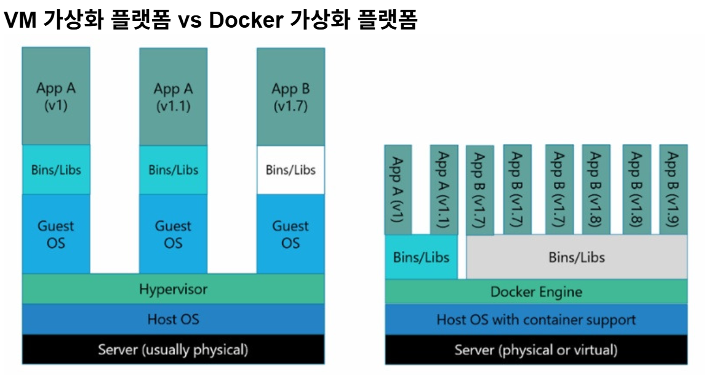
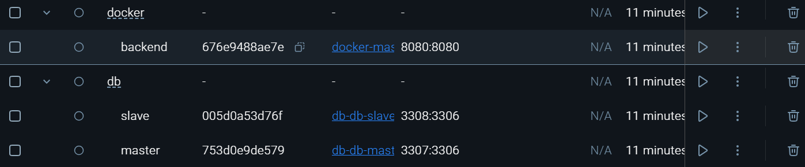
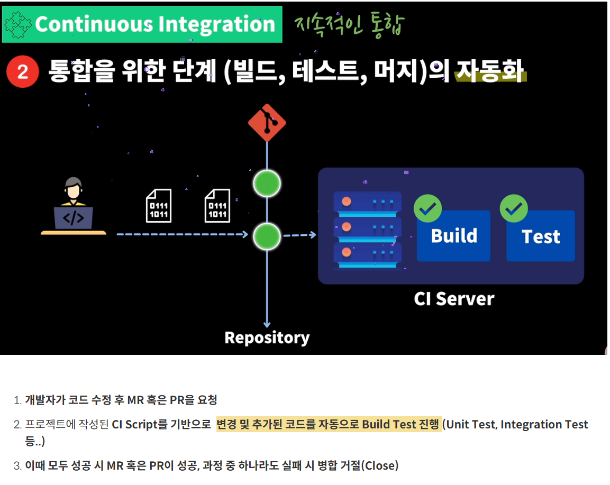
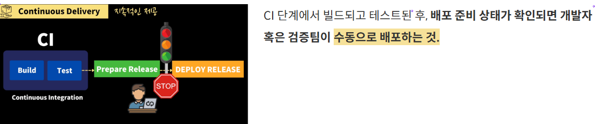
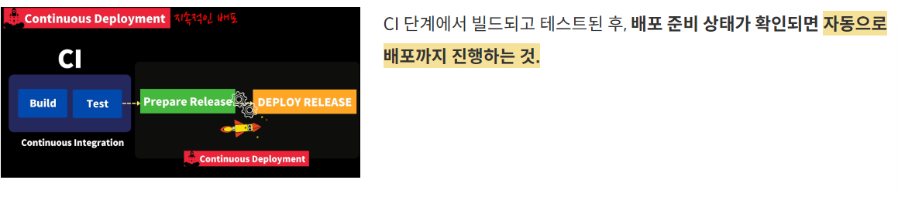

# Docker, CI/CD와 깃허브 액션

---

- 목차

# ✅ 8주차 주제

---

- Docker란 무엇일까요?
- Github Actions을 통한 배포는 어떻게 이뤄질 수 있을까요?
- CI/CD의 이론에 대해서 공부해봅시다.

# ✅ 발표 내용

---

### Docker란 무엇일까요?

1. 컨테이너 기술은 무엇이고 왜 필요할까요?
    
    컨테이너는 애플리케이션을 격리된 환경에서 실행할 수 있도록 해주는 **경량 가상화 기술**
    
    **OS 가상화 방식**으로, **호스트 운영체제 커널을 공유**하면서도 격리된 실행 환경을 제공
    전통적인 가상 머신(VM)과 달리, 컨테이너는 **빠르게 실행되고 자원을 적게 사용**
    
    컨테이너 기술이 필요한 이유 : 
    
    ### 1. **일관된 실행 환경**
    
    - 개발 환경, 테스트 환경, 운영 환경에서 실행 결과가 다르면 문제가 됩니다.
    - 컨테이너는 "한 번 만들면 어디서든 똑같이 실행"됩니다. (Build Once, Run Anywhere)
    
    ### 2. **경량화 및 빠른 실행**
    
    - VM은 OS 전체를 포함하지만, 컨테이너는 **필요한 파일과 설정만 포함**합니다.
    - 따라서 **시작 속도가 빠르고 리소스 사용량이 적음**.
    
    ### 3. **이식성과 배포 용이성**
    
    - 컨테이너 이미지 하나로 로컬 개발, 테스트 서버, 클라우드 등 어디서든 실행 가능.
    - CI/CD 파이프라인과도 잘 어울림 (자동 테스트, 배포에 적합).
    
    ### 4. **확장성과 마이크로서비스 구조 지원**
    
    - 여러 컨테이너를 조합하여 마이크로서비스 아키텍처(MSA)를 구현할 수 있음.
    - 필요할 때마다 컨테이너 인스턴스를 **수평 확장** 가능.
    
    ### 5. **격리성**
    
    - 각 컨테이너는 서로 격리되어 있어, 하나의 문제가 다른 서비스로 확산되는 걸 막음.
    - 컨테이너는 가상화 기술 중 하나로 대표적으로 LXC(Linux Container)가 있습니다. 기존 OS를 가상화 시키던 것과 달리 컨테이너는 **OS레벨의 가상화로 프로세스를 격리시켜 동작하는 방식**으로 이루어집니다.
    
    
    
2. 도커란 무엇일까요?
    - Docker란 Go언어로 작성된 리눅스 **컨테이너 기반**으로하는 **오픈소스 가상화 플랫폼**
    - Docker를 쓰는 이유는 **성능향상, 뛰어난 이식성, 쉽게 Scale Out을 할 수 있는 유연성**
    
    1. 도커 이미지란 무엇이고 스프링 애플리케이션을 어떻게 이미지화할 수 있을까요?
    
    도커 이미지는 컨테이너를 만들기 위한 실행 환경의 스냅샷
    
    **Docker 이미지**는 애플리케이션 실행에 필요한 코드, 라이브러리, 환경설정 등을 포함하는 **불변(immutable) 템플릿**
    이 이미지를 기반으로 실제 실행 단위인 **컨테이너**가 생성
    
    Spring 애플리케이션도 이 이미지를 통해 컨테이너로 실행할 수 있음
    
    <Dockerfile>
    
    ```docker
    ## 1. 베이스 이미지 설정 - Java 21을 사용하여 실행할 것이므로 적절한 JDK 이미지 선택
    FROM openjdk:21
    
    ## 2. ARG를 사용해 빌드 결과 JAR 파일의 경로를 지정
    ARG JAR_FILE=build/libs/*.jar
    
    LABEL name="frozzun99"
    
    # 3. 위에서 정의한 JAR 파일을 컨테이너의 app.jar로 복사
    COPY ${JAR_FILE} app.jar
    
    # application-prod.yml을 컨테이너에 복사
    COPY src/main/resources/application-prod.yml /app/application-prod.yml
    
    # 4. 컨테이너 시작 시 JAR 파일을 실행하는 명령어
    ENTRYPOINT ["java", "-jar", "/app.jar"]
    
    ```
    
    <docker-compose.dev.yaml>
    
    ```bash
    ### 개발 서버 ###
    
    services:
      backend:
        build:
          context: .
          dockerfile: Dockerfile
        container_name: uni-backend
        ports:
          - "8080:8080"
        env_file:
          - .env
        environment:
          SPRING_DATASOURCE_URL: ${MYSQL_URL}
          SPRING_DATASOURCE_USERNAME: ${MYSQL_USERNAME}
          SPRING_DATASOURCE_PASSWORD: ${MYSQL_PASSWORD}
        depends_on:
          mysql:
            condition: service_healthy
        networks:
          - app-network
    
      mysql:
        hostname: mysql
        container_name: uni-mysql
        image: mysql:latest
        env_file:
          - .env
        environment:
          SPRING_DATASOURCE_URL: ${MYSQL_URL}
          SPRING_DATASOURCE_USERNAME: ${MYSQL_USERNAME}
          SPRING_DATASOURCE_PASSWORD: ${MYSQL_PASSWORD}
        ports:
          - "3306:3306"
        volumes:
          - db_mysql:/var/lib/mysql
        healthcheck:
          test: [ "CMD", "mysqladmin", "ping", "--silent" ]
          interval: 10s
          retries: 5
          start_period: 30s
          timeout: 10s
        networks:
          - app-network
    
    volumes:
      db_mysql:
    
    networks:
      app-network:
        driver: bridge
    ```
    
    ```bash
        # 3. Docker 이미지 빌드
    			docker build -t ${{ secrets.DOCKERHUB_USERNAME }}/2025_unithon_team_4_be-backend .
    
        # 5. Docker Hub 이미지 푸시
          run: docker push ${{ secrets.DOCKERHUB_USERNAME }}/2025_unithon_team_4_be-backend
    
    ```
    
    1. 여러 대의 컨테이너를 어떻게 동시에 띄울 수 있을까요?
        1. docker-compose.yaml 파일 안에 여러 서비스를 정의하면 동시에 띄울 수 있다.
        
        ```bash
        version: '3.8'
        services:
          backend:
            build:
              context: .
              dockerfile: Dockerfile
            container_name: backend
            ports:
              - "8080:8080"
            env_file:
              - .env
            environment:
              SPRING_DATASOURCE_URL: ${DB_URL}
              SPRING_DATASOURCE_USERNAME: ${DB_USERNAME}
              SPRING_DATASOURCE_PASSWORD: ${DB_PASSWORD}
            depends_on:
              mysql:
                condition: service_healthy  # 컨테이너가 준비되었는지 확인
            networks:
              - app-network
        
          mysql:
            container_name: mysql
            image: mysql:latest
            env_file:
              - .env
            ports:
              - "3306:3306"
            volumes:
              - db_mysql:/var/lib/mysql
              - ./init.sql:/docker-entrypoint-initdb.d/init.sql  # init.sql 파일 매핑
            healthcheck:
              test: [ "CMD", "mysqladmin", "ping", "--silent" ]
              interval: 10s
              retries: 5
              start_period: 30s
              timeout: 10s
            networks:
              - app-network
        
          rabbitmq:
            container_name: rabbitmq
            image: rabbitmq:3-management
            ports:
              - "5672:5672"  # AMQP Protocol Port
              - "15672:15672"  # Management UI Port
            environment:
              RABBITMQ_DEFAULT_USER: ${RABBITMQ_USERNAME}
              RABBITMQ_DEFAULT_PASS: ${RABBITMQ_PASSWORD}
            networks:
              - app-network
        
          prometheus:
            container_name: prometheus
            image: prom/prometheus
            volumes:
              - ./prometheus/prometheus.yml:/etc/prometheus/prometheus.yml
              - prometheus-data:/prometheus
            ports:
              - "9090:9090"
            command:
              - '--storage.tsdb.path=/prometheus'
              - '--config.file=/etc/prometheus/prometheus.yml'
            restart: always
            networks:
              - app-network
        
          grafana:
            container_name: grafana
            image: grafana/grafana
            ports:
              - "3000:3000"
            volumes:
              - grafana-data:/var/lib/grafana
              - ./grafana/provisioning/:/etc/grafana/provisioning/
            restart: always
            depends_on:
              - prometheus
            networks:
              - app-network
        
          node_exporter:
            image: prom/node-exporter
            volumes:
              - /proc:/host/proc:ro
              - /sys:/host/sys:ro
              - /:/rootfs:ro
            command:
              - '--path.procfs=/host/proc'
              - '--path.rootfs=/rootfs'
              - '--path.sysfs=/host/sys'
              - '--collector.filesystem.mount-points-exclude=^/(sys|proc|dev|host|etc)($$|/)'
            ports:
              - "9100:9100"
            networks:
              - app-network
        volumes:
          db_mysql:
          grafana-data:
          prometheus-data:
        
        networks:
          app-network:
            driver: bridge
        ```
        
        위 코드에서는 backend, mysql, rabbitmq, prometheus, grafana, node_exporter 를 띄웠다.
        
    
    1. 여러대의 컨테이너를 따로 띄워서 통신하는 방법
    
    
    
    <docker-compose.app.yaml>
    
    ```bash
    services:
      master-slave-test:
        build:
          context: ..
          dockerfile: Dockerfile
        container_name: backend
        #    image: frozzun99/master-slave-test:latest
        ports:
          - "8080:8080"
        restart: always
        environment:
          SPRING_DATASOURCE_MASTER_URL: jdbc:mysql://db-master:3306/db
          SPRING_DATASOURCE_SLAVE_URL: jdbc:mysql://db-slave:3306/db
          SPRING_DATASOURCE_USERNAME: root
          SPRING_DATASOURCE_PASSWORD: password
        networks:
          - app-net
    
    networks:
      app-net:
        external: true  # networks: external: true 로 DB쪽 네트워크에 연결
    ```
    
    <docker-compose.db.yaml>
    
    ```bash
    services:
      db-master:
        container_name: db-master
        build:
          context: ./master
          dockerfile: Dockerfile
        restart: always
        environment:
          MYSQL_DATABASE: 'db'
          MYSQL_USER: 'user'
          MYSQL_PASSWORD: 'password'
          MYSQL_ROOT_PASSWORD: 'password'
        ports:
          - '3307:3306'
        # Where our data will be persisted
        volumes:
          - my-db-master:/var/lib/mysql
          - my-db-master:/var/lib/mysql-files
        networks:
          - app-net
      
      db-slave:
        container_name: db-slave
        build:
          context: ./slave
          dockerfile: Dockerfile
        restart: always
        environment:
    #      MYSQL_DATABASE: 'db'
    #      MYSQL_USER: 'user'
    #      MYSQL_PASSWORD: 'password'
          MYSQL_ROOT_PASSWORD: 'password'
        ports:
          - '3308:3306'
        # Where our data will be persisted
        volumes:
          - my-db-slave:/var/lib/mysql
          - my-db-slave:/var/lib/mysql-files
        networks:
          - app-net
    
    # Names our volume
    volumes:
      my-db-master:
      my-db-slave:
    
    networks:
      app-net:
        external: true
    ```
    
    이런 방식으로 한다면 두 컨테이너간의 네트워크 설정을 따로 해줘야함.
    
    ```bash
    ## app-net 라는 네트워크를 생성
    docker network create app-net
    ```
    

### CI/CD란 무엇일까요?

1. CI/CD의 의미
    1. CI의 의미
        1. 지속적인 통합(Continous Integration) : 작업한 코드를 주기적으로 빌드 → 테스트 → 병합
        - 작업한 코드를 주기적으로 빌드 및 테스트 하여 레포지토리에 통합(merge) 하는 것.
        - 버그 수정, 새로운 기능 개발한 코드가 주기적으로 Main Repository에 병합되는 것을 의미
        
        CI의 2가지 Point
        
        1. 코드 변경사항을 주기적으로 빈번하게 merge
            1. 예시) [🐵 A개발자], [🐷 B 개발자]모두 a.js 파일을 작업 후오랜 기간이 지나고 merge 하게 된다면!?
                1. 코드가 충돌하게 되고 오랫동안 꼬여버린 코드를 병합하는데 시간이 오래 걸리게 된다.오히려 코드 작성 시간 보다 코드 충돌 해결 시간에 더 많은 시간을 할애해야 할 수도 있다. 😅따라서 작은 단위로 개발하여 ‘주기적으로 빈번하게 머지 해야 한다.’
        2. 통합 단계의 자동화 ( 통합을 위한 단계 )
            1. 예시) 팀 내 개발자들이 배포에 적용할 기능 개발 후 하루에 수십 번 Main Branch에 Merge를 진행한다면?
                1. 팀장(혹은 리뷰어)가  팀 내 모든 개발자들의 코드를 빌드, 테스트, 배포까지 하는 것은 엄청난 반복 작업이다.
                따라서 코드 변경사항을 Build 하고 Test 하는 과정을 자동화하면 귀찮은 반복 작업을 생략할 수 있으며, 시간도 절약된다.
            
            
            
        
    2. CD의 두가지 의미
        1. 지속적인 제공(Continuos Delivery) : 수동 배포
        
        
        
        1. 지속적인 배포(Coutinuos Deployment) : 자동 배포
        
        
        
2. 다양한 CI/CD 툴
    1. Jenkins
        
        ### 📌 개요
        
        - 오픈소스 CI/CD 서버
        - Java 기반
        - 수많은 **플러그인**을 통해 거의 모든 빌드/배포 시나리오 지원
        
        ### 🔧 주요 특징
        
        - **파이프라인 as code** (`Jenkinsfile`)
        - 자유로운 구성 (단순 CI부터 복잡한 CD까지)
        - GitHub, Docker, Kubernetes, Slack 등 거의 모든 툴과 연동 가능
        - 방대한 커뮤니티와 문서
        
        ### 👍 장점
        
        - 유연성 최고 (직접 설계 가능)
        - 매우 널리 사용됨 → 정보가 많음
        - 플러그인 수천 개 제공
        
        ### 👎 단점
        
        - **설정이 복잡**하고 관리 비용 큼
        - 플러그인 충돌 가능성
        - UI가 오래된 느낌
    2. GoCD
        
        ### 📌 개요
        
        - ThoughtWorks에서 만든 오픈소스 CI/CD 도구
        - **파이프라인 시각화**에 강점
        - **배포 환경, 의존성 관리**에 초점
        
        ### 🔧 주요 특징
        
        - GoCD는 파이프라인 단계(Stages, Jobs, Tasks)에 대한 시각적 구성이 우수
        - **배포 순서, 승인 흐름** 등을 쉽게 정의 가능
        - YAML 또는 UI로 파이프라인 정의
        - 에이전트 기반 실행 (Jenkins의 노드 개념과 유사)
        
        ### 👍 장점
        
        - 직관적인 UI + 파이프라인 시각화
        - **단계 간 의존성 명확히 표현 가능**
        - CD 친화적 설계 (승인, 프로모션 흐름)
        
        ### 👎 단점
        
        - Jenkins에 비해 **커뮤니티 작음**
        - 플러그인 생태계가 빈약
        - 트렌디한 DevOps 툴들과의 연동은 제한적

### Github Actions란 무엇일까요?

1. Github Actions 소개
    1. GitHub Actions는 GitHub에서 제공하는 CI/CD 자동화 도구입니다.
    GitHub 저장소에 코드 푸시, PR, 이슈 생성 등의 이벤트가 발생했을 때, 자동으로 테스트, 빌드, 배포 등의 작업을 수행할 수 있습니다.
    - 특징 :
        - GitHub에 내장 → 별도 서버 없이 바로 사용 가능
        - `.github/workflows/*.yml` 파일로 정의
        - 다양한 커뮤니티 액션(빌드, 테스트, 배포 등) 재사용 가능
        - Docker, Linux, macOS, Windows 등 다양한 가상 환경 지원
2. Workflow란?

```bash
name: Java CI with Gradle

# 동작 조건 설정 : main 브랜치에 push 혹은 pull request가 발생할 경우 동작한다.
on:
  push:
    branches: [ "main" ]
  pull_request:
    branches: [ "main" ]

permissions:
  contents: read

jobs:
  # Spring Boot 애플리케이션을 빌드하여 도커허브에 푸시하는 과정
  build-docker-image:
    runs-on: ubuntu-latest
    steps:
    - uses: actions/checkout@v3
    # 1. Java 21 세팅
    - name: Set up JDK 21
      uses: actions/setup-java@v3
      with:
        java-version: '21'
        distribution: 'temurin'

    # 2. Spring Boot 애플리케이션 빌드
    - name: Grant execute permission for gradlew
      run: chmod +x gradlew

    - name: Build with Gradle
      uses: gradle/gradle-build-action@v3
      with:
        arguments: clean bootJar

    # 3. Docker 이미지 빌드
    - name: docker image build
      run: docker build -t ${{ secrets.DOCKERHUB_USERNAME }}/2025_unithon_team_4_be-backend .

    # 4. DockerHub 로그인
    - name: docker login
      uses: docker/login-action@v2
      with:
        username: ${{ secrets.DOCKERHUB_USERNAME }}
        password: ${{ secrets.DOCKERHUB_PASSWORD }}

    # 5. Docker Hub 이미지 푸시
    - name: docker Hub push
      run: docker push ${{ secrets.DOCKERHUB_USERNAME }}/2025_unithon_team_4_be-backend

  # 위 과정에서 푸시한 이미지를 ec2에서 풀받아서 실행시키는 과정
  run-docker-image-on-ec2:
    # build-docker-image (위)과정이 완료되어야 실행됩니다.
    needs: build-docker-image
    runs-on: self-hosted

    steps:
      # 1. 최신 이미지를 풀받습니다
      - name: docker pull
        run: sudo docker pull ${{ secrets.DOCKERHUB_USERNAME }}/2025_unithon_team_4_be-backend

      # 2. 기존의 컨테이너를 중지시킵니다
      - name: docker stop container
        run: sudo docker ps -q | xargs -r sudo docker stop

      # 모든 컨테이너 삭제
      - name: remove all container
        run: sudo docker ps -aq | xargs -r sudo docker rm -f

      # app-network 가 없으면 생성
      - name: Ensure Docker Network Exists
        run: sudo docker network inspect app-network >/dev/null 2>&1 || sudo docker network create app-network

      # Mysql 컨테이너 실행
      - name: mysql run new container
        run: |
          sudo docker run -d --name mysql --network app-network \
            -e MYSQL_ROOT_PASSWORD=1234 \
            -e MYSQL_DATABASE=uni-mysql \
            -p 3306:3306 mysql:latest

      # 3. 최신 이미지를 컨테이너화하여 실행시킵니다
      - name: docker run new container
        run: |
          sudo docker run --network app-network --name 2025_unithon_team_4_be-backend --rm -d -p 8080:8080 \
            -e JWT_SECRET=${{ secrets.JWT_SECRET }} \
            -e TOUR_API_KEY=${{ secrets.TOUR_API_KEY }} \
            -e SPRING_PROFILES_ACTIVE=prod \
            -e SPRING_DATASOURCE_URL=jdbc:mysql://mysql:3306/uni-mysql \
            -e SPRING_DATASOURCE_USERNAME=root \
            -e SPRING_DATASOURCE_PASSWORD=1234 \
            ${{ secrets.DOCKERHUB_USERNAME }}/2025_unithon_team_4_be-backend

      # 4. 미사용 이미지를 정리합니다
      - name: delete old docker image
        run: sudo docker system prune -af

```

1. Workflow를 작성하기 위한 문법들
    1. workflow
        - name : CI for Spring App
            
            ```bash
            name: Java CI with Gradle
            ```
            
        - on :
            
            ```bash
            # 동작 조건 설정 : main 브랜치에 push 혹은 pull request가 발생할 경우 동작한다.
            on:
              push:
                branches: [ "main" ]
              pull_request:
                branches: [ "main" ]
            ```
            
        - permissions :
            
            ```bash
            # GitHub 저장소의 콘텐츠를 읽을 수 있는 최소 권한을 부여
            permissions:
              contents: read
            
            ```
            
        - jobs :
            - build-docker-image :
            
            ```bash
              # Spring Boot 애플리케이션을 빌드하여 도커허브에 푸시하는 과정
              build-docker-image:
                runs-on: ubuntu-latest
            ```
            
        - steps :
            
            ```bash
                 steps:
                - uses: actions/checkout@v3
                # 1. Java 21 세팅
                - name: Set up JDK 21
                  uses: actions/setup-java@v3
                  with:
                    java-version: '21'
                    distribution: 'temurin'
            
                # 2. Spring Boot 애플리케이션 빌드
                - name: Grant execute permission for gradlew
                  run: chmod +x gradlew
            
                - name: Build with Gradle
                  uses: gradle/gradle-build-action@v3
                  with:
                    arguments: clean bootJar
            
                # 3. Docker 이미지 빌드
                - name: docker image build
                  run: docker build -t ${{ secrets.DOCKERHUB_USERNAME }}/2025_unithon_team_4_be-backend .
            
                # 4. DockerHub 로그인
                - name: docker login
                  uses: docker/login-action@v2
                  with:
                    username: ${{ secrets.DOCKERHUB_USERNAME }}
                    password: ${{ secrets.DOCKERHUB_PASSWORD }}
            
                # 5. Docker Hub 이미지 푸시
                - name: docker Hub push
                  run: docker push ${{ secrets.DOCKERHUB_USERNAME }}/2025_unithon_team_4_be-backend
            
            ```
            
        - run-docker-image-on-ec2:
        
        ```bash
          run-docker-image-on-ec2:
            # build-docker-image (위)과정이 완료되어야 실행됩니다.
            needs: build-docker-image
            runs-on: self-hosted
        ```
        
        - steps :
            
            ```bash
                steps:
                  # 1. 최신 이미지를 풀받습니다
                  - name: docker pull
                    run: sudo docker pull ${{ secrets.DOCKERHUB_USERNAME }}/2025_unithon_team_4_be-backend
            
                  # 2. 기존의 컨테이너를 중지시킵니다
                  - name: docker stop container
                    run: sudo docker ps -q | xargs -r sudo docker stop
            
                  # 모든 컨테이너 삭제
                  - name: remove all container
                    run: sudo docker ps -aq | xargs -r sudo docker rm -f
            
                  # app-network 가 없으면 생성
                  - name: Ensure Docker Network Exists
                    run: sudo docker network inspect app-network >/dev/null 2>&1 || sudo docker network create app-network
            
                  # Mysql 컨테이너 실행
                  - name: mysql run new container
                    run: |
                      sudo docker run -d --name mysql --network app-network \
                        -e MYSQL_ROOT_PASSWORD=1234 \
                        -e MYSQL_DATABASE=uni-mysql \
                        -p 3306:3306 mysql:latest
            
                  # 3. 최신 이미지를 컨테이너화하여 실행시킵니다
                  - name: docker run new container
                    run: |
                      sudo docker run --network app-network --name 2025_unithon_team_4_be-backend --rm -d -p 8080:8080 \
                        -e JWT_SECRET=${{ secrets.JWT_SECRET }} \
                        -e TOUR_API_KEY=${{ secrets.TOUR_API_KEY }} \
                        -e SPRING_PROFILES_ACTIVE=prod \
                        -e SPRING_DATASOURCE_URL=jdbc:mysql://mysql:3306/uni-mysql \
                        -e SPRING_DATASOURCE_USERNAME=root \
                        -e SPRING_DATASOURCE_PASSWORD=1234 \
                        ${{ secrets.DOCKERHUB_USERNAME }}/2025_unithon_team_4_be-backend
            
                  # 4. 미사용 이미지를 정리합니다
                  - name: delete old docker image
                    run: sudo docker system prune -af
            
            ```
            
    2. event
        1. 이벤트 트리거
            1. push
                
                ```bash
                # 예: main 브랜치에 코드가 올라가면 워크플로우 실행
                on:
                  push:
                    branches: [ "main" ]
                ```
                
            2. pull_request
                
                ```bash
                # 예: develop 브랜치에 대한 PR이 생기면 실행
                on:
                  pull_request:
                    branches: [ "develop" ]
                ```
                
            3. workflow_dispatch
                
                ```bash
                # 수동으로 워크플로우를 실행
                on:
                  workflow_dispatch:
                ```
                
            4. schedule
                
                ```bash
                # 정기적으로 워크플로우를 실행 (크론 스케줄 사용) 
                # 예: 매일 정해진 시간에 테스트 실행, 백업 등
                on:
                  schedule:
                    - cron: '0 0 * * *' # 매일 자정
                ```
                
            5. release
                
                ```bash
                # GitHub Release 생성, 수정, 삭제 등에 반응
                # 예: 릴리즈가 배포되었을 때 워크플로우 자동 실행
                on:
                  release:
                    types: [published]
                ```
                
            6. issues, pull_request_review, workflow_call 등등
                - `issues`: 이슈 생성/닫기 시
                - `pull_request_review`: PR 리뷰 작성 시
                - `workflow_call`: 다른 워크플로우에서 호출 가능 (재사용 워크플로우용)
    3. jobs
        1. 가상환경 선택
            
            ```bash
            # build라는 작업(Job)이 GitHub에서 제공하는 최신 Ubuntu 환경에서 실행된다
            jobs:
              build:
                runs-on: ubuntu-latest
                
                ,,,
                
                ,,,
                
                
            # 사용자가 직접 만든 GitHub Runner (예: EC2 서버 등)에서 실행
            	run-docker-image-on-ec2:
                # build-docker-image (위)과정이 완료되어야 실행됩니다.
                needs: build-docker-image
                runs-on: self-hosted
            ```
            
            ```bash
            jobs:
              test-on-linux:
                runs-on: ubuntu-latest
                steps:
                  - run: echo "Linux 환경에서 테스트"
            
              test-on-windows:
                runs-on: windows-latest
                steps:
                  - run: echo "Windows 환경에서 테스트"
            
              test-on-mac:
                runs-on: macos-latest
                steps:
                  - run: echo "Mac 환경에서 테스트"
            
            ```
            

## 🔎 과제

<aside>
✅ **배포를 위한 밑작업 해오기**

0. 개인 레포지토리 하나 생성하고 실습 코드 커밋 & 푸쉬
1. AWS 계정 만들고 사용할 IAM 계정 만들기(MFA 적용, EC2, RDS 접근권한 설정 필수)
2. EC2 생성하고 스왑 메모리 설정해주기([https://diary-developer.tistory.com/32](https://diary-developer.tistory.com/32))
3. RDS 생성하기

</aside>

## 🔎 실습

<aside>
✅ **Swagger 띄우기**

1. DockerFile 작성하기
2. 배포용 application-prod.yml 작성하기
3. GitActions Secret에 주입받을 값 설정하기
4. 워크플로우 생성하고 CICD.yml 작성하기

</aside>

## 개인별 발표주제

[제목 없음](%E1%84%8C%E1%85%A6%E1%84%86%E1%85%A9%E1%86%A8%20%E1%84%8B%E1%85%A5%E1%86%B9%E1%84%8B%E1%85%B3%E1%86%B7%201f9ba96e906f81c7968bdab0fefc2acf.csv)