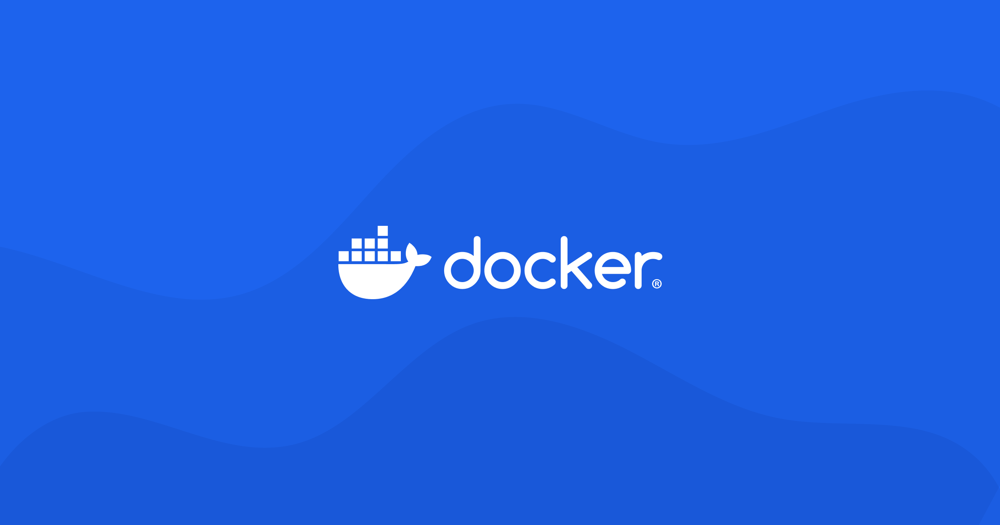

# Docker, CI/CD와 깃허브 액션

추가 일시: 2025년 5월 6일 오후 9:17
강의: Appcenter_Server

# 🛠️Docker, CI/CD와 깃허브 액션

---

## 🍀 Docker란 무엇인가요?

---



### ✅ 컨테이너 기술은 무엇이고 왜 필요할까요?

컨테이너 기술은 어플리케이션과 그 실행에 필요한 모든 종속성(라이브러리, 설정파일 등)을 단일 패키지로 묶어서 다양한 환경에서 실행할 수 있게 해주는 가상화 기술 입니다.

- 환경 독립성: 개발, 테스트, 프로덕션 환경 간 일관성을 보장합니다.
- 리소스 효율성: VM가상머신과 달리 호스트 OS커널을 공유하여 가볍습니다.
- 격리성: 각 컨테이너는 독립적으로 실행되어 보안과 안정성이 향상됩니다.

### ✅ 도커란 무엇인가요?

Docker는 컨테이너 기술을 구현한 오픈소스 플랫폼으로, 애플리케이션을 개발, 배포, 실행하기 위한 도구와 서비스를 제공합니다.

 ****🐳 **도커의 구성요소**

- Docker 엔진: 컨테이너를 생성하고 관리하는 핵심 기술
- Dockerfile: 이미지 빌드 명령을 포함한 텍스트 파일
- Docker 이미지: 애플리케이션과 의존성을 포함한 패키지
- Docker 컨테이너: 이미지의 실행 인스턴스
- Docker Hub: 이미지를 공유할 수 있는 중앙 저장소

**스프링 애플리케이션을 어떻게 이미지화할 수 있을까요?**

1. Dockerfile 생성

Docker image를 만들기 위해서 Dockerfile에 베이스 이미지, 작업 디렉토리, JAR 파일, 포트, 어플리케이션 실행 명령등을 작성해야 합니다.

> FROM
> 
- 베이스 이미지를 지정합니다.
- 로컬에 해당 이미지가 없다면 Docker Hub에서 가져옵니다.

> WORKDIR
> 
- 이후 작성되는 명령어들이 실행될 작업 디렉토리를 설정합니다.
- (만약 해당 디렉토리가 존재하지 않는다면 자동으로 생성)
- 절대경로 사용이 권장됩니다.

> COPY와 ADD
> 
- 로컬 파일이나 디렉토리를 이미지로 복사합니다.
- ADD는 추가 기능(원격 URL, tar 자동 압축 해제)이 있지만, 단순 복사는 COPY를 권장합니다.

> RUN
> 
- 이미지 빌드 과정에서 실행될 명령어를 지정합니다.
- 시스템 패키지 설치, 파일 생성 등에 사용됩니다.

> EXPOSE
> 
- 컨테이너가 실행 중에 수신할 포트를 지정합니다.

> CMD와 ENTRYPOINT
> 
- 컨테이너 실행 시 실행할 명령어를 지정합니다.
- CMD는 `docker run` 명령의 인자로 덮어쓸 수 있습니다.
- ENTRYPOINT는 항상 실행되며, CMD나 `docker run`의 인자가 ENTRYPOINT의 인자로 전달됩니다.

> VOLUME
> 
- 데이터를 유지하기 위한 볼륨 마운트 포인트를 지정합니다.

Dockerfile 작성

```docker
FROM bellsoft/liberica-openjdk-alpine:21

WORKDIR /app

VOLUME /tmp

ARG JAR_FILE=build/libs/*.jar

COPY ${JAR_FILE} app.jar

ENTRYPOINT ["java", "-jar", "app.jar"]
```

1. Docker image 빌드

작성한 Dockerfile을 사용하여 Docker 이미지를 빌드합니다. (로컬시스템에 저장됨)

```bash
docker build -t appcenter_server_study:1.0 .
```

- `t appcenter-server_study:1.0`: 이미지 이름과 태그 지정
- `.`: 현재 디렉토리의 Dockerfile 사용

1. 이미지 확인하기

빌드된 이미지가 목록에 있는지 확인합니다.

```bash
docker images
```

1. Docker 컨테이너 실행하기

```bash
docker run -p 8080:8080 appcenter_server_study:1.0
```

- 왼쪽 포트 (첫 번째 8080): 호스트 시스템에서 사용할 포트
- 오른쪽 포트 (두 번째 8080): 컨테이너 내부에서 애플리케이션이 사용하는 포트

🐳 Docker Hub에 이미지 Push

```bash
# Docker Hub 로그인
docker login

# 이미지에 태그 지정
docker tag appcenter_server_study:1.0 username/appcenter_server_study:1.0

# Docker Hub에 이미지 푸시
docker push username/appcenter_server_study:1.0
```

**여러 대의 컨테이너를 어떻게 동시에 띄울 수 있을까요?**

Docker Compose는 여러 컨테이너로 구성된 애플리케이션을 정의하고 실행하기 위한 도구입니다.

`docker-compose.yml` 파일의 기본 구조

```yaml

version: '3.8'  # Docker Compose 파일 형식 버전

services:     # 실행할 컨테이너 정의
  service1:   # 첫 번째 서비스 이름
    # 서비스 구성...
  
  service2:   # 두 번째 서비스 이름
    # 서비스 구성...

volumes:      # 볼륨 정의
  # 볼륨 구성...

networks:     # 네트워크 정의
  # 네트워크 구성...

```

network 분리의 역할

작성예시

```yaml
services:
	app:
		container_name: appcenter_server_study
		image: ${DOCKER_USER}/${DOCKER_REPO}:1.0
		volumes:
			- app_tmp:/tmp
		ports:
			- "8080:8080"
		environment:
			TZ: "Asiz/Seoul" #시간대 설정
	
```

```yaml
호스트 시스템                           컨테이너 내부
+-----------------------+              +-------------------+
| /var/lib/docker/      |              |                   |
|   volumes/            |              |                   |
|     app_tmp/          |              |                   |
|       _data/          | ←→ 매핑 →    |     /tmp/         |
|         (파일들)      |              |      (파일들)     |
+-----------------------+              +-------------------+
```

.env 환경변수파일 (.ignore 필수)

```yaml
DOCKER_REPO=appcenter_server_study
DOCKER_USER=jungseokhwan
```

## ☘️ CI/CD란 무엇인가요?

---

### ✅ CI/CD의 의미

⚙️ **CI의 의미**

> CI는 Continuous Integration 으로 지속적 통합을 의미합니다.

개발자들이 코드 변경사항을 중앙 저장소에 자주 병합하는 소프트웨어 개발 방식입니다.

각 통합은 자동화된 빌드와 테스트를 통해 검증되어 통합 문제를 식속하게 발견하고 해결할 수 있게 합니다.

CI의 주요 목표는 버그를 신속하게 찾아 해결하고, 소프트웨어 품질을 향상시키며, 새로운 업데이트의 검증 및 릴리스 시간을 단축하는 것입니다.
> 

🔃 **CD의 두가지 의미**

- 지속적 배포(Continuous Deployment)

> 개발자의 변경사항이 레포지토리에서 고객이 사용 가능한 프로덕션 환경까지 자동으로 릴리스되는 방식입니다. 
테스트를 통과한 코드 변경사항이 별도의 수동 개입 없이 자동으로 사용자에게 배포됩니다.
> 

- 지속적 전달(Continuous Delivery)

> 소프트웨어를 언제든지 안정적으로 릴리스할 수 있는 상태로 유지하는 방식입니다.
모든 코드 변경사항이 테스트 환경과 프로덕션 환경으로 자동 배포되지만, 최종 프로덕션 환경으로의 배포는 비즈니스 결정에 따라 수동으로 진행됩니다.
> 

두 가지 CD 모두 개발 과정을 자동화하여 소프트웨어를 더 빠르고 안정적으로 제공하는 것을 목표로 합니다.

지속적 배포는 완전 자동화된 파이프라인을, 지속적 전달은 최종 배포 단계에서 수동 승인을 포함한다는 차이가 있습니다.

### ✅ 다양한 CI/CD 툴

**Jenkins**

Jenkins는 가장 널리 사용되는 오픈 소스 자동화 서버로, CI/CD(지속적 통합/지속적 배포) 프로세스를 자동화하는 데 사용됩니다.

개발자가 Git에 코드를 푸시하면 자동으로 다음 단계를 수행합니다.

1. 소스 코드 가져오기
2. 코드 컴파일 및 빌드
3. 단위 테스트 실행
4. 코드 정적 분석
5. 배포

**GoCD**

Jenkins와 유사한 툴로 Pipeline을 정의에 따라 Server가 작업을 할당하고 Agent가 실행하는 구조이다.

YAML 및 JSON 형식으로 파이프라인을 구성합니다.

파이프라인 시각화에 강점을 가지고 있습니다.

## 🍀 Github Actions란 무엇인가요?

---


GitHub Actions: [https://docs.github.com/ko/actions](https://docs.github.com/ko/actions)

### ✅ Github Actions 소개

> GitHub Actions는 빌드, 테스트 및 배포 파이프라인을 자동화할 수 있는 CI/CD 플랫폼입니다.
리포지토리에 변경 내용을 푸시할 때마다 테스트를 실행하거나 병합된 pull request를 프로덕션에 배포하는 워크플로를 만들 수 있습니다.
> 

- Github 저장소에 내장되어 별도의 서비스가 필요없다.
- YAML기반의 구성이다.
- 환경변수와 같이 민감한 정보를 안전하게 관리할 수 있다.

### ✅ Workflow란?

시작부터 끝까지 자동화된 프로세스의 전체 흐름을 의미합니다.

**구성요소**

- **트리거(Triggers)**: 워크플로우를 시작하는 이벤트
    - push: 코드가 저장소에 푸시될 때 실행되는 가장 기본적인 트리거
    - pull_request: PR이 생성되거나 업데이트될 때 실행
- **작업(Jobs)**: 독립적인 실행 단위
- **단계(Steps)**: 각 작업 내에서 실행되는 개별 작업
- **조건(Conditions)**: 특정 상황에서만 실행하도록 하는 규칙
- **아티팩트(Artifacts)**: 워크플로우 실행 결과물

**기본구조**

```java
name: CI/CD  #워크플로우 이름

on: # 트리거 정의 (push 또는 pullrequest가 발생할 때 동작)
  push:
    branches: [ main ]
  pull_request:
    branches: [ main ]

jobs: # 작업 정의
  build:
    runs-on: ubuntu-latest #가상환경 지정
    steps:
      - uses: actions/checkout@v3
      - name: 단계 이름
        run: 실행할 명령어
```