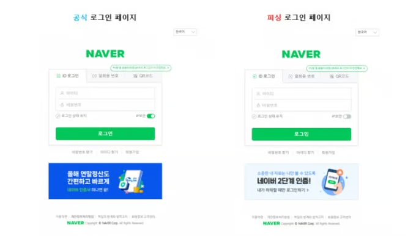

# Spring OAuth 2.0

---

## 공통 주제

### 🍀 Spring OAuth 2.0

1. OAuth 2.0은 무엇인가요?
    - OAuth 2.0은 타사 애플리케이션(클라이언트)이 사용자 리소스(Google 계정 정보 등)에 접근할 수 있도록 권한을 위임하는 인증 프레임워크이다.
    - 사용자가 비밀번호를 직접 노출하지 않고도 제3자 애플리케이션(Client)이 사용자의 리소스(이메일, 프로필 정보 등)에 제한적으로 접근할 수 있도록 한다.
    - 우리가 일상에서 흔히 사용하는 ‘구글로 로그인’, ‘카카오로 로그인’ 등의 기능에 사용되는 것이 바로 이 OAuth 2.0이다.
    
    1. OAuth 2.0는 왜 필요한가요?
        - OAuth 2.0을 사용하지 않은 로그인 방식의 문제점을 생각해보자. 사용자가 로그인 페이지에 ID와 비밀번호를 직접 입력하고, 웹 애플리케이션(클라이언트)이 해당 정보를 받아 직접 인증을 처리한다면,
            - → 사용자는 사용하는 웹 사이트마다 계정을 따로 생성해야 한다.
            - → 비밀번호 유출 시, 중복된 ID와 비밀번호를 사용한 다른 사이트들도 위험해진다.
            
        - 만약 로그인 정보를 타사 애플리케이션에 직접 입력한다면,
            - → 당연하게도 심각한 보안 문제를 유발한다.
            - → 사기 수법 중 하나이다…
                
                
                
            
        - OAuth 2.0을 사용한다면,
            - → 사용자는 신뢰할 수 있는 인증 서버(Google, 카카오, 네이버 등)에 로그인한다.
            - → 토큰 기반 인증을 통해 리소스에 접근한다(비밀번호가 노출되지 않는다).
        
    2. OAuth 2.0을 구성하는 Resource Owner, Client, Authorization Server, Resource Server은 무엇이고 각각 어떤 역할을 하나요?
        
        
        | 구성 요소 | 역할 | 예시 |
        | --- | --- | --- |
        | **Resource Owner** | 리소스를 가진 사용자 | Google 계정 주인 |
        | **Client** | 사용자 리소스에 접근하려는 앱 | 내가 만든 웹서비스 |
        | **Authorization Server** | 인증 및 토큰 발급 담당 | Google OAuth 서버 |
        | **Resource Server** | 보호된 리소스를 실제 제공 | Google API 서버 |
    
2. Spring Security와 함께 적용된 OAuth 2.0의 내부 동작 원리
    1. Spring Security는 OAuth 2.0을 어떻게 적용하고 처리하나요?
        
        [요청 전달 및 처리 순서]
        
        HTTP 요청 → 필터 → 디스패처 서블릿 → 인터셉터 → 컨트롤러
        
        - 요청이 들어오면 가장 먼저 디스패처 서블릿을 거친다고 했는데, 왜 필터가 먼저일까?
        - 디스패처 서블릿에 도달하기 전, 로그인 주소 요청 및 응답 처리를 필터가 해주기 때문이다
        
        **[OAuth2 로그인의 흐름]**
        
        1. OAuth2 로그인 필터 등록
            1. SecurityConfig에서 `http.oauth2Login()`을 호출
            2. Spring Security는 `FilterChainProxy`에 다음 두 필터를 등록
                - `OAuth2AuthorizationRequestRedirectFilter`
                    - 인가 코드 요청을 생성·저장하고 인가 서버로 리다이렉트
                - `OAuth2LoginAuthenticationFilter`
                    - 인가 서버로부터 인가 코드를 수신하여 액세스 토큰 교환 및 인증을 처리
        2. 인가 요청 진입점 매칭
            1. 사용자의 `GET /oauth2/authorization/{registrationId}` 요청
            2. `OAuth2AuthorizationRequestRedirectFilter.doFilterInternal(request, response, chain)` 실행
            3. 이 안에서 `authorizationRequestResolver.resolve(request)`를 호출
            4. 인가 요청 여부 판별
                
                
                
        3. resolve를 통한 `OAuth2AuthorizationRequest` 생성
            1. 기본 구현체는 `DefaultOAuth2AuthorizationRequestResolver`
            2. 요청 URI가 `/oauth2/authorization/{registrationId}` 패턴과 일치한다면…
                - `registrationId` 추출
                
                
                
                - `clientRegistrationRepository.findByRegistrationId(registrationId)` 호출
                - `OAuth2AuthorizationRequest.Builder`를 이용해 `authorizationUri`, `clientId`, `redirectUri`, `scopes`, `state` 등을 설정하고 `build()`로 객체 생성
                - 최종적으로 `OAuth2AuthorizationRequest` 객체 반환
                    
                    
                    
        4. 인가 요청 저장소에 저장
            1. `OAuth2AuthorizationRequestRedirectFilter`는 반환된 `OAuth2AuthorizationRequest authRequest`를 즉시 저장소에 저장
                
                
                
        5. 인가 서버로 리디렉션(특정 URL을 다른 URL로 재정의. 즉, 다른 웹 페이지로 이동)
            1. `OAuth2AuthorizationRequestRedirectFilter.sendRedirectionForAuthorization(request, response, authRequest)` 내부에서…
                - `String redirectUri = authRequest.getAuthorizationRequestUri();` 얻기
                - `redirectStrategy.sendRedirect(response, redirectUri);` 호출
                - ⇒ 브라우저가 인가 서버의 로그인/권한동의 페이지로 이동
                    
                    
                    
        6. 인가 코드 수신 진입점
            1. 인가 서버에서 사용자가 권한 동의
            2. `GET /login/oauth2/code/{registrationId}?code=...&state=...`로 리다이렉트
                
                
                
            3. `OAuth2LoginAuthenticationFilter`가 `AntPathRequestMatcher`(`/login/oauth2/code/*`)로 매칭
                - 부모 클래스인 `AbstractAuthenticationProcessingFilter` 생성자 호출 시, 위 `DEFAULT_FILTER_PROCESSES_URI`를 인자로 넘겨 RequestMatcher를 설정한다
                    - 그래서 이게 뭘까…?
                        - 필터 적용 범위를 제한한다.
                        - 불필요한 연산을 방지한다.
                        - ⇒ “인가 코드가 돌아오는 이 경로에서만 OAuth2 인증 필터를 작동시켜라”라는 조건을 구현한 것이다.
            4. `attemptAuthentication(request, response)`를 호출
                - 이제 `/login/oauth2/code/{registrationId}` 요청이 오면…
                - `OAuth2LoginAuthenticationFilter` → `requiresAuthentication` 매칭 → `attemptAuthentication` 이런 과정으로 동작하게 된다.
                    - 각자가 담당하는 경로에 대해서만 동작하도록 구분된 것.
            
        7. 인증 토큰 생성 및 위임
            1. 인가 요청 + 응답을 묶어서`OAuth2AuthorizationCodeAuthenticationToken` 생성
                - 해당 토큰을 `AuthenticationManager`(보통 `ProviderManager`)에 위임
                - `AuthenticationManager`(ProviderManager)에게 전달
                    
                    
                    
        8. 액세스 토큰 발급
            1. `OAuth2LoginAuthenticationProvider.authenticate()` 내부에서…
                - `OAuth2AuthorizationCodeAuthenticationProvider`가 `OAuth2AuthorizationCodeGrantRequest`를 생성
                
                
                
                - `accessTokenResponseClient.getTokenResponse(grantRequest)`를 호출해 토큰 엔드포인트에 POST 요청을 전송하고, `OAuth2AccessTokenResponse`를 받는다.
                
                
                
        9. 사용자 정보 로드
            1. 토큰 발급이 완료되면, `DefaultOAuth2UserService.loadUser(request)`를 사용하여 리소스 서버의 사용자 정보 엔드포인트에 GET 요청
            2. 응답 JSON을 파싱하여 `DefaultOAuth2User` 또는 커스텀 `OAuth2User` 객체를 생성하여 반환
            
            
            
        10. 인증 성공 처리
            1. `OAuth2LoginAuthenticationFilter`의 부모 클래스인`AbstractAuthenticationProcessingFilter.successfulAuthentication()`가 호출되어 
            2. `SecurityContext` 설정
            3. 이어서 등록된 `OAuth2AuthenticationSuccessHandler`의 `onAuthenticationSuccess(request, response, authResult)`가 실행
            
            
            

**[직접 해보기(미완)]**

1. 의존성 추가
- 먼저, gradle에 `org.springframework.boot:spring-boot-starter-oauth2-client` 의존성을 추가해주자.

1. yml 설정
- yml 파일에 클라이언트 ID와 보안 비밀번호를 입력한다. ‘보안’ ‘비밀번호’이니 당연히 유출되지 않도록 관리해야 한다.
    - 유출되면 어떻게 될까… → 공격자가 무단으로 토큰을 발급하여 개인정보에 접근하거나, API 호출을 대량으로 발생시켜 요금 발생을 유발할 수 있다.
        
        
        
- scope는 클라이언트가 부여받은 리소스 접근 권한이다. 이렇게만 말하면 헷갈리기 쉬울 것 같다(나는 그랬다). 어떤 애플리케이션에서 구글이나 카카오 로그인을 사용하면(즉 OAuth 인증 과정을 거치면), 권한에 대한 동의를 구하게 된다. 아래처럼 말이다.
    
    
    
1. Security 설정
- 
1. CustomOAuth2UserService
-