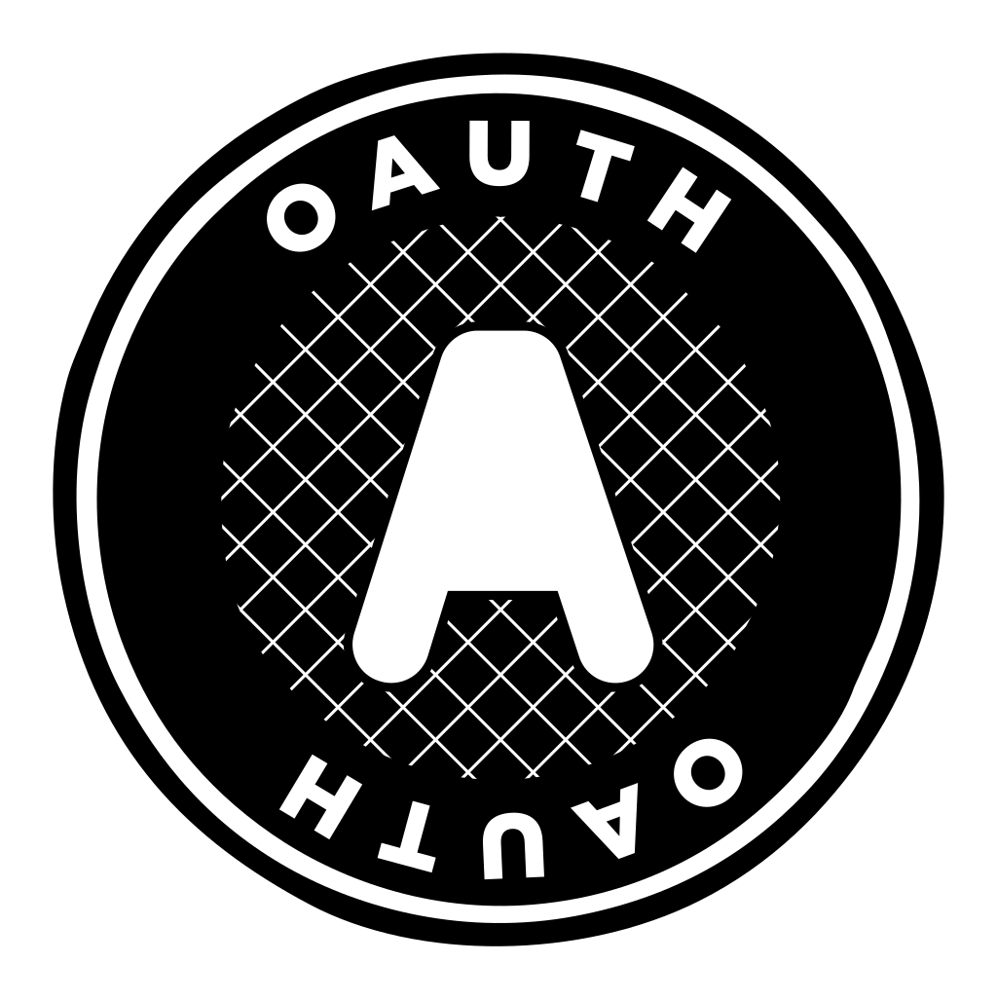

# Spring OAuth 2.0

추가 일시: 2025년 5월 23일 오후 5:19
강의: Appcenter_Server

# 🔑 Spring OAuth 2.0

---

## 🍀 OAuth 2.0은 무엇인가요?

---

### ✅ OAuth 2.0 이란?

> OAuth 2.0은 사용자가 자신의 자원에 대한 접근을 제3자 애플리케이션에 허용할 수 있도록 해 주는 권한 부여 프레임워크입니다.
이는 사용자가 자신의 자원에 대한 접근을 다른 애플리케이션에 제공할 수 있는 안전하고 표준화된 방법을 제공하며, 로그인 자격 증명을 공유하지 않고도 가능합니다.
> 

OAuth 2.0의 핵심은 ‘위임된 인가(Delegated Authorization)’ 개념입니다.

예를 들어, 사진 인쇄 서비스를 이용하면서 Google Photos의 사진을 사용하고 싶다면, Google 계정의 비밀번호를 인쇄 서비스에 알려주는 대신 OAuth 2.0을 통해 해당 서비스가 사용자의 사진에만 접근할 수 있도록 제한된 권한을 부여할 수 있습니다.

### ✅ OAuth 2.0는 왜 필요한가요?

👍 **OAuth 2.0의 장점**

**보안 강화**

OAuth 2.0는 비밀번호를 공유하지 않고도 안전한 접근을 가능하게 합니다.

사용자는 원본 서비스(ex. Google)에서만 로그인하고, 제3자의 어플리케이션은 임시 토큰만 받습니다.

이 토큰은 특정 기간 동안만 유효하고 특정 권한으로만 제한됩니다. 

**세분화된 권한 제어**

스코프(scope)개념을 통해 필요한 권한만 정확히 부여할 수 있습니다.

예를 들어, 사진 인쇄 서비스는 사진 읽기 권한만, 캘린더 앱은 일정 읽기/쓰기 권한만 받을 수 있습니다.

**쉬운 권한 관리**

사용자는 각 애플리케이션별로 개별적으로 권한을 취소할 수 있습니다.

Goolge 설정에서 특정 앱의 접근 권한만 제거하면 되고, 다른 연결된 서비스들은 영향을 받지 않습니다.

이 외에도 다양한 장점이 있습니다.

OAuth2.0를 사용하면 사용자는 새로운 계정을 만들 필요 없이 기존 계정으로 다양한 서비스를 이용할 수 있어 편의성이 크게 향상됩니다.

또한 사용자들은 신뢰하는 플랫폼을 통해 로그인할 수 있어 새로운 서비스도 큰 플랫폼의 신뢰성을 활용할 수 있습니다.

개발자는 인증 시스템을 처음부터 구축할 필요없이 기존의 안정적인 인증 제공자를 활용할 수 있습니다.

### ✅ Resource Owner, Client, Authorization Server, Resource Server은 무엇이고 각각 어떤 역할을 하나요?

<aside>
🧑‍💼

**Resource Owner**

보호된 리소스에 대한 접근 권한을 부여할 수 있는 주체입니다.

주요 역할: 자신의 데이터나 리스스에 대한 접근 권한을 제 3자 어플리케이션에게 허용하거나 거부할 수 있는 권한을 가집니다.

실제 예시

- 일반 사용자
- Google 계정 소유자
- Facebook 프로필 소유자
- Instagram 사진 소유자
</aside>

<aside>
📱

**Client**

Resource Owner를 대신하여 보호된 리소스에 접근 요청을 하는 어플리케이션입니다.
주요 역할: 사용자의 동의를 받아 Authorization Server로부터 토큰을 받고, 이를 사용해 Resource Server의 데이터에 접근합니다.

실제 예시

- Canva (디자인 도구)
- 사진 인쇄 서비스
- 운동 추적 앱
- Slack 데스크톱 앱
</aside>

<aside>
🔐

**Authorization Server**

Resource Owner의 신원을 확인하고 Client에게 액세스 토큰을 발급하는 서버입니다.

역할

- 사용자 인증 (로그인 확인)
- 사용자 동의 확인 (권한 승인)
- 토큰 발급 및 관리
- 토큰 갱신 처리
</aside>

<aside>
📊

**Resource Server**

보호된 리소스를 호스팅하고, 유효한 액세스 토큰을 가진 요청에 대해 리소스를 제공하는 서버입니다.

역할:

- 액세스 토큰의 유효성 검증
- 토큰의 권한 범위(scope) 확인
- 적절한 권한이 있을 때만 리소스 제공
- API 응답 반환
</aside>

**동작과정 (ex. Spotify)**

- Client가 당신을 Authorization Server로 리디렉션
- Resource Owner(당신)가 Spotify에서 로그인하고 앱의 재생 목록 접근 요청을 승인
- Authorization Server가 Client에게 액세스 토큰 발급
- Client가 액세스 토큰으로 Resource Server에 API 요청
- Resource Server가 토큰을 검증하고 재생 목록 데이터 반환

## 🍀 OAuth 2.0의 내부 동작 원리 with. Spring Security

---

### ✅ Spring Security는 OAuth 2.0을 어떻게 적용하고 처리하나요?

**사용자가 보호된 리소스에 접근시도**

프론트에서 벡엔드에 로그인 시도 요청을 하게 되면,

`OAuth2AuthorizationRequestRedirectFilter` 에서 요청을 처리합니다.

이후 해당 클래스의 `doFilterInternal` 메서드를 호출하게 됩니다.

메서드 안에서 `OAuth2AuthorizationRequestResolver` 객체의 `resolve`메서드가 인증 요청을 생성

→ 요청 URL과 ClientRegistrationId를 검사하여 `OAuth2AuthorizationRequest` 객체를 생성 후 반환하게 됩니다.

이후 `OAuth2AuthorizationRequest` 객체의 redirectUri

즉, /login/oauth2/code/{registrationId} 경로로 콜백 수신하게 됩니다. (yml파일에 작성한 uri)

사용자는 authorizationRequestUri ← 로그인 페이지를 제공받습니다.

여기까지의 과정이 로그인 페이지 제공까지 입니다.

**Authorization Code Response**

해당 과정이 끝나고 사용자가 소셜 로그인 페이지에서 로그인을 합니다.

로그인 과정이 수행되면 Authorization Code가 `OAuth2LoginAuthenticationFilter`로 전달됩니다.

`OAuth2LoginAuthenticationFilter`에는 `doFilter` 메서드가 정의되지 않아,

상위클래스(`AbstractAuthenticationProcessingFilter`)의 `diFilter`메서드가 호출됩니다.

이후 요청 URL을 확인하고 인증을 시도하기 위해 `attemptAuthentication` 메서드를 호출합니다.

`OAuth2LoginAuthenticationFilter` 에 구현되어있습니다.

인증을 성공하면 `successfulAuthentication` 메서드를 통해 Spring Security Context에 인증 객체를 저장합니다.

**Access Token Request & User Infomation Request**

인가 코드를 가져와 OAuth2 제공자 인증 서버에서 Access Token를 발급 받고 해당 토큰으로 사용자 정보를 받아 인증 객체를 생성하여 반환합니다.

토큰을 발급 받고 사용자 정보를 가져오는 부분은 `ProviderManager` 객체에 위임합니다.

이때 , `OAuth2LoginAuthenticationToken` 을 파라미터로 전달합니다.

`ProviderManager` 객체는 `AuthenticationProvider` 인터페이스의 구현체들을 리스트로 가지고 있습니다.

인증 요청이 왔을 때, `Provider` 리스트를 순회하여 인증을 지원 하는 `Provider` 에게 인증을 위임합니다.

`OAuth2LoginAuthenticationProvider` 객체는 인가 코드로 OAuth2 제공자 인증 서버에서 Access Token을 발급 받습니다.

Access Token으로 사용자 정보를 받아 인증 객체를 생성하고 반환하는 로직을 처리합니다.

이 때, Access Token 발급과 사용자 정보를 받아오는 부분은 `OAuth2AuthorizationCodeAuthenticationProvider` 객체와 `UserService` 객체에게 위임합니다.

이후 리소스 서버로 부터 받은 사용자 정보를 DB에 저장하고, 서비스 자체 Access Token과 Refresh Token을 생성합니다.

참고 자료

https://www.youtube.com/watch?v=Mh3LaHmA21I

[https://velog.io/@nefertiri/스프링-시큐리티-OAuth2-동작-원리](https://velog.io/@nefertiri/%EC%8A%A4%ED%94%84%EB%A7%81-%EC%8B%9C%ED%81%90%EB%A6%AC%ED%8B%B0-OAuth2-%EB%8F%99%EC%9E%91-%EC%9B%90%EB%A6%AC)